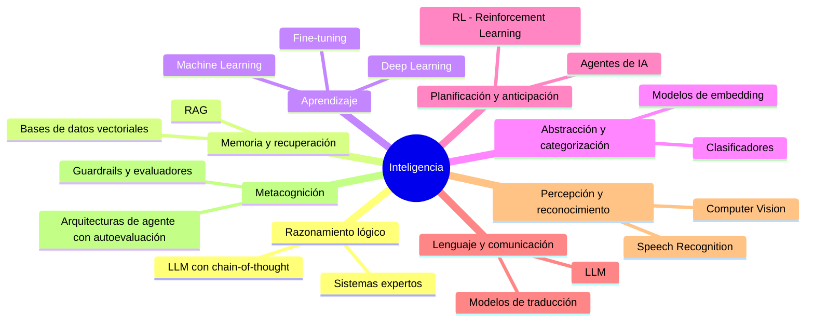

# Ingeniería de IA desde los Fundamentos
## Cómo pensar, diseñar e implementar soluciones con Inteligencia Artificial

---

**Módulo:** I — Los Fundamentos de la Inteligencia Artificial  
**Capítulo:** 1 — ¿Qué entendemos por inteligencia?  
**Versión:** 0.5  
**Estado:** Revisión conceptual  
**Fecha:** 2026-06-28

---

## Objetivos de aprendizaje

Al finalizar este capítulo, el lector será capaz de:

1. Definir el concepto de inteligencia desde una perspectiva multidimensional y no reduccionista.
2. Distinguir entre los distintos tipos de capacidades cognitivas que componen la inteligencia.
3. Identificar por qué la pregunta sobre la inteligencia es anterior y más fundamental que cualquier herramienta de IA.
4. Aplicar el método de primeros principios para analizar cualquier problema de IA antes de elegir una solución.
5. Formular las preguntas correctas antes de evaluar si un problema requiere Inteligencia Artificial (IA).
6. Reconocer los errores de razonamiento más frecuentes al conceptualizar la inteligencia artificial.

---

## Introducción

Este libro no comienza hablando de modelos, algoritmos ni herramientas. Comienza con una pregunta mucho más antigua, incómoda y productiva:

> ¿Qué significa realmente ser inteligente?

Durante siglos, filósofos, matemáticos, psicólogos e ingenieros intentaron responderla. Platón especulaba sobre la naturaleza de la razón. Descartes trazaba la línea entre mente y materia. Turing preguntaba si una máquina podría imitar la conversación humana. Cada uno de ellos, desde su época y con sus herramientas, atacaba la misma pregunta fundamental. La Inteligencia Artificial es, en gran medida, una consecuencia colectiva de esa búsqueda.

Antes de estudiar cómo funciona un Large Language Model (LLM), antes de hablar de tokens, embeddings o ventanas de contexto, necesitamos comprender qué estamos intentando reproducir cuando hablamos de "inteligencia". No porque sea un ejercicio filosófico opcional, sino porque un profesional que no puede responder esa pregunta tomará decisiones técnicas basadas en intuiciones vagas, moda tecnológica o casos de éxito ajenos que no aplican a su contexto.

Este capítulo establece el marco conceptual que usaremos durante todo el libro. No es un calentamiento. Es el cimiento.

---

## Motivación del problema

### ¿Qué problema intenta resolver este capítulo?

Existe una paradoja en la industria tecnológica actual: se implementan soluciones de IA a gran velocidad, pero la mayoría de los equipos no pueden responder con precisión qué tipo de problema están atacando ni por qué la IA es la herramienta correcta para ese problema.

El resultado es predecible: sistemas que funcionan en demos pero fallan en producción, modelos sobredimensionados para tareas simples, expectativas desalineadas entre equipos técnicos y de negocio, y proyectos que consumen presupuesto sin generar valor real.

La raíz de estos fracasos raramente está en la falta de conocimiento técnico. Está en la falta de claridad conceptual. Un equipo que no sabe exactamente qué tipo de "inteligencia" necesita su problema no puede evaluar con criterio qué solución es adecuada.

### ¿Por qué existe esta confusión?

Porque la IA llegó al mainstream como producto antes de llegar como concepto. La mayoría de los profesionales conocieron la IA a través de interfaces conversacionales, demostraciones impresionantes y titulares que generalizaban en exceso. El resultado es que muchos usan el término "inteligencia artificial" para describir fenómenos técnicamente muy distintos: un motor de búsqueda, un sistema de recomendación, un generador de texto y un clasificador de imágenes. Son todos IA, pero funcionan de formas radicalmente diferentes y sirven para propósitos radicalmente diferentes.

Construir criterio empieza por distinguir qué es realmente la inteligencia, antes de hablar de cómo artificializarla.

---

## Desarrollo conceptual desde primeros principios

### La caja con inteligencia

Imaginá que alguien llega a tu oficina con una caja y afirma:

> "Dentro de esta caja hay una inteligencia."

¿Qué harías para verificarlo? Posiblemente comenzarías a formular preguntas:

- ¿Puede responder preguntas que no le hiciste antes?
- ¿Puede adaptarse si cambia el contexto?
- ¿Puede identificar cuándo no sabe algo?
- ¿Puede aprender de sus errores?
- ¿Puede explicar por qué tomó una decisión?
- ¿Puede equivocarse, reconocerlo y corregirse?

Sin notarlo, acabas de construir un criterio de evaluación. Esas preguntas no son arbitrarias. Corresponden a capacidades cognitivas que la psicología y la ciencia cognitiva han estudiado durante décadas.

### La inteligencia no es una habilidad. Es un sistema.

Este es el primer principio que debemos internalizar: **la inteligencia no es una habilidad única, sino un conjunto de capacidades que interactúan**.

La psicología cognitiva distingue, entre otras, las siguientes capacidades:

**Razonamiento lógico.** La capacidad de derivar conclusiones válidas a partir de premisas. Un sistema puede ser excelente en esto y completamente ciego a contexto emocional.

**Memoria y recuperación.** No basta con almacenar información. La inteligencia requiere recuperarla en el momento correcto, con el contexto correcto. Saber que Waterloo fue una batalla no tiene valor si no podés usarlo cuando te preguntan por qué Napoleón fue exiliado.

**Aprendizaje.** La capacidad de modificar el comportamiento futuro a partir de experiencia pasada. Esto va mucho más allá de almacenar datos: implica generalización, es decir, aprender reglas que se aplican a situaciones nuevas.

**Abstracción y categorización.** La capacidad de reconocer que dos objetos distintos pertenecen a la misma categoría conceptual. Un perro y un delfín son ambos mamíferos aunque parezcan completamente distintos. Esta capacidad es fundamental para el razonamiento analógico.

**Planificación y anticipación.** La capacidad de modelar estados futuros, evaluar consecuencias de acciones posibles y elegir la secuencia de pasos que lleva al objetivo. Un ajedrecista no mueve la pieza que tiene delante: modela el tablero futuro.

**Lenguaje y comunicación.** No como mero transporte de información, sino como representación simbólica del pensamiento. El lenguaje permite externalizar conceptos abstractos, compartirlos y construir sobre ellos colectivamente.

**Percepción y reconocimiento de patrones.** La capacidad de extraer información significativa de señales ruidosas o ambiguas. Reconocemos una cara en condiciones de poca luz, con un ángulo inusual, a pesar de no haberla visto exactamente así antes.

**Metacognición.** La capacidad de pensar sobre el propio pensamiento. Saber qué sabés y qué no sabés. Esta dimensión es crucial: un sistema que no puede modelar sus propias limitaciones tomará decisiones peligrosamente confiadas.

### ¿Por qué importa esto para la IA?

Porque distintos sistemas de IA son excepcionales en algunas de estas dimensiones y completamente incapaces en otras.

Un LLM puede producir texto coherente, razonar sobre escenarios hipotéticos y resumir documentos extensos. Pero no tiene experiencia de tiempo real, no aprende de sus conversaciones individuales (salvo que esté diseñado para ello), y no tiene acceso a información posterior a su fecha de entrenamiento. Su "memoria" es en realidad un parámetro estadístico aprendido de texto.

Un sistema de Machine Learning (ML) clásico puede aprender a clasificar imágenes con alta precisión, pero si le mostrás una imagen con ruido artificial que a un humano le parece idéntica al original, puede fallar de formas completamente contraintuitivas.

Un sistema experto basado en reglas puede razonar de forma determinista y auditable, pero se quiebra ante situaciones que sus diseñadores no anticiparon.

Cada tipo de sistema de IA es bueno en dimensiones específicas de la inteligencia. Elegir el sistema correcto requiere saber qué dimensión necesita tu problema.

### La IA no nació con ChatGPT

Este punto merece énfasis porque la mayoría de los profesionales que se acercan a la IA hoy lo hacen con la imagen mental de un asistente conversacional. Eso genera una distorsión cognitiva: asocian "IA" con texto generativo, con chatbots, con herramientas conversacionales.

La IA como disciplina tiene raíces en la década de 1950. Alan Turing propuso en 1950 un criterio operacional para evaluar la inteligencia de una máquina: si un humano no puede distinguir si está conversando con una máquina o con otro humano, la máquina puede ser considerada "inteligente" a efectos prácticos. Ese criterio, conocido como la Prueba de Turing, no estaba evaluando si la máquina "piensa" en sentido filosófico. Estaba proponiendo una medida funcional del comportamiento inteligente.

Desde entonces, la IA ha atravesado múltiples ciclos de entusiasmo y decepción (conocidos como "inviernos de la IA"), ha generado subdisciplinas radicalmente distintas, y ha producido herramientas con capacidades que van desde el reconocimiento de patrones en imágenes médicas hasta la generación de código fuente.

ChatGPT no inauguró la IA. Inauguró su acceso masivo. Y esa distinción importa, porque significa que hay décadas de investigación, errores y aprendizajes previos que este libro intentará destilarte.

---

## Analogía

Una empresa mediana tiene varios departamentos: Recursos Humanos, Finanzas, Comercial, Operaciones y Tecnología.

Ninguno de esos departamentos, por sí solo, representa la inteligencia de la organización. Recursos Humanos gestiona talento pero no sabe si un producto es rentable. Finanzas puede calcular márgenes pero no evalúa si un candidato encaja culturalmente. Comercial genera ventas pero no garantiza que la cadena de suministro pueda cumplir.

Sin embargo, cuando estos departamentos comparten información, coordinan decisiones y actúan con un objetivo común, la empresa opera de forma que desde afuera parece inteligente: responde al mercado, adapta su estrategia, aprende de sus errores.

La inteligencia de la empresa no está en ningún departamento. Está en la calidad de su integración.

El cerebro humano funciona de manera análoga. No hay un módulo único de "inteligencia". Hay regiones especializadas que procesan lenguaje, emoción, movimiento, reconocimiento visual, planificación temporal, y que en conjunto producen lo que llamamos comportamiento inteligente.

Cuando diseñamos sistemas de IA, debemos recordar esta lección: no existe un modelo único que resuelva todo. Existirán sistemas especializados que, bien integrados, podrán abordar problemas complejos.

---

## Diagrama

### Las dimensiones de la inteligencia y su cobertura en sistemas de IA

> Cada rama del árbol representa una dimensión cognitiva. Los sistemas tecnológicos mencionados cubren partes de esa dimensión, no su totalidad. Ningún sistema cubre el árbol completo de forma equilibrada.

→ Referencia cruzada: en el **Capítulo 4 (Machine Learning)** y el **Capítulo 7 (LLM)** veremos en detalle qué dimensiones cubre cada tipo de sistema y cuáles son sus límites técnicos.

---

## Ejemplo real

### Escenario: TerraLogix y el proyecto "IA para ventas"

TerraLogix es una empresa de consultoría de infraestructura con 120 empleados y operaciones en tres países. Su directora comercial, Valentina Soria, ha presentado al comité directivo una iniciativa: implementar "IA para el área de ventas".

La propuesta es entusiasta pero vaga. Valentina menciona que "la IA puede analizar nuestros datos de clientes y decirnos a quién llamar primero". El CTO, Rodrigo Méndez, es convocado para evaluar la viabilidad técnica.

En la reunión, Rodrigo hace una sola pregunta:

> "¿Qué tipo de decisión queremos que la IA tome, o qué tipo de información queremos que produzca?"

La respuesta de Valentina abre un debate que dura cuarenta minutos. Al final, el equipo identifica que en realidad hay tres problemas distintos mezclados en una sola propuesta:

1. **Priorización de leads**: dado un listado de prospectos, ordenarlos según probabilidad de conversión. Esto es un problema de clasificación con ML supervisado.

2. **Generación de mensajes personalizados**: redactar correos electrónicos adaptados al perfil de cada cliente. Esto es un caso de uso para un LLM con contexto.

3. **Análisis de tendencias**: detectar patrones en datos históricos de ventas para anticipar demanda por región. Esto es un problema de análisis de series temporales.

Tres problemas distintos, tres tipos de solución distintos, tres equipos distintos que necesitan capacidades distintas.

Si TerraLogix hubiera implementado "un modelo de IA" genérico sin esta clarificación, habría invertido presupuesto en una solución que resuelve parcialmente el problema uno, ignora el dos y no está diseñada para el tres.

La pregunta de Rodrigo no fue técnica. Fue conceptual. Y fue la más valiosa de la reunión.

→ Referencia cruzada: en el **Capítulo 14 (Casos de Estudio)** analizaremos en detalle arquitecturas completas para escenarios similares al de TerraLogix.

---

## Conversación con un arquitecto

**Contexto:** Martina es desarrolladora senior con cinco años de experiencia en backend. Acaba de incorporarse a un equipo de IA y tiene su primera conversación de fondo con el arquitecto del proyecto, Diego.

---

**Martina:** Diego, ¿por qué el capítulo empieza hablando de filosofía? Vine a aprender a construir sistemas de IA, no a leer a Aristóteles.

**Diego:** Lo entiendo. Pero dejame hacerte una pregunta antes. Si tu cliente te dice "necesito IA para mi empresa", ¿qué construís?

**Martina:** Depende de qué necesite, supongo.

**Diego:** Exacto. Y para saber qué necesita, primero tenés que entender qué tipo de problema tiene. Y para entender eso, necesitás saber qué tipos de capacidades existen. No podés hacer esa pregunta si para vos "IA" es solo un chatbot.

**Martina:** Pero en la práctica, cuando llega un requerimiento, ¿no terminás usando siempre las mismas tres o cuatro tecnologías?

**Diego:** El desarrollador junior sí. El arquitecto no. Un arquitecto tiene que saber cuándo NO usar IA. Tengo un caso de un cliente que quería un modelo de lenguaje para responder preguntas sobre su catálogo de productos. Analizamos el problema y vimos que el catálogo era pequeño, estable y bien estructurado. La solución óptima era un buscador con filtros y una base de datos relacional bien indexada. Cero IA. Cero costo de inferencia. Tiempo de respuesta diez veces mejor.

**Martina:** ¿Y el cliente aceptó eso?

**Diego:** Al principio no. Porque venía convencido de que necesitaba IA. Cuando entendió que la IA no era la solución más adecuada para ese problema específico, cambió de postura. Pero para convencerlo, yo tenía que poder articular exactamente qué capacidades de "inteligencia" requería su problema y por qué un sistema clásico las cubría mejor en ese contexto.

**Martina:** Entonces la pregunta no es "¿cuál es el mejor modelo de IA?". Es "¿qué tipo de inteligencia necesita este problema?".

**Diego:** Eso es exactamente. Y esa pregunta no la podés responder si no tenés claro qué significa "inteligencia" en primer lugar. Por eso empieza ahí el libro.

---

## Errores frecuentes

### Error 1: Tratar "inteligencia artificial" como un concepto unitario

El error más común es hablar de "la IA" como si fuera un único sistema con capacidades uniformes. En la práctica, el campo incluye docenas de subcampos con fundamentos matemáticos, objetivos y limitaciones radicalmente distintos: Machine Learning supervisado, aprendizaje por refuerzo (Reinforcement Learning), modelos generativos, sistemas expertos, Computer Vision, procesamiento de lenguaje natural y muchos más.

Cuando un profesional dice "vamos a resolver esto con IA" sin especificar qué subcampo, qué tipo de modelo y qué capacidad concreta necesita, está tomando una decisión arquitectónica con una abstracción vacía. El equivalente sería decir "vamos a construir la base de datos" sin especificar si es relacional, documental, en grafos o en columnas.

**Consecuencia práctica:** equipos que seleccionan tecnologías por popularidad antes que por adecuación al problema, con el costo de rediseño que eso implica.

### Error 2: Confundir competencia en una dimensión con inteligencia general

Un LLM puede generar texto de altísima calidad y razonar sobre escenarios complejos. Eso impresiona. Pero ese mismo LLM puede fallar en operaciones matemáticas básicas, inventar referencias bibliográficas que no existen (fenómeno conocido como "alucinación"), o dar respuestas contradictorias ante la misma pregunta formulada de forma ligeramente distinta.

El error es inferir que porque el sistema es muy bueno en una dimensión de la inteligencia, lo es en todas. Un campeón mundial de ajedrez no es necesariamente un buen negociador. Un LLM que escribe poesía sofisticada no es necesariamente un sistema confiable para cálculos financieros críticos.

**Consecuencia práctica:** sistemas desplegados en contextos para los que no fueron evaluados, con el riesgo operativo y reputacional que eso implica.

### Error 3: Ignorar la dimensión de la metacognición

La metacognición —la capacidad de un sistema para saber qué sabe y qué no sabe— es una de las dimensiones más ignoradas en la evaluación de sistemas de IA. La mayoría de los sistemas actuales no tienen esta capacidad de forma nativa: generan una respuesta con la misma confianza aparente independientemente de si están en terreno conocido o completamente fuera de su dominio de entrenamiento.

Cuando un sistema de IA no puede reconocer sus propias limitaciones, el riesgo no lo absorbe el sistema: lo absorbe el usuario que confía en su output sin verificación.

**Consecuencia práctica:** decisiones basadas en outputs incorrectos pero presentados con alta confianza. La mitigación requiere diseño explícito: evaluar outputs, establecer umbrales de confianza, implementar mecanismos de verificación y definir circuitos de escalada a revisión humana.

→ Referencia cruzada: el **Capítulo 12 (Mitos sobre la IA)** profundiza en las consecuencias organizacionales de estos errores conceptuales.

---

## Buenas prácticas

1. **Antes de evaluar cualquier solución, definir qué capacidad cognitiva necesita el problema.** ¿Es un problema de clasificación? ¿De generación de texto? ¿De planificación de acciones? ¿De reconocimiento de patrones en imágenes? Ser preciso en esta definición filtra el 80% de las elecciones tecnológicas incorrectas.

2. **Preguntar siempre si el problema requiere IA o si un sistema determinista lo resuelve mejor.** Los sistemas deterministas son más baratos, más rápidos, más auditables y más predecibles. La IA tiene sentido cuando el espacio del problema es demasiado grande, ambiguo o variable para codificar reglas explícitas.

3. **Separar los problemas compuestos en subproblemas atómicos antes de proponer una arquitectura.** Como ilustra el caso TerraLogix, lo que parece "un problema de IA" suele ser tres o cuatro subproblemas distintos. Cada subproblema puede requerir un enfoque diferente.

4. **Mantener escepticismo calibrado ante demostraciones impresionantes.** Un sistema que funciona bien en una demo puede no funcionar bien en producción con datos reales, edge cases, usuarios no expertos o carga real. Evaluar siempre con datos representativos del problema real.

5. **Documentar las suposiciones sobre inteligencia que están implícitas en cada decisión de diseño.** Si el sistema asume que el usuario siempre formulará preguntas de una forma determinada, esa suposición debe ser explícita. Las suposiciones implícitas son la fuente más frecuente de fallos en producción.

6. **Desarrollar el hábito de preguntar "¿qué pasa cuando falla?"** antes de preguntar "¿cómo lo construimos?". La respuesta a esa pregunta determina si el sistema necesita supervisión humana, mecanismos de fallback, logging exhaustivo o alertas automáticas.

---

## Laboratorio estructurado

### Laboratorio 1.1 — Mapeo de capacidades cognitivas a problemas reales

**Objetivo:** Desarrollar la capacidad de identificar qué dimensiones de la inteligencia requiere un problema concreto, antes de considerar cualquier solución tecnológica.

**Nivel:** Introductorio

**Tiempo estimado:** 45–60 minutos

**Prerrequisitos:** Ninguno técnico. Solo lectura de este capítulo.

**Herramientas:** Papel y lápiz, o cualquier herramienta de notas digital. No se requiere código.

---

**Escenario:**

Sos consultor en una empresa de logística llamada FreightCore. La gerente de operaciones, Ana Burgos, te convoca a una reunión y te dice:

> "Necesitamos IA para nuestro centro de distribución. Tenemos problemas con los tiempos de entrega, los conductores se quejan de las rutas y los clientes llaman demasiado para pedir actualizaciones de estado."

---

**Desarrollo:**

**Paso 1 — Descomponer el problema (15 minutos)**

Leé la descripción de Ana con atención. Identificá cuántos problemas distintos hay implícitos en su descripción. Escribilos como problemas separados, en una oración cada uno. No propongas soluciones todavía.

Guía de preguntas:
- ¿Cuántos actores distintos mencionó Ana (personas, sistemas)?
- ¿Cuántas quejas distintas mencionó?
- ¿Hay problemas de información, de optimización, o de comunicación?

**Paso 2 — Mapear dimensiones cognitivas (15 minutos)**

Para cada problema identificado en el Paso 1, respondé:
- ¿Qué capacidad cognitiva necesita este problema?
- ¿Es un problema que un ser humano podría resolver con suficiente tiempo y datos? ¿O requiere procesar volúmenes imposibles para un humano?
- ¿Necesita aprender continuamente o es un problema estático?

**Paso 3 — Evaluar si requiere IA (10 minutos)**

Para cada subproblema, respondé honestamente:
- ¿Un sistema de reglas bien diseñado podría resolverlo?
- ¿Cuántos datos históricos existirían disponibles?
- ¿El problema cambia con el tiempo o es estable?

**Paso 4 — Sintetizar y priorizar (10 minutos)**

Elaborá un mapa con tres columnas:

| Subproblema | Capacidad cognitiva requerida | ¿Requiere IA? (sí / no / depende) |
|---|---|---|
| ... | ... | ... |

---

**Validación:**

Al finalizar, tu mapa debería:
- Identificar al menos 3 subproblemas distintos.
- Asignar al menos 2 capacidades cognitivas diferentes.
- Incluir al menos un caso donde la respuesta sea "no" o "depende".

Si todos los subproblemas marcaron "sí, requiere IA", revisá el Paso 3.

---

**Reflexión:**

1. ¿Cuál fue el subproblema más difícil de categorizar? ¿Por qué?
2. ¿Cambia tu respuesta si FreightCore tiene 10.000 envíos diarios versus 100 envíos diarios?
3. ¿Qué información adicional le pedirías a Ana antes de proponer cualquier arquitectura?

---

**Desafíos opcionales:**

- **Nivel 1:** Repetí el ejercicio con un escenario de tu propia industria o empresa.
- **Nivel 2:** Investigá qué soluciones de optimización de rutas existen antes de IA (algoritmos de Vehicle Routing Problem). ¿Cuándo conviene usarlos en lugar de ML?
- **Nivel 3:** Definí qué métricas usarías para evaluar si la solución "funciona" para cada subproblema. ¿Son métricas de negocio, técnicas, o ambas?

---

## Preguntas de reflexión

1. ¿Puede existir inteligencia sin lenguaje? ¿Y sin memoria? Justificá tu respuesta con al menos un ejemplo concreto.

2. Si un sistema de IA supera al mejor humano en ajedrez, ¿eso lo hace más inteligente que ese humano? ¿En qué sentido sí, en qué sentido no?

3. Un sistema de reconocimiento de imágenes médicas detecta cáncer de pulmón con 97% de precisión, superando el promedio de los radiólogos humanos. ¿Eso significa que el sistema "comprende" la imagen? ¿Qué diferencia hace esa distinción en términos de cómo debería usarse el sistema?

4. ¿Por qué es importante que un arquitecto de IA sepa cuándo NO usar IA? ¿Qué presiones organizacionales dificultan esa decisión?

5. La metacognición —saber qué no sabés— es una capacidad que los sistemas actuales de IA tienen de forma muy limitada. ¿Qué implicancias tiene eso para el diseño de sistemas donde el error puede tener consecuencias graves (medicina, justicia, infraestructura crítica)?

6. Si la inteligencia es un conjunto de capacidades que interactúan, ¿cuál sería el criterio para decir que un sistema es "suficientemente inteligente" para un propósito dado? ¿Es esa una pregunta técnica, de negocio, o ética?

7. Pensá en un problema que hayas resuelto recientemente en tu trabajo. ¿Qué capacidades cognitivas usaste? ¿Cuáles de esas capacidades son automatizables hoy con IA? ¿Cuáles no?

---

## Resumen

La inteligencia no es una propiedad binaria que se tiene o no se tiene. Es un conjunto de capacidades cognitivas interrelacionadas, que incluyen razonamiento lógico, memoria, aprendizaje, abstracción, planificación, lenguaje, percepción y metacognición. Cada una de estas dimensiones puede ser parcialmente implementada en sistemas artificiales, pero ningún sistema actual las cubre todas de forma equilibrada. La Inteligencia Artificial como campo surgió de la pregunta filosófica y científica sobre si era posible replicar estas capacidades en máquinas, y esa pregunta tiene más de setenta años. Los modelos conversacionales que popularizaron la IA en los últimos años son una manifestación reciente de ese esfuerzo, no su punto de partida.

Para un profesional que diseña soluciones, la claridad conceptual sobre qué tipo de inteligencia requiere un problema es más valiosa que el conocimiento de cualquier herramienta específica. Las herramientas cambian. El método de análisis es duradero: preguntar primero qué problema se intenta resolver, qué tipo de capacidad cognitiva necesita, si realmente requiere IA, y qué pasa cuando el sistema falla. Ese método es el hilo conductor de este libro.

---

## Checklist del capítulo

Antes de continuar al Capítulo 2, verificá que podés responder estas preguntas sin releer el texto:

- [ ] Puedo nombrar al menos cinco dimensiones de la inteligencia.
- [ ] Puedo explicar por qué la IA no comenzó con los modelos conversacionales actuales.
- [ ] Puedo distinguir un problema que requiere IA de uno que no lo requiere.
- [ ] Entiendo por qué un mismo "problema de negocio" puede contener múltiples subproblemas con soluciones distintas.
- [ ] Puedo explicar qué es la metacognición y por qué es relevante en sistemas de IA.
- [ ] Comprendo que distintos sistemas de IA cubren distintas dimensiones cognitivas.
- [ ] Sé formular la pregunta "¿qué tipo de inteligencia necesita este problema?" antes de proponer una arquitectura.

---

## Glosario breve

**Inteligencia Artificial (IA):** Campo de la informática dedicado a desarrollar sistemas que exhiben capacidades cognitivas habitualmente asociadas a la inteligencia humana.

**Machine Learning (ML):** Subcampo de la IA que desarrolla algoritmos capaces de aprender patrones a partir de datos, sin ser explícitamente programados para cada caso.

**Large Language Model (LLM):** Modelo de ML entrenado sobre grandes volúmenes de texto, capaz de generar, resumir y razonar sobre lenguaje natural.

**Metacognición:** Capacidad de un sistema para modelar sus propios procesos cognitivos, incluyendo sus limitaciones y zonas de incertidumbre.

**Prueba de Turing:** Criterio operacional propuesto por Alan Turing en 1950 para evaluar si una máquina exhibe comportamiento inteligente indistinguible del humano en una conversación.

**Alucinación (en LLMs):** Fenómeno por el cual un LLM genera información incorrecta o inventada presentada con aparente confianza.

**Primeros principios:** Método de razonamiento que parte de las verdades fundamentales de un dominio, en lugar de analogías o suposiciones heredadas, para derivar conclusiones originales.

**Inferencia:** En el contexto de ML, proceso de usar un modelo ya entrenado para generar una predicción o respuesta ante una entrada nueva.

---

## Referencias cruzadas

| Concepto introducido | Capítulo donde se desarrolla en profundidad |
|---|---|
| Machine Learning | Capítulo 4 |
| Deep Learning | Capítulo 5 |
| Transformers | Capítulo 6 |
| Large Language Models | Capítulo 7 |
| Tokens y contexto | Capítulos 8 y 9 |
| Embeddings y RAG | Capítulos 10 y siguientes |
| Mitos y errores sobre la IA | Capítulo 12 |
| Casos de estudio completos | Capítulo 14 |

---

## Próximos pasos — Capítulo 2

En el Capítulo 2 responderemos una pregunta que este capítulo deja abierta: ¿por qué nació la Inteligencia Artificial como disciplina formal?

Veremos el contexto histórico que hizo posible la IA, los problemas que sus fundadores intentaban resolver, y por qué la primera formulación del campo fue tan diferente a lo que hoy llamamos IA. Entender el origen de la IA no es un ejercicio de historia: es entender por qué el campo tiene las fortalezas y limitaciones que tiene hoy.

Si este capítulo respondió "¿qué es la inteligencia?", el próximo responderá "¿por qué quisimos construir una?"

---

> "Un arquitecto no memoriza respuestas. Comprende problemas para poder diseñar soluciones."
