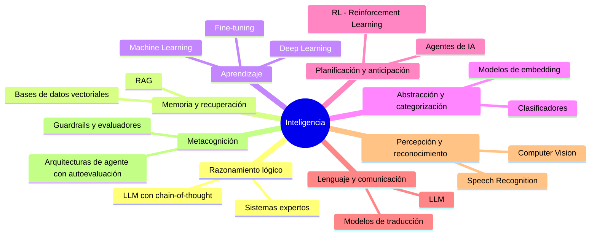
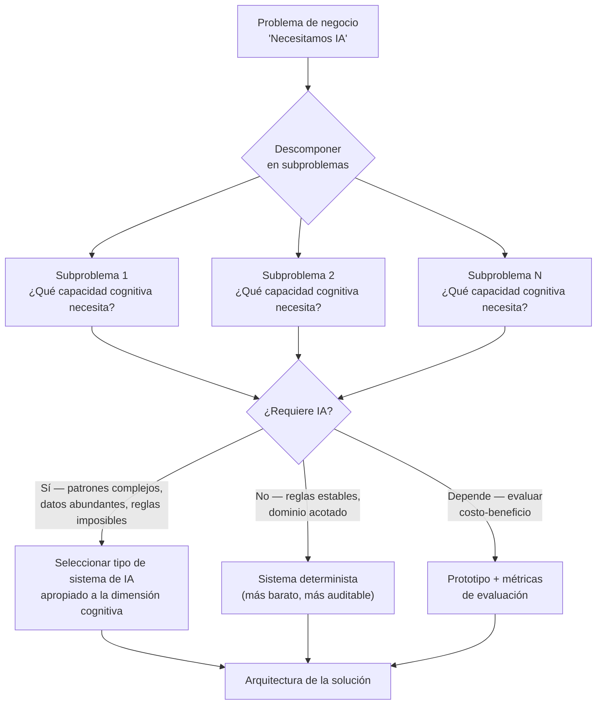

```mermaid
mindmap
  root((Inteligencia))
    Razonamiento lógico
      Sistemas expertos
      LLM con chain-of-thought
    Memoria y recuperación
      Bases de datos vectoriales
      RAG
    Aprendizaje
      Machine Learning
      Deep Learning
      Fine-tuning
    Abstracción y categorización
      Clasificadores
      Modelos de embedding
    Planificación y anticipación
      Agentes de IA
      RL - Reinforcement Learning
    Lenguaje y comunicación
      LLM
      Modelos de traducción
    Percepción y reconocimiento
      Computer Vision
      Speech Recognition
    Metacognición
      Arquitecturas de agente con autoevaluación
      Guardrails y evaluadores
```

```mermaid
flowchart TD
    A["Problema de negocio\n'Necesitamos IA'"] --> B{Descomponer\nen subproblemas}
    B --> C["Subproblema 1\n¿Qué capacidad cognitiva necesita?"]
    B --> D["Subproblema 2\n¿Qué capacidad cognitiva necesita?"]
    B --> E["Subproblema N\n¿Qué capacidad cognitiva necesita?"]
    C --> F{¿Requiere IA?}
    D --> F
    E --> F
    F -->|"Sí — patrones complejos,\ndatos abundantes, reglas imposibles"| G["Seleccionar tipo de sistema de IA\napropiado a la dimensión cognitiva"]
    F -->|"No — reglas estables,\ndominio acotado"| H["Sistema determinista\n(más barato, más auditable)"]
    F -->|"Depende — evaluar\ncosto-beneficio"| I["Prototipo + métricas\nde evaluación"]
    G --> J["Arquitectura de la solución"]
    H --> J
    I --> J
```
