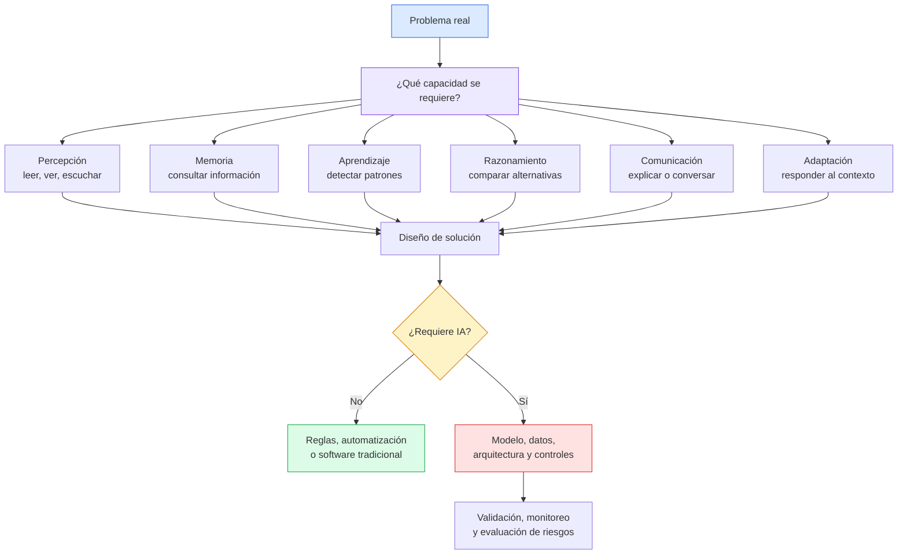

# Ingeniería de IA desde los Fundamentos

## Módulo I — Los Fundamentos de la Inteligencia Artificial

## Capítulo 1 — ¿Qué entendemos por inteligencia?

**Versión:** 0.5  
**Estado:** Revisión conceptual

---

## 1. Objetivos de aprendizaje

Al finalizar este capítulo serás capaz de:

1. Explicar por qué un libro sobre Inteligencia Artificial (IA) debe comenzar por la pregunta "¿qué entendemos por inteligencia?".
2. Distinguir inteligencia como capacidad única de inteligencia como conjunto de capacidades.
3. Identificar capacidades asociadas con la inteligencia: aprendizaje, razonamiento, memoria, adaptación, creatividad, comunicación y toma de decisiones.
4. Comprender por qué no toda conducta aparentemente inteligente requiere IA.
5. Aplicar una primera mirada de arquitecto: partir del problema antes de elegir una tecnología.
6. Reconocer límites conceptuales: simular una conducta inteligente no equivale necesariamente a comprender como un ser humano.
7. Preparar el marco mental necesario para estudiar, en el Capítulo 2, por qué nació la IA como disciplina.

---

## 2. Introducción

Este libro no comienza hablando de modelos, algoritmos, librerías ni herramientas.

Comienza con una pregunta más antigua y más incómoda:

> ¿Qué significa realmente ser inteligente?

La pregunta parece filosófica, pero tiene consecuencias técnicas directas. Cuando una organización dice "queremos incorporar IA", en realidad está diciendo algo menos preciso: "queremos que un sistema haga una tarea que asociamos con alguna forma de inteligencia". Esa tarea puede ser clasificar documentos, responder preguntas, recomendar productos, detectar fraude, generar texto, resumir información o asistir a una decisión.

Cada una de esas tareas exige capacidades distintas.

Un sistema que detecta anomalías en una red no necesita escribir poesía. Un asistente que responde preguntas sobre políticas internas no necesita controlar un robot. Un modelo que genera texto puede sonar convincente sin comprender el mundo como lo hace una persona. Si no distinguimos esas diferencias desde el inicio, corremos el riesgo de llamar "inteligente" a cualquier automatización que parezca sofisticada.

Antes de estudiar Large Language Models (LLMs), tokens, embeddings, Context Window o Retrieval-Augmented Generation (RAG), necesitamos una base conceptual: qué intentamos reproducir, automatizar o asistir cuando hablamos de inteligencia.

Este capítulo construye esa base.

---

## 3. Motivación del problema

Imaginá que alguien llega a tu oficina con una caja cerrada y afirma:

> "Dentro de esta caja hay una inteligencia."

No podés verla. Solo podés interactuar con ella.

¿Qué harías para comprobarlo?

Probablemente empezarías a formular preguntas:

- ¿Puede aprender de ejemplos?
- ¿Puede recordar información relevante?
- ¿Puede resolver problemas nuevos?
- ¿Puede explicar por qué tomó una decisión?
- ¿Puede adaptarse si cambia el contexto?
- ¿Puede distinguir entre una instrucción válida y una peligrosa?
- ¿Puede reconocer que no sabe algo?
- ¿Puede crear una respuesta original?
- ¿Puede equivocarse de manera detectable?

Sin darte cuenta, ya estarías haciendo ingeniería conceptual. Estarías convirtiendo una palabra amplia, "inteligencia", en una lista de capacidades observables.

Ese paso es fundamental. En tecnología, los conceptos demasiado generales suelen producir malas decisiones. Si una empresa pide "IA" sin definir qué capacidad necesita, el proyecto queda mal planteado desde el inicio. Puede terminar usando un LLM donde bastaba una regla, o una regla donde hacía falta aprendizaje estadístico.

La primera tarea del arquitecto no es elegir un modelo. Es aclarar qué tipo de capacidad inteligente requiere el problema.

---

## 4. La primera sorpresa: la IA no empezó con ChatGPT

La Inteligencia Artificial no nació con ChatGPT.

Tampoco nació con Internet.

Ni siquiera nació exactamente con las computadoras modernas.

La pregunta sobre si una máquina podría razonar, calcular, aprender o simular pensamiento aparece mucho antes que las herramientas actuales. Filósofos, matemáticos, psicólogos, lingüistas, neurocientíficos e ingenieros exploraron durante siglos distintas versiones del mismo problema:

> ¿Puede una entidad no humana realizar tareas que asociamos con la inteligencia?

La IA moderna es una consecuencia técnica de esa pregunta.

Esto importa porque evita una confusión frecuente: creer que la IA es una moda reciente. Las herramientas actuales son nuevas, pero el problema de fondo no lo es. Lo que cambió fue la capacidad computacional, la disponibilidad de datos, los métodos de entrenamiento y la escala de los modelos.

En capítulos posteriores veremos cómo esa historia evoluciona hacia Machine Learning (ML), Deep Learning (DL), Transformers y LLMs. Pero la raíz conceptual está aquí: queremos construir sistemas capaces de realizar tareas que antes parecían exigir inteligencia humana.

---

## 5. Desarrollo conceptual desde primeros principios

### 5.1 Inteligencia no es una sola cosa

No existe una definición única y universalmente aceptada de inteligencia.

Algunas personas la asocian con memoria. Otras con razonamiento lógico. Otras con creatividad. Otras con adaptación. Otras con lenguaje. Otras con la capacidad de resolver problemas bajo incertidumbre.

Una definición útil para este libro es:

> La inteligencia es un conjunto de capacidades que permiten percibir información, interpretarla, aprender de la experiencia, razonar sobre alternativas, adaptarse al contexto y actuar para alcanzar objetivos.

Esta definición no pretende cerrar el debate filosófico. Pretende ser útil para ingeniería.

Desde esa mirada, la inteligencia no es una propiedad única que un sistema "tiene" o "no tiene". Es una combinación de capacidades. Un sistema puede ser muy fuerte en una y débil en otra.

Por ejemplo:

- Una calculadora supera a una persona en aritmética, pero no entiende el propósito de un presupuesto.
- Un sistema de recomendación puede aprender patrones de consumo, pero no explicar una decisión estratégica.
- Un LLM puede redactar una respuesta clara, pero puede inventar datos si no tiene fuentes confiables.
- Un sistema de visión puede detectar defectos en una línea industrial, pero no negociar prioridades con un equipo humano.

La pregunta profesional no es "¿esto es inteligente?". La pregunta útil es:

> ¿Qué capacidad específica necesitamos que el sistema tenga?

### 5.2 Capacidades asociadas con inteligencia

Podemos organizar la inteligencia en capacidades observables:

| Capacidad | Pregunta técnica | Ejemplo |
|---|---|---|
| Percepción | ¿Puede recibir señales del entorno? | Leer texto, procesar una imagen, recibir eventos de sensores. |
| Memoria | ¿Puede conservar o consultar información relevante? | Recuperar historial de tickets o documentos internos. |
| Aprendizaje | ¿Puede mejorar su comportamiento a partir de datos? | Ajustar predicciones con ejemplos históricos. |
| Razonamiento | ¿Puede relacionar información y evaluar alternativas? | Comparar opciones de arquitectura para un caso de negocio. |
| Adaptación | ¿Puede responder ante cambios del contexto? | Modificar una recomendación si cambian restricciones. |
| Comunicación | ¿Puede expresar resultados de forma comprensible? | Explicar una recomendación a un usuario. |
| Creatividad | ¿Puede generar combinaciones nuevas o propuestas originales? | Redactar variantes de una campaña o un diseño inicial. |
| Autocontrol | ¿Puede reconocer límites, incertidumbre o riesgo? | Responder "no tengo información suficiente". |

Ningún sistema necesita todas estas capacidades para ser útil. Un detector de fraude puede requerir aprendizaje y velocidad, pero no creatividad. Un asistente documental puede requerir comunicación, recuperación de información y manejo de incertidumbre, pero no autonomía total.

### 5.3 Conducta inteligente no es lo mismo que inteligencia humana

En ingeniería trabajamos con conductas observables. Si un sistema clasifica correctamente correos como spam, nos importa que la clasificación funcione. No necesitamos afirmar que el sistema "entiende" el correo como una persona.

Esta distinción será central en todo el libro.

Un modelo puede producir una salida útil sin tener conciencia. Puede generar una explicación gramaticalmente correcta sin comprender en sentido humano. Puede reconocer patrones estadísticos complejos sin tener intención, deseo ni criterio moral.

Por eso evitaremos frases como:

- "La IA piensa."
- "El modelo sabe."
- "El modelo entiende todo."
- "El modelo tiene conciencia."

Podemos usar expresiones abreviadas en conversación, pero técnicamente conviene ser más precisos:

- "El modelo genera una respuesta a partir del prompt y su entrenamiento."
- "El sistema clasifica según patrones aprendidos de los datos."
- "La aplicación recupera documentos relevantes y los incorpora como contexto."
- "El agente ejecuta herramientas bajo reglas definidas por la aplicación."

Esta precisión no es un detalle académico. Reduce errores de diseño.

### 5.4 El problema antes que la herramienta

Desde el primer capítulo establecemos una regla metodológica:

> Nunca estudiaremos un concepto sin preguntar qué problema intenta resolver, por qué apareció y qué limitaciones tiene.

La razón es práctica. En proyectos reales, la conversación suele comenzar al revés:

- "Queremos un chatbot."
- "Necesitamos usar IA generativa."
- "Hay que integrar un LLM."
- "Deberíamos entrenar un modelo propio."

Todas esas frases empiezan por la solución. Un arquitecto debe retroceder un paso:

- ¿Qué problema operativo existe?
- ¿Quién lo padece?
- ¿Qué decisión o tarea queremos mejorar?
- ¿Qué información está disponible?
- ¿Qué nivel de error es aceptable?
- ¿Qué alternativa más simple podría resolverlo?

La IA puede ser una respuesta poderosa. Pero no debería ser la primera palabra de la conversación.

---

## 6. Analogías

### 6.1 La empresa como sistema inteligente

Pensá en una empresa.

Recursos Humanos, Finanzas, Comercial, Operaciones, Seguridad e IT cumplen funciones distintas. Ninguna de esas áreas representa por sí sola la inteligencia de la organización. Sin embargo, cuando coordinan información, toman decisiones y se adaptan al mercado, la empresa parece actuar de manera inteligente.

Con la inteligencia ocurre algo similar. No es una sola pieza. Es una coordinación de capacidades.

La analogía ayuda a evitar un error: buscar "la inteligencia" en un único componente. En sistemas de IA, el modelo es importante, pero la aplicación, los datos, la memoria, las herramientas, las validaciones y los usuarios también forman parte del comportamiento final.

### 6.2 El tablero de control

Otra analogía útil es un tablero de control industrial.

Un tablero recibe señales, muestra indicadores, activa alarmas y permite tomar decisiones. Pero no todo tablero es inteligente. Puede ser muy útil y completamente determinístico.

La IA aparece cuando necesitamos algo más que reglas fijas: reconocer patrones variables, inferir a partir de ejemplos, generar lenguaje, comparar significados o adaptarnos a casos no previstos.

Esta analogía marca una frontera: automatizar no siempre es hacer IA.

---

## 7. Diagrama Mermaid

El siguiente diagrama muestra cómo pasamos de una idea general de inteligencia a una decisión de arquitectura.

El punto central del diagrama es la bifurcación: no todo problema que parece inteligente requiere IA. Y cuando sí la requiere, la decisión no termina en "usar un modelo". Recién empieza el trabajo de arquitectura.

---

## 8. Ejemplos reales

### 8.1 Soporte interno en una empresa de software

Una empresa recibe cientos de consultas internas por semana:

- "¿Cómo solicito acceso a producción?"
- "¿Dónde está la política de backups?"
- "¿Qué procedimiento seguimos ante un incidente crítico?"

La primera reacción podría ser construir un chatbot con IA. Pero el análisis debe empezar antes.

Si las preguntas son simples, repetitivas y tienen respuestas estables, una base de conocimiento bien organizada con búsqueda tradicional puede alcanzar. Si las preguntas combinan documentos, usan lenguaje ambiguo y requieren sintetizar fuentes, una arquitectura con Retrieval-Augmented Generation (RAG) podría aportar valor.

La capacidad requerida no es "inteligencia general". Es acceso semántico a conocimiento documental, comunicación en lenguaje natural y manejo de incertidumbre.

### 8.2 Clasificación de tickets

Un equipo de operaciones necesita clasificar tickets como "red", "base de datos", "aplicación" o "seguridad".

Si las reglas son claras, un conjunto de patrones puede resolver el problema. Si los textos son variados y cambian con el tiempo, Machine Learning (ML) puede aprender patrones desde ejemplos históricos. Si además se necesita explicar la clasificación en lenguaje natural, un LLM puede participar como asistente.

La solución depende de la capacidad necesaria: reglas, aprendizaje, explicación o una combinación.

### 8.3 Decisiones de crédito

Una institución financiera evalúa solicitudes de crédito.

Aquí el riesgo es alto. Una predicción incorrecta puede afectar a una persona y a la organización. No alcanza con que el sistema "parezca inteligente". Se necesitan datos de calidad, explicabilidad, auditoría, cumplimiento normativo, control de sesgos y responsabilidad humana.

Este ejemplo muestra que cuanto mayor es el impacto de una decisión, más importante es distinguir capacidad técnica de gobernanza.

---

## 9. Conversación con un arquitecto

**Estudiante:** Si un sistema responde preguntas en lenguaje natural, ¿podemos decir que es inteligente?

**Arquitecto:** Podemos decir que muestra una conducta que asociamos con inteligencia lingüística. Pero eso no significa que comprenda como una persona.

**Estudiante:** ¿Entonces no es inteligencia?

**Arquitecto:** Depende de qué quieras evaluar. Para una aplicación, quizá lo importante sea si ayuda al usuario a resolver una tarea. Para una discusión filosófica, la pregunta es distinta.

**Estudiante:** ¿Cómo llevo eso a un proyecto real?

**Arquitecto:** Primero definí la capacidad requerida. ¿Necesitás clasificar, predecir, buscar, generar, razonar, explicar o actuar?

**Estudiante:** ¿Y después elijo el modelo?

**Arquitecto:** Después evaluás si hace falta IA. Si hace falta, decidís qué tipo de IA, qué datos usar, qué controles aplicar y cómo medir si funciona.

**Estudiante:** Entonces el problema no es "poner IA".

**Arquitecto:** Exacto. El problema es diseñar un sistema que use la capacidad adecuada para una tarea concreta, con límites claros.

---

## 10. Errores frecuentes

### Error 1: Confundir inteligencia con lenguaje fluido

Una respuesta bien redactada puede ser incorrecta. La fluidez no garantiza comprensión, verdad ni criterio.

### Error 2: Llamar IA a cualquier automatización

Un flujo que envía un correo cuando ocurre un evento puede ser automatización tradicional. No necesita IA salvo que deba interpretar, generar o adaptar contenido de forma no determinística.

### Error 3: Empezar por la herramienta

"Usemos un LLM" no es un análisis. Es una propuesta incompleta. Falta problema, usuarios, datos, riesgos, costo y criterios de éxito.

### Error 4: Creer que una capacidad implica todas las demás

Un sistema que clasifica imágenes no necesariamente razona. Un modelo que redacta texto no necesariamente verifica hechos. Una capacidad fuerte no implica inteligencia general.

### Error 5: Atribuir conciencia al modelo

Los modelos realizan inferencia. No tienen intención ni conciencia. Diseñar como si la tuvieran lleva a expectativas equivocadas.

### Error 6: Ignorar el impacto del error

No es lo mismo recomendar una película que asistir una decisión médica, financiera o legal. La arquitectura debe cambiar según el riesgo.

---

## 11. Buenas prácticas

1. Empezar por el problema, no por la tecnología.
2. Nombrar la capacidad inteligente requerida.
3. Separar automatización, Machine Learning (ML), Deep Learning (DL) y Large Language Models (LLMs).
4. Evaluar siempre una alternativa sin IA.
5. Definir qué significa éxito antes de construir.
6. Identificar qué ocurre si el sistema se equivoca.
7. Usar lenguaje técnico preciso: el modelo genera, clasifica o infiere; no "sabe" ni "entiende" en sentido humano.
8. Diseñar controles proporcionales al riesgo.
9. Documentar supuestos desde el inicio.
10. Mantener al usuario y su tarea real en el centro del diseño.

---

## 12. Laboratorio

### Objetivo

Transformar una idea vaga de "usar IA" en una definición clara de problema, capacidad requerida y alternativa de solución.

### Nivel

Inicial.

### Tiempo estimado

45 a 60 minutos.

### Prerrequisitos

No requiere conocimientos previos de IA. Es recomendable haber leído este capítulo completo.

### Herramientas

- Editor de texto o cuaderno.
- Opcional: hoja de cálculo para comparar alternativas.

### Escenario

Una organización plantea la siguiente solicitud:

> "Queremos usar IA para mejorar la atención interna a empleados."

La frase es demasiado amplia. Tu tarea es convertirla en un análisis inicial que permita decidir si realmente hace falta IA.

### Desarrollo

**Paso 1 — Formular el problema**

Acción: reescribí la solicitud sin mencionar IA.

Motivo: obliga a separar el dolor real de la solución propuesta.

Resultado esperado: una frase como "Los empleados tardan demasiado en encontrar respuestas sobre políticas internas y procedimientos operativos".

**Paso 2 — Identificar usuarios y tareas**

Acción: listá al menos tres tipos de usuarios y qué necesitan hacer.

Motivo: la inteligencia requerida depende de la tarea. Recursos Humanos, soporte técnico y finanzas pueden necesitar capacidades distintas.

Resultado esperado:

| Usuario | Tarea | Información requerida |
|---|---|---|
| Empleado nuevo | Conocer beneficios | Políticas internas |
| Analista de soporte | Resolver incidentes frecuentes | Procedimientos técnicos |
| Responsable de área | Consultar métricas | Reportes estructurados |

**Paso 3 — Nombrar la capacidad requerida**

Acción: para cada tarea, indicá si requiere búsqueda, memoria, razonamiento, generación de lenguaje, clasificación, predicción o simple automatización.

Motivo: evita tratar todos los problemas como si necesitaran el mismo tipo de IA.

Resultado esperado: una tabla de capacidades.

**Paso 4 — Comparar alternativas**

Acción: compará tres opciones: proceso manual mejorado, automatización tradicional y solución con IA.

Motivo: una recomendación profesional necesita alternativas.

Resultado esperado:

| Opción | Ventajas | Riesgos | Cuándo conviene |
|---|---|---|---|
| Mejorar documentación | Bajo costo | Requiere disciplina editorial | Preguntas simples y estables |
| Automatización tradicional | Predecible | Poca flexibilidad | Flujos claros y repetitivos |
| IA con RAG o LLM | Flexible en lenguaje natural | Puede responder mal si no hay controles | Preguntas ambiguas sobre documentos variados |

**Paso 5 — Definir una recomendación inicial**

Acción: escribí una recomendación de 150 a 200 palabras.

Motivo: el arquitecto debe comunicar decisiones, no solo analizarlas.

Resultado esperado: una recomendación que indique si conviene usar IA, bajo qué alcance y con qué cautelas.

### Validación

El laboratorio está completo si:

- el problema está definido sin mencionar primero la herramienta;
- las capacidades requeridas están nombradas;
- existe al menos una alternativa sin IA;
- la recomendación incluye riesgos y límites;
- la decisión puede defenderse ante un equipo técnico.

### Preguntas para reflexionar

1. ¿Qué cambió cuando escribiste el problema sin usar la palabra IA?
2. ¿Qué tareas podían resolverse sin IA?
3. ¿Qué capacidad inteligente apareció como más importante?
4. ¿Qué información faltaría antes de construir una solución?
5. ¿Qué riesgo sería inaceptable en una primera versión?

### Desafíos opcionales

1. Repetí el ejercicio con un caso de salud, finanzas o gobierno.
2. Agregá una columna de impacto si el sistema se equivoca.
3. Diseñá una primera métrica de éxito para cada alternativa.

---

## 13. Preguntas de reflexión

1. ¿Qué significa para vos que un sistema "parezca inteligente"?
2. ¿Qué diferencia hay entre resolver un problema y comprenderlo?
3. ¿Qué tareas no delegarías a una IA sin supervisión humana?
4. ¿Qué capacidad asociada con inteligencia te parece más difícil de evaluar?
5. ¿Qué ejemplo de tu trabajo diario podría resolverse con automatización tradicional y no con IA?
6. ¿Qué señales indicarían que una organización está empezando por la herramienta y no por el problema?
7. ¿Cómo explicarías a un directivo que IA no es una solución única?
8. ¿Qué debería poder demostrar un sistema antes de llamarlo confiable?

---

## 14. Resumen

Este capítulo estableció la base conceptual del libro: antes de hablar de Inteligencia Artificial (IA), necesitamos hablar de inteligencia.

La inteligencia no fue presentada como una propiedad única, sino como un conjunto de capacidades: percibir, recordar, aprender, razonar, adaptarse, comunicar, crear y reconocer límites. Esta mirada permite analizar sistemas de IA de forma más precisa. Un sistema puede ser útil en una capacidad y limitado en muchas otras.

También establecimos una regla metodológica que acompañará todo el libro: empezar por el problema. La IA no debe ser la primera palabra de una solución. Primero hay que entender la tarea, los usuarios, los datos, el riesgo y las alternativas más simples.

En el Capítulo 2 veremos cómo esta pregunta por la inteligencia se transformó en una disciplina técnica: la Inteligencia Artificial.

---

## 15. Checklist del capítulo

- [ ] Puedo explicar por qué el libro empieza preguntando qué es la inteligencia.
- [ ] Puedo describir inteligencia como conjunto de capacidades.
- [ ] Puedo diferenciar conducta inteligente de comprensión humana.
- [ ] Puedo nombrar al menos cinco capacidades asociadas con inteligencia.
- [ ] Puedo explicar por qué no toda automatización requiere IA.
- [ ] Puedo identificar el problema antes de proponer una herramienta.
- [ ] Puedo usar terminología precisa sin atribuir conciencia al modelo.
- [ ] Puedo analizar un caso simple y decidir si requiere IA o no.

---

## 16. Glosario breve

**Aplicación:** software que integra uno o más modelos, datos, reglas, interfaces y controles para resolver una tarea.

**Arquitecto:** profesional responsable de diseñar la solución, justificar decisiones técnicas y gestionar restricciones.

**Automatización:** ejecución de tareas mediante reglas o flujos definidos, sin requerir necesariamente aprendizaje desde datos.

**Conducta inteligente:** comportamiento observable que asociamos con alguna capacidad de inteligencia.

**Inference:** proceso en el que un modelo genera una salida a partir de una entrada.

**Inteligencia Artificial (IA):** campo orientado a construir sistemas capaces de realizar tareas asociadas con inteligencia humana.

**Machine Learning (ML):** enfoque en el que un sistema aprende patrones desde datos en lugar de depender solo de reglas explícitas.

**Modelo:** sistema entrenado que realiza inferencia.

---

## 17. Referencias cruzadas

- **Capítulo 2:** retomará la pregunta de este capítulo para explicar por qué nació la IA como disciplina.
- **Capítulo 4:** profundizará en Machine Learning (ML), donde la capacidad central será aprender patrones desde datos.
- **Capítulo 7:** abordará Large Language Models (LLMs), sistemas que muestran capacidades lingüísticas avanzadas.
- **Capítulo 12:** retomará varios errores conceptuales de este capítulo al analizar mitos sobre IA.
- **Capítulo 14:** aplicará el criterio "problema antes que herramienta" a casos de estudio completos.

---

## 18. Bibliografía y lecturas recomendadas

- Turing, A. M. "Computing Machinery and Intelligence". 1950.
- McCarthy, J. et al. "A Proposal for the Dartmouth Summer Research Project on Artificial Intelligence". 1955.
- Russell, S. y Norvig, P. *Artificial Intelligence: A Modern Approach*.
- Simon, H. A. *The Sciences of the Artificial*.
- Kahneman, D. *Thinking, Fast and Slow*.

---

## 19. Próximo capítulo

En el Capítulo 2 estudiaremos por qué nació la Inteligencia Artificial como disciplina. La pregunta ya no será solo "qué es la inteligencia", sino qué motivó a matemáticos, científicos e ingenieros a intentar construir sistemas capaces de reproducir algunas de sus capacidades.

Veremos que la IA no aparece como una herramienta aislada, sino como respuesta a una ambición técnica más profunda: comprender y construir mecanismos capaces de resolver problemas, razonar, aprender y actuar.

> "Un arquitecto no memoriza respuestas. Comprende problemas para poder diseñar soluciones."
