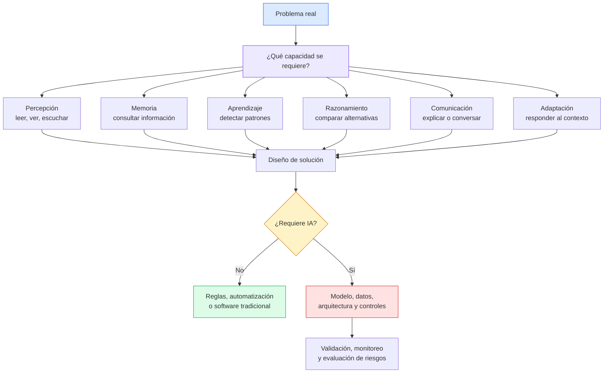

# Diagramas — Capítulo 1

**Capítulo:** 1 — ¿Qué entendemos por inteligencia?  
**Versión:** v0.5  
**Archivo relacionado:** `Modulo1/codex/capitulo-01-v0.5.md`

---

## Diagrama 1 — Del problema a la decisión de arquitectura

Este diagrama acompaña la sección "Diagrama Mermaid" del capítulo. Su función es mostrar que la decisión profesional no empieza por "usar IA", sino por identificar el problema y la capacidad requerida.

---

## Criterio editorial del diagrama

- Explica un concepto central, no decora.
- Refuerza la filosofía del libro: problema antes que herramienta.
- Introduce capacidades asociadas con inteligencia sin convertirlas en una taxonomía rígida.
- Muestra que la alternativa sin IA sigue siendo una decisión válida.
- Conecta el Capítulo 1 con decisiones arquitectónicas que se desarrollarán en capítulos posteriores.
