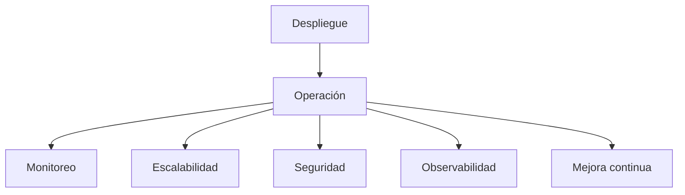

# Capítulo 10 — Operación y Escalabilidad de Soluciones de IA
## Sección 01 — De la Implementación a la Operación Continua

**Versión:** 1.0  
**Estado:** Aprobado para publicación

> *"Una solución de IA comienza a demostrar su verdadero valor el día que entra en producción."*

---

# Objetivos de aprendizaje

Al finalizar esta sección el lector será capaz de:

- comprender las diferencias entre desarrollar y operar una solución de IA;
- identificar los desafíos operativos propios de entornos empresariales;
- reconocer los componentes que intervienen en la operación continua;
- incorporar criterios operativos desde el diseño arquitectónico.

---

# Introducción

Construir una solución inteligente representa solo una parte del trabajo del Arquitecto de IA.

Una vez desplegada, la aplicación debe operar de forma estable, responder a cambios del negocio, adaptarse al crecimiento de usuarios y mantener niveles aceptables de calidad, seguridad y costos.

La operación deja de ser una actividad posterior al desarrollo para convertirse en un requisito arquitectónico.

---

# La operación como capacidad empresarial

Una plataforma de IA en producción requiere coordinar múltiples funciones.

Cada una de estas capacidades contribuye a mantener la disponibilidad y la evolución de la solución.

---

# Objetivos de la operación

La operación continua busca garantizar:

- disponibilidad del servicio;
- tiempos de respuesta consistentes;
- uso eficiente de recursos;
- continuidad del negocio;
- incorporación segura de cambios;
- respuesta rápida ante incidentes.

Estos objetivos deben definirse antes del primer despliegue.

---

# Caso de estudio

Una empresa pone en producción un asistente para atención interna.

Durante las primeras semanas el número de usuarios se triplica.

Gracias a que la arquitectura había sido diseñada con componentes desacoplados, monitoreo centralizado y mecanismos de escalado, el incremento de carga se absorbe sin modificar la lógica de negocio.

La estabilidad obtenida no depende únicamente del modelo de IA, sino de la preparación operativa de toda la plataforma.

---

# Buenas prácticas

- Diseñar pensando en la operación desde las primeras etapas.
- Automatizar tareas repetitivas de despliegue y supervisión.
- Definir indicadores operativos antes de la puesta en producción.
- Mantener procedimientos documentados para incidentes y recuperación.
- Revisar periódicamente capacidad, costos y utilización.

---

# Errores frecuentes

- Considerar finalizado el proyecto tras el despliegue.
- Diseñar sin objetivos operativos medibles.
- Depender de intervenciones manuales para tareas críticas.
- Separar completamente arquitectura y operación.

---

# Ideas clave

- Operar una solución de IA requiere capacidades adicionales al desarrollo.
- La operación continua forma parte del diseño arquitectónico.
- Escalabilidad, monitoreo y resiliencia deben planificarse desde el inicio.

---

# Transición hacia la siguiente sección

La próxima sección analizará las estrategias de despliegue para aplicaciones inteligentes, comparando distintos enfoques de operación y su impacto sobre disponibilidad, riesgo y evolución.

---

> **"Un arquitecto no memoriza respuestas. Comprende problemas para poder diseñar soluciones."**
