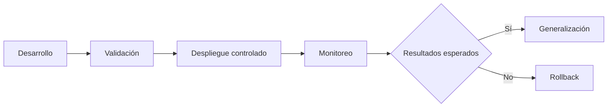

# Capítulo 10 — Operación y Escalabilidad de Soluciones de IA
## Sección 02 — Estrategias de Despliegue para Aplicaciones Inteligentes

**Versión:** 1.0  
**Estado:** Aprobado para publicación

> *"Desplegar una solución de IA no consiste únicamente en publicar código; consiste en introducir cambios minimizando el riesgo para el negocio."*

---

# Objetivos de aprendizaje

Al finalizar esta sección el lector será capaz de:

- comprender las principales estrategias de despliegue utilizadas en soluciones empresariales de IA;
- evaluar el impacto de cada estrategia sobre disponibilidad y riesgo;
- seleccionar un enfoque de despliegue alineado con los objetivos del negocio;
- incorporar el despliegue continuo como parte de la arquitectura.

---

# Introducción

Cada nueva versión de una aplicación inteligente puede incorporar cambios en modelos, prompts, bases de conocimiento, reglas de negocio o integraciones.

Aplicar estos cambios directamente sobre todos los usuarios incrementa el riesgo operativo.

Por ello, una arquitectura madura contempla mecanismos que permitan introducir modificaciones de forma gradual, controlada y reversible.

---

# El despliegue como proceso

El objetivo no es acelerar el despliegue a cualquier costo, sino reducir la probabilidad de incidentes.

---

# Estrategias habituales

| Estrategia | Características | Escenario recomendado |
|------------|-----------------|-----------------------|
| Reemplazo directo | Actualización inmediata | Sistemas de bajo impacto |
| Despliegue gradual | Incorporación progresiva de usuarios | Plataformas empresariales |
| Paralelo | Convivencia temporal entre versiones | Validación de cambios relevantes |
| Canario | Exposición inicial a un grupo reducido | Cambios frecuentes con bajo riesgo aceptable |

La elección depende del nivel de criticidad del sistema y del costo asociado a una eventual reversión.

---

# Consideraciones específicas para IA

En soluciones inteligentes, un despliegue puede involucrar mucho más que una nueva versión del software.

Entre los elementos que suelen evolucionar se encuentran:

- modelos de lenguaje;
- prompts del sistema;
- índices vectoriales;
- bases documentales;
- reglas de orquestación;
- herramientas disponibles para agentes.

Cada uno de estos componentes requiere validaciones independientes antes de extender el cambio al resto de la organización.

---

# Caso de estudio

Una empresa actualiza el modelo utilizado por su asistente corporativo.

En lugar de sustituir inmediatamente la versión anterior, expone el nuevo modelo únicamente al 10 % de los usuarios internos.

Durante una semana compara indicadores de calidad, latencia, costos y satisfacción.

Tras confirmar que los resultados cumplen los objetivos definidos, amplía progresivamente el alcance hasta completar la migración.

La estrategia reduce significativamente el riesgo de afectar la operación diaria.

---

# Buenas prácticas

- Automatizar el proceso de despliegue siempre que sea posible.
- Mantener mecanismos de reversión rápidos.
- Versionar todos los componentes de la solución.
- Comparar métricas antes y después de cada cambio.
- Documentar los criterios de aprobación para nuevas versiones.

---

# Errores frecuentes

- Actualizar múltiples componentes simultáneamente sin validación.
- Carecer de un plan de rollback.
- Desplegar cambios sin monitoreo posterior.
- Asumir que una mejora técnica siempre producirá una mejora operativa.

---

# Ideas clave

- Desplegar implica gestionar riesgos además de distribuir software.
- La evolución de una solución de IA debe realizarse de forma incremental.
- El monitoreo posterior al despliegue resulta tan importante como la validación previa.

---

# Transición hacia la siguiente sección

La próxima sección abordará las estrategias de escalabilidad para aplicaciones inteligentes, analizando cómo responder al crecimiento de usuarios, datos y cargas de trabajo sin comprometer la calidad del servicio.

---

> **"Un arquitecto no memoriza respuestas. Comprende problemas para poder diseñar soluciones."**
