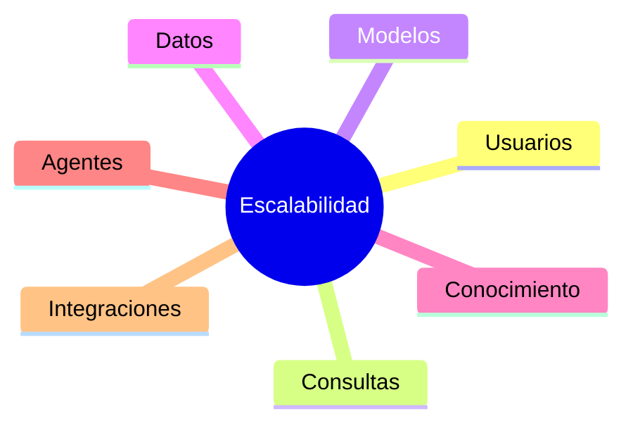

# Capítulo 10 — Operación y Escalabilidad de Soluciones de IA
## Sección 03 — Escalabilidad de Plataformas de IA

**Versión:** 1.0  
**Estado:** Aprobado para publicación

> *"Escalar una solución de IA no consiste únicamente en agregar recursos; consiste en preservar el nivel de servicio mientras el negocio crece."*

---

# Objetivos de aprendizaje

Al finalizar esta sección el lector será capaz de:

- comprender los distintos tipos de escalabilidad aplicables a soluciones de IA;
- identificar los factores que condicionan el crecimiento de una plataforma;
- diseñar arquitecturas preparadas para incrementos de carga;
- equilibrar rendimiento, disponibilidad y costos durante la expansión del sistema.

---

# Introducción

Toda solución exitosa enfrenta tarde o temprano el mismo desafío: crecer.

El aumento de usuarios, documentos, consultas, modelos, agentes o procesos incrementa la demanda sobre la infraestructura y sobre la arquitectura.

El objetivo no consiste únicamente en soportar mayor volumen, sino en hacerlo manteniendo la calidad del servicio y la experiencia del usuario.

---

# Dimensiones de la escalabilidad

Cada dimensión puede evolucionar de forma independiente y requerir estrategias específicas.

---

# Escalabilidad horizontal y vertical

Dos enfoques predominan en arquitecturas empresariales.

**Escalabilidad vertical**

Consiste en incrementar la capacidad de un componente existente mediante más CPU, memoria o aceleradores especializados.

Ventajas:

- simplicidad operativa;
- menor complejidad inicial.

Limitaciones:

- capacidad máxima finita;
- mayor dependencia de un único nodo.

**Escalabilidad horizontal**

Consiste en distribuir la carga entre múltiples instancias equivalentes.

Ventajas:

- mayor resiliencia;
- crecimiento gradual;
- mejor tolerancia a fallos.

Limitaciones:

- mayor complejidad de coordinación;
- necesidad de balanceo y sincronización.

La elección depende del contexto operativo y de los objetivos del negocio.

---

# Componentes que suelen escalar de forma independiente

En una plataforma moderna no todos los componentes evolucionan al mismo ritmo.

Por ejemplo:

| Componente | Motivo habitual de crecimiento |
|------------|--------------------------------|
| Servicios de IA | Incremento de consultas |
| Base documental | Nuevas fuentes de conocimiento |
| Orquestador | Mayor número de procesos |
| Observabilidad | Más eventos y métricas |
| Integraciones | Nuevos sistemas corporativos |

Diseñar cada componente para escalar de manera independiente reduce costos y simplifica la operación.

---

# Caso de estudio

Una compañía comienza con un asistente interno utilizado por cincuenta personas.

Un año después, el sistema presta servicio a ocho países y varios miles de empleados.

La arquitectura permite escalar de forma independiente el motor de recuperación documental, los servicios de inferencia y el componente de observabilidad.

El crecimiento se realiza sin modificar la lógica de negocio ni la experiencia del usuario.

---

# Buenas prácticas

- Identificar cuellos de botella antes de que afecten la operación.
- Escalar únicamente los componentes necesarios.
- Automatizar el aprovisionamiento de capacidad.
- Definir objetivos de rendimiento medibles.
- Revisar periódicamente la utilización real de recursos.

---

# Errores frecuentes

- Escalar toda la plataforma ante un problema localizado.
- Diseñar componentes imposibles de distribuir.
- Ignorar el crecimiento del conocimiento corporativo.
- Considerar únicamente el rendimiento del modelo de IA.

---

# Ideas clave

- Escalar implica preservar la calidad mientras aumenta la demanda.
- Los distintos componentes evolucionan a velocidades diferentes.
- La arquitectura debe facilitar un crecimiento gradual y controlado.

---

# Transición hacia la siguiente sección

La próxima sección analizará la optimización de costos operativos, explicando cómo equilibrar rendimiento, disponibilidad y consumo de recursos durante la operación continua de soluciones empresariales de IA.

---

> **"Un arquitecto no memoriza respuestas. Comprende problemas para poder diseñar soluciones."**
