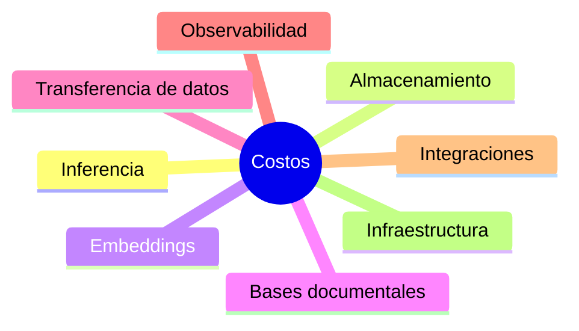

# Capítulo 10 — Operación y Escalabilidad de Soluciones de IA
## Sección 04 — Optimización de Costos en Plataformas de Inteligencia Artificial

**Versión:** 1.0  
**Estado:** Aprobado para publicación

> *"Una arquitectura eficiente no es la que consume más recursos, sino la que utiliza únicamente los necesarios para cumplir los objetivos del negocio."*

---

# Objetivos de aprendizaje

Al finalizar esta sección el lector será capaz de:

- comprender los principales factores que influyen en el costo operativo de una solución de IA;
- identificar decisiones arquitectónicas con impacto económico;
- equilibrar rendimiento, disponibilidad y costos;
- incorporar la optimización continua como parte de la operación.

---

# Introducción

Una solución de IA puede ser técnicamente excelente y, sin embargo, resultar inviable desde el punto de vista económico.

La operación continua implica consumir infraestructura, modelos, almacenamiento, redes y servicios de integración.

Por ello, el Arquitecto de IA debe considerar el costo como un atributo de calidad y no únicamente como una restricción presupuestaria.

---

# ¿Dónde se generan los costos?

Cada componente contribuye al costo total y puede optimizarse mediante decisiones de diseño.

---

# Decisiones arquitectónicas con impacto económico

| Decisión | Impacto esperado |
|----------|------------------|
| Selección del modelo | Consumo de recursos y costo por inferencia |
| Estrategia RAG | Reducción de consultas innecesarias |
| Caché de respuestas | Disminución de procesamiento repetitivo |
| Escalado automático | Mejor utilización de infraestructura |
| Desacoplamiento | Evolución sin reemplazar toda la plataforma |

El objetivo consiste en maximizar el valor obtenido por cada recurso consumido.

---

# Optimización continua

La optimización no debe realizarse únicamente cuando aparecen problemas.

Una plataforma madura revisa periódicamente:

- utilización de recursos;
- crecimiento del conocimiento;
- consultas repetitivas;
- latencia;
- disponibilidad;
- costo por interacción;
- costo total de operación.

Estos indicadores permiten ajustar la arquitectura antes de que el crecimiento afecte la sostenibilidad del sistema.

---

# Caso de estudio

Una empresa detecta que más del 40 % de las consultas recibidas corresponden a preguntas frecuentes con respuestas prácticamente idénticas.

La arquitectura incorpora un mecanismo de caché para respuestas estables y evita invocar el modelo en esos escenarios.

La medida reduce significativamente el consumo de recursos sin modificar la experiencia del usuario.

El ahorro proviene de una decisión arquitectónica y no de un cambio tecnológico.

---

# Buenas prácticas

- Medir el costo por proceso de negocio y no solo por componente.
- Automatizar el escalado cuando resulte conveniente.
- Revisar periódicamente recursos infrautilizados.
- Evitar consultas repetitivas mediante estrategias de reutilización.
- Incorporar indicadores financieros al tablero operativo.

---

# Errores frecuentes

- Dimensionar permanentemente para la carga máxima.
- Optimizar únicamente infraestructura e ignorar la arquitectura.
- No medir el costo por interacción.
- Introducir componentes que no aportan valor al negocio.

---

# Ideas clave

- El costo constituye un atributo arquitectónico.
- Optimizar significa eliminar desperdicio sin degradar la calidad.
- La eficiencia operacional requiere medición continua y decisiones basadas en evidencia.

---

# Transición hacia la siguiente sección

La próxima sección analizará la resiliencia operacional y la continuidad del negocio, abordando estrategias para mantener la disponibilidad de soluciones de IA frente a fallos, degradaciones y cambios del entorno.

---

> **"Un arquitecto no memoriza respuestas. Comprende problemas para poder diseñar soluciones."**
