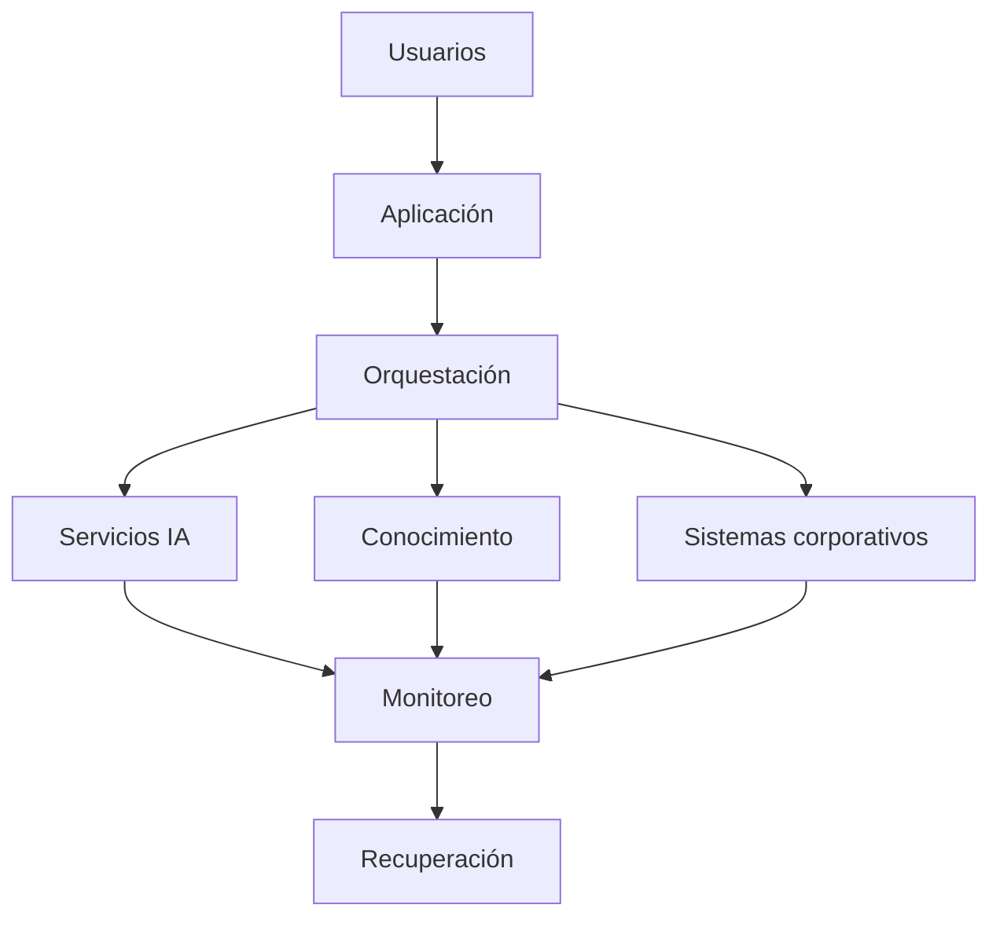

# Capítulo 10 — Operación y Escalabilidad de Soluciones de IA
## Sección 05 — Resiliencia Operacional y Continuidad del Negocio

**Versión:** 1.0  
**Estado:** Aprobado para publicación

> *"La calidad de una plataforma se pone a prueba cuando las condiciones dejan de ser ideales."*

---

# Objetivos de aprendizaje

Al finalizar esta sección el lector será capaz de:

- comprender los principios de resiliencia aplicados a soluciones de IA;
- identificar estrategias para mantener la continuidad del servicio;
- diseñar arquitecturas preparadas para fallos parciales;
- incorporar la continuidad del negocio como atributo arquitectónico.

---

# Introducción

Toda plataforma empresarial enfrentará incidentes: caídas de infraestructura, indisponibilidad de servicios externos, errores humanos, problemas de red o cambios inesperados en la demanda.

El objetivo de una arquitectura resiliente no consiste en impedir cualquier fallo, sino en minimizar su impacto sobre el negocio y recuperar el servicio de manera controlada.

En soluciones de IA, donde intervienen modelos, repositorios documentales, servicios de inferencia y múltiples integraciones, la resiliencia adquiere una importancia aún mayor.

---

# Capas de resiliencia

La resiliencia debe contemplarse en todos los niveles de la arquitectura y no únicamente en la infraestructura.

---

# Estrategias de continuidad

Una plataforma madura incorpora mecanismos como:

- redundancia de componentes críticos;
- balanceo de carga;
- reintentos controlados;
- degradación funcional;
- copias de seguridad;
- planes de recuperación;
- procedimientos documentados para incidentes.

Cada mecanismo reduce un tipo específico de riesgo operativo.

---

# Degradación controlada

Cuando un componente deja de estar disponible, la aplicación no necesariamente debe dejar de funcionar.

Algunas alternativas son:

- responder utilizando información previamente almacenada;
- limitar funcionalidades no esenciales;
- derivar procesos a revisión humana;
- utilizar un servicio alternativo.

El objetivo es preservar la operación del negocio mientras se resuelve el incidente.

---

# Caso de estudio

Una organización utiliza un asistente corporativo conectado a varios sistemas internos.

Durante una interrupción temporal del repositorio documental, el motor de recuperación deja de estar disponible.

La arquitectura detecta el incidente, informa al usuario que las respuestas pueden estar limitadas, mantiene operativas las consultas generales y deriva automáticamente los casos críticos al equipo de soporte.

El servicio continúa disponible, aunque con capacidades reducidas.

La continuidad del negocio se preserva sin ocultar la degradación existente.

---

# Buenas prácticas

- Identificar los componentes cuya indisponibilidad afecta directamente al negocio.
- Diseñar procedimientos de recuperación antes del despliegue.
- Automatizar verificaciones periódicas de disponibilidad.
- Ejecutar pruebas de recuperación de forma planificada.
- Mantener documentación actualizada sobre los procedimientos operativos.

---

# Errores frecuentes

- Suponer que la infraestructura por sí sola garantiza resiliencia.
- No probar los procedimientos de recuperación.
- Depender de un único componente crítico.
- Diseñar aplicaciones incapaces de operar con funcionalidades degradadas.

---

# Ideas clave

- La resiliencia combina arquitectura, operación y procesos.
- La continuidad del negocio debe priorizarse frente a la recuperación tecnológica.
- Una plataforma preparada para fallos ofrece mayor confianza y menor riesgo operativo.

---

# Transición hacia la siguiente sección

La próxima sección analizará la observabilidad operacional, mostrando cómo métricas, registros y trazas permiten detectar incidentes, comprender su origen y acelerar la mejora continua de plataformas empresariales de Inteligencia Artificial.

---

> **"Un arquitecto no memoriza respuestas. Comprende problemas para poder diseñar soluciones."**
