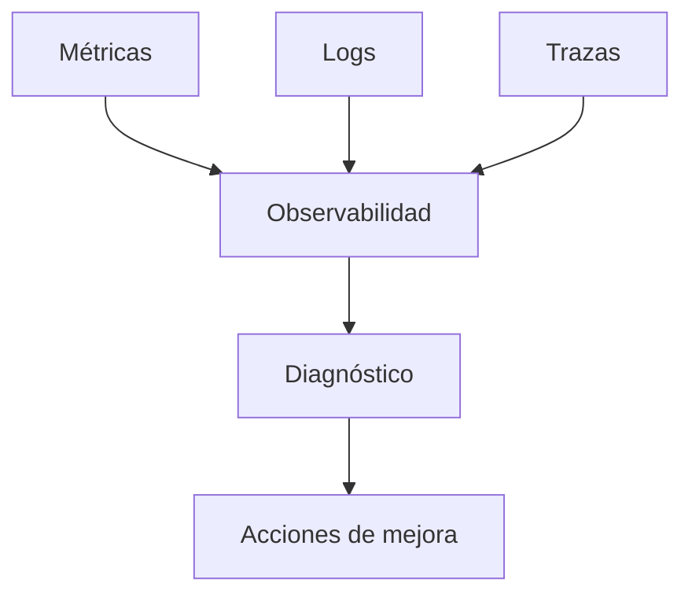

# Capítulo 10 — Operación y Escalabilidad de Soluciones de IA
## Sección 06 — Observabilidad Operacional en Plataformas de IA

**Versión:** 1.0  
**Estado:** Aprobado para publicación

> *"Operar con confianza requiere comprender el comportamiento del sistema en todo momento, no únicamente cuando aparece un incidente."*

---

# Objetivos de aprendizaje

Al finalizar esta sección el lector será capaz de:

- comprender el papel de la observabilidad durante la operación de soluciones de IA;
- diferenciar métricas, registros y trazas;
- diseñar mecanismos de diagnóstico para plataformas inteligentes;
- incorporar la observabilidad como una capacidad permanente de la arquitectura.

---

# Introducción

Una plataforma de IA puede encontrarse disponible y, aun así, ofrecer respuestas de baja calidad, consumir recursos de forma excesiva o degradar progresivamente la experiencia del usuario.

Detectar estas situaciones exige observar el comportamiento integral del sistema.

La observabilidad proporciona el contexto necesario para comprender qué ocurre, por qué ocurre y cómo responder de manera efectiva.

---

# Los tres pilares de la observabilidad

Cada tipo de información responde preguntas diferentes y, en conjunto, permite reconstruir el comportamiento de la plataforma.

---

# ¿Qué conviene observar?

Además de los indicadores clásicos de infraestructura, una solución de IA debería registrar:

- latencia por tipo de consulta;
- utilización de modelos;
- recuperación documental;
- tasa de éxito de agentes;
- tiempos de ejecución por etapa;
- costos por interacción;
- errores de integración;
- indicadores de calidad definidos por el negocio.

La combinación de métricas técnicas y funcionales facilita una visión completa de la operación.

---

# Observabilidad orientada al negocio

Una arquitectura madura no limita la observación al estado de los servidores.

También responde preguntas como:

- ¿Se redujo el tiempo de resolución de consultas?
- ¿Cuántos procesos fueron automatizados?
- ¿Qué porcentaje de respuestas requirió intervención humana?
- ¿Qué dominios generan mayor volumen de consultas?

Estas métricas permiten evaluar si la solución continúa generando valor.

---

# Caso de estudio

Una organización detecta que la infraestructura mantiene niveles normales de utilización, pero el tiempo promedio de atención aumenta de forma sostenida.

El análisis de trazas revela que una nueva fuente documental incrementó significativamente el tiempo de recuperación de contexto.

La arquitectura permite identificar el componente afectado, optimizar la estrategia de indexación y recuperar el rendimiento esperado sin modificar el modelo de lenguaje.

---

# Buenas prácticas

- Diseñar la observabilidad desde el inicio del proyecto.
- Correlacionar métricas técnicas con indicadores del negocio.
- Centralizar eventos relevantes para facilitar el análisis.
- Definir alertas basadas en umbrales significativos.
- Revisar periódicamente la efectividad de los indicadores.

---

# Errores frecuentes

- Monitorear únicamente infraestructura.
- Registrar grandes volúmenes de datos sin objetivos definidos.
- Carecer de trazabilidad entre componentes.
- No utilizar la información recolectada para mejorar la plataforma.

---

# Ideas clave

- La observabilidad acelera el diagnóstico y la mejora continua.
- Las métricas del negocio son tan importantes como las métricas técnicas.
- Una plataforma observable evoluciona con menor riesgo operativo.

---

# Transición hacia la siguiente sección

La próxima sección abordará la automatización de la operación mediante procesos de autosanación, escalado dinámico y gestión inteligente de recursos para plataformas empresariales de Inteligencia Artificial.

---

> **"Un arquitecto no memoriza respuestas. Comprende problemas para poder diseñar soluciones."**
