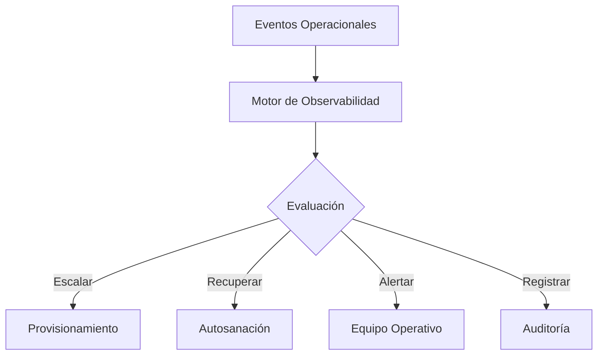

# Capítulo 10 — Operación y Escalabilidad de Soluciones de IA
## Sección 07 — Automatización Operacional y Plataformas Autoadaptativas

**Versión:** 1.0  
**Estado:** Aprobado para publicación

> *"La excelencia operacional se alcanza cuando la plataforma puede detectar, analizar y responder a determinadas situaciones sin intervención humana, manteniendo siempre el control arquitectónico."*

---

# Objetivos de aprendizaje

Al finalizar esta sección el lector será capaz de:

- comprender el papel de la automatización en la operación de plataformas de IA;
- identificar escenarios donde la plataforma puede responder automáticamente;
- diferenciar automatización operativa de autonomía de negocio;
- diseñar arquitecturas preparadas para evolucionar mediante mecanismos de autosanación y autoescalado.

---

# Introducción

La operación manual resulta suficiente durante las primeras etapas de un proyecto.

Sin embargo, a medida que aumentan la cantidad de usuarios, componentes y procesos, la complejidad operacional crece más rápido que la capacidad del equipo para administrarla manualmente.

La automatización permite mantener estabilidad, reducir tiempos de respuesta y minimizar errores repetitivos.

El objetivo no consiste en eliminar a los operadores, sino en liberar tiempo para tareas de mayor valor.

---

# Automatización dentro de la plataforma

Las decisiones automatizadas deben estar gobernadas por políticas previamente definidas y nunca reemplazar el control organizacional.

---

# Automatizaciones habituales

Una plataforma empresarial puede automatizar procesos como:

- escalado dinámico de servicios;
- reinicio controlado de componentes;
- limpieza de recursos temporales;
- rotación de credenciales y certificados;
- actualización de índices documentales;
- validación periódica de integraciones;
- generación de reportes operativos.

Estas acciones reducen la carga operativa sin modificar las decisiones propias del negocio.

---

# Autosanación

La autosanación consiste en aplicar respuestas automáticas frente a fallos conocidos.

Por ejemplo:

- reiniciar un servicio que dejó de responder;
- reemplazar una instancia degradada;
- redirigir tráfico hacia componentes disponibles;
- recuperar procesos interrumpidos.

El beneficio principal reside en disminuir el tiempo de recuperación sin esperar una intervención manual.

---

# Caso de estudio

Una organización opera una plataforma de asistentes internos utilizada por miles de empleados.

El monitoreo detecta que una de las instancias encargadas de recuperar documentos presenta tiempos de respuesta superiores al umbral definido.

Automáticamente se inicia una nueva instancia, se redistribuye la carga y se registra el incidente para su análisis posterior.

Los usuarios continúan utilizando el sistema sin percibir la degradación ocurrida.

La automatización mejora la continuidad operativa sin modificar el comportamiento funcional de la aplicación.

---

# Buenas prácticas

- Automatizar únicamente procesos repetitivos y bien conocidos.
- Mantener políticas explícitas para cada acción automática.
- Registrar todas las decisiones tomadas por la plataforma.
- Validar periódicamente la efectividad de las automatizaciones.
- Permitir intervención humana cuando la situación lo requiera.

---

# Errores frecuentes

- Automatizar procesos cuya lógica aún no está estabilizada.
- Eliminar completamente la supervisión humana.
- Ejecutar acciones automáticas sin auditoría.
- Incrementar la complejidad operativa mediante automatizaciones innecesarias.

---

# Ideas clave

- Automatizar mejora la eficiencia operacional cuando existe una arquitectura sólida.
- La autosanación reduce tiempos de recuperación frente a incidentes conocidos.
- La automatización debe complementar la operación humana y no reemplazarla.

---

# Transición hacia la siguiente sección

La próxima sección integrará los conceptos de operación, escalabilidad, resiliencia y automatización mediante un caso de estudio completo sobre la evolución operacional de una plataforma empresarial basada en Inteligencia Artificial.

---

> **"Un arquitecto no memoriza respuestas. Comprende problemas para poder diseñar soluciones."**
