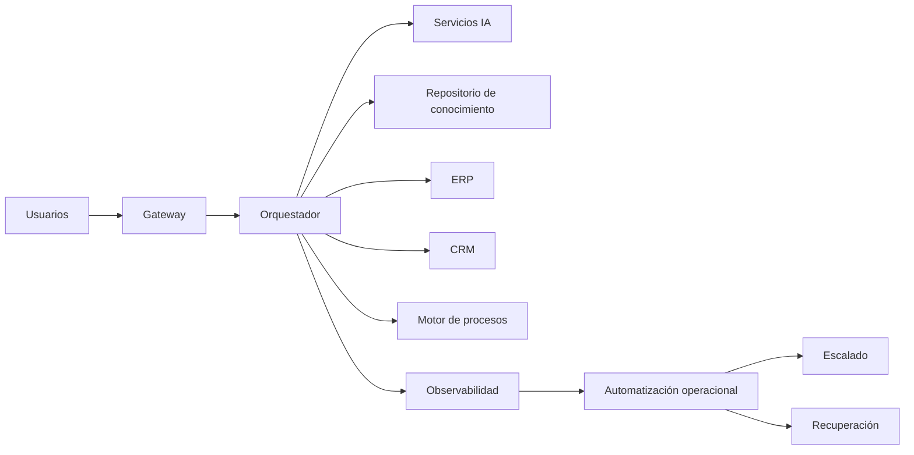

# Capítulo 10 — Operación y Escalabilidad de Soluciones de IA
## Sección 08 — Caso de Estudio: Operación de una Plataforma Empresarial de IA a Gran Escala

**Versión:** 1.0  
**Estado:** Aprobado para publicación

> *"La verdadera madurez de una plataforma no se demuestra el día de su despliegue, sino durante los años en que debe seguir evolucionando sin interrumpir el negocio."*

---

# Objetivos de aprendizaje

Al finalizar esta sección el lector será capaz de:

- integrar los conceptos de operación, escalabilidad y resiliencia en un escenario empresarial;
- comprender cómo evolucionan las plataformas de IA durante su vida útil;
- analizar decisiones arquitectónicas desde una perspectiva operacional;
- identificar mecanismos para sostener el crecimiento sin perder estabilidad.

---

# Escenario

Una organización multinacional implementa una plataforma de IA para asistir a empleados de distintas áreas: soporte, compras, recursos humanos, legal y finanzas.

La solución integra:

- autenticación corporativa;
- recuperación de conocimiento mediante RAG;
- servicios de IA para generación y clasificación;
- agentes para automatizar procesos repetitivos;
- sistemas corporativos existentes.

El volumen inicial es de unos cientos de consultas diarias, con una proyección de crecimiento constante.

---

# Arquitectura operacional

La operación se diseña como una capacidad transversal y no como un componente aislado.

---

# Evolución de la plataforma

Durante los primeros meses aparecen nuevos requerimientos:

- incorporación de más áreas de negocio;
- incremento de consultas concurrentes;
- nuevas bases documentales;
- actualización periódica de modelos;
- mayor cantidad de integraciones.

Gracias al desacoplamiento entre componentes, la plataforma evoluciona mediante cambios incrementales sin afectar la experiencia de los usuarios.

---

# Decisiones arquitectónicas

| Desafío | Respuesta arquitectónica |
|---------|--------------------------|
| Mayor demanda | Escalado independiente de servicios |
| Nuevas fuentes documentales | Indexación incremental |
| Cambios de modelos | Servicios desacoplados |
| Crecimiento operativo | Automatización de tareas repetitivas |
| Incremento del riesgo | Observabilidad y auditoría centralizadas |

Cada decisión reduce el impacto del crecimiento sobre la operación cotidiana.

---

# Resultados

La plataforma mantiene:

- disponibilidad consistente;
- tiempos de respuesta estables;
- incorporación continua de nuevas capacidades;
- reducción del esfuerzo operativo;
- control sobre costos y utilización de recursos.

El éxito no depende únicamente del rendimiento del modelo, sino de una arquitectura diseñada para evolucionar.

---

# Buenas prácticas

- Diseñar la operación antes del crecimiento.
- Automatizar procesos repetitivos y verificables.
- Medir permanentemente indicadores técnicos y de negocio.
- Evolucionar la plataforma mediante cambios pequeños.
- Mantener componentes reemplazables y desacoplados.

---

# Errores frecuentes

- Tratar la operación como una actividad posterior al desarrollo.
- Escalar toda la plataforma frente a un único cuello de botella.
- Introducir cambios sin monitoreo posterior.
- Ignorar el crecimiento del conocimiento corporativo.

---

# Ideas clave

- La operación continua constituye una disciplina de ingeniería.
- Escalabilidad, resiliencia y automatización forman un único sistema.
- Una arquitectura preparada para evolucionar reduce riesgos y costos a largo plazo.

---

# Transición hacia la siguiente sección

La próxima y última sección del capítulo sintetizará los principios presentados, propondrá un checklist operativo para arquitectos de IA y cerrará el capítulo estableciendo el vínculo con el siguiente eje temático del libro.

---

> **"Un arquitecto no memoriza respuestas. Comprende problemas para poder diseñar soluciones."**
