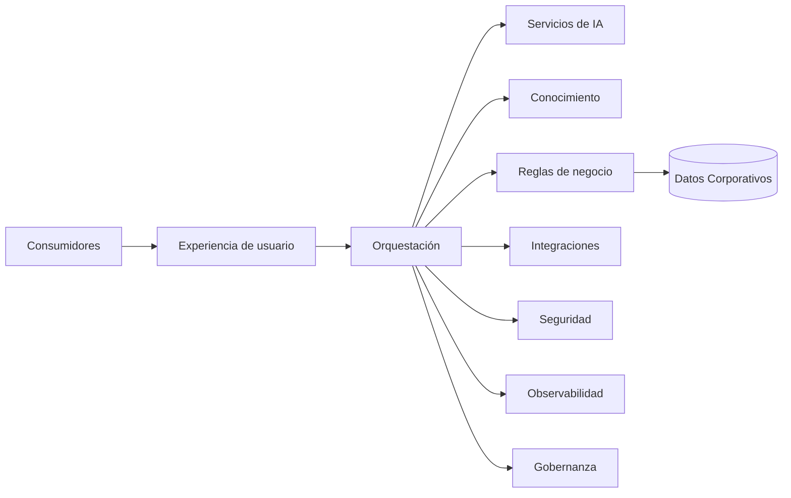

# Capítulo 11 — Arquitecturas de Referencia para Soluciones de Inteligencia Artificial
## Sección 02 — Bloques Funcionales de una Arquitectura de Referencia para IA

**Versión:** 1.0  
**Estado:** Aprobado para publicación

> *"Las arquitecturas sólidas se construyen combinando capacidades bien definidas, no acumulando tecnologías."*

---

# Objetivos de aprendizaje

Al finalizar esta sección el lector será capaz de:

- identificar los bloques funcionales presentes en la mayoría de las arquitecturas empresariales de IA;
- comprender la responsabilidad de cada bloque;
- diferenciar capacidades funcionales de implementaciones tecnológicas;
- utilizar estos bloques como base para diseñar nuevas soluciones.

---

# Introducción

Aunque los casos de uso varían entre industrias, la mayoría de las soluciones empresariales de Inteligencia Artificial comparten un conjunto reducido de capacidades esenciales.

Estas capacidades constituyen los bloques funcionales de una arquitectura de referencia.

No representan productos específicos ni obligan a utilizar una tecnología determinada.

Representan responsabilidades que toda arquitectura debe contemplar.

---

# Vista funcional

Cada bloque puede implementarse mediante distintas tecnologías sin modificar la arquitectura conceptual.

---

# Responsabilidades de los bloques

| Bloque | Responsabilidad principal |
|--------|----------------------------|
| Experiencia de usuario | Interacción con personas y aplicaciones |
| Orquestación | Coordinar el flujo de trabajo |
| Servicios de IA | Inferencia, clasificación y generación |
| Conocimiento | Proveer contexto verificable |
| Reglas de negocio | Aplicar políticas organizacionales |
| Integraciones | Conectar sistemas corporativos |
| Seguridad | Gestionar identidad, permisos y protección |
| Observabilidad | Medir, registrar y diagnosticar |
| Gobernanza | Asegurar control, auditoría y evolución |

La separación de responsabilidades permite que cada bloque evolucione de manera independiente.

---

# Relaciones entre bloques

Los bloques no funcionan de forma aislada.

La orquestación coordina la interacción entre ellos.

Las reglas de negocio determinan cuándo utilizar capacidades de IA.

La seguridad protege todos los flujos.

La observabilidad registra el comportamiento del conjunto.

La gobernanza define las políticas que condicionan la evolución de la plataforma.

Este enfoque reduce el acoplamiento y facilita la incorporación de nuevas capacidades sin rediseñar la arquitectura.

---

# Caso de estudio

Una empresa incorpora un nuevo servicio de resumen automático de documentos.

Gracias a la arquitectura de referencia existente, únicamente se añade un nuevo servicio dentro del bloque de IA.

La autenticación, la auditoría, la observabilidad, las reglas de negocio y las integraciones continúan reutilizando los componentes existentes.

El tiempo de incorporación disminuye considerablemente porque la arquitectura ya contemplaba la distribución de responsabilidades.

---

# Buenas prácticas

- Diseñar bloques funcionales independientes de tecnologías concretas.
- Mantener contratos claros entre componentes.
- Evitar responsabilidades duplicadas.
- Reutilizar capacidades comunes entre proyectos.
- Revisar periódicamente la arquitectura de referencia para incorporar nuevos patrones.

---

# Errores frecuentes

- Confundir componentes funcionales con productos comerciales.
- Concentrar demasiadas responsabilidades en un único bloque.
- Duplicar servicios compartidos entre soluciones.
- Diseñar arquitecturas específicas imposibles de reutilizar.

---

# Ideas clave

- Los bloques funcionales representan capacidades, no herramientas.
- Una buena arquitectura distribuye responsabilidades con claridad.
- La reutilización arquitectónica acelera el desarrollo y mejora la gobernanza.

---

# Transición hacia la siguiente sección

La próxima sección analizará los patrones arquitectónicos más utilizados para combinar estos bloques funcionales y construir soluciones empresariales escalables, resilientes y preparadas para evolucionar.

---

> **"Un arquitecto no memoriza respuestas. Comprende problemas para poder diseñar soluciones."**
