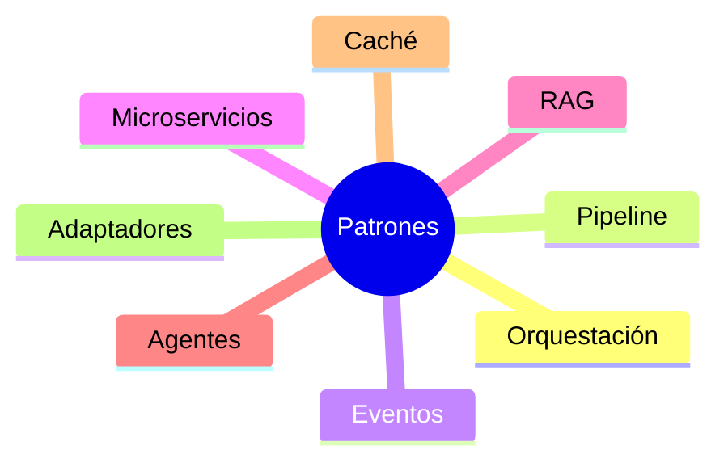
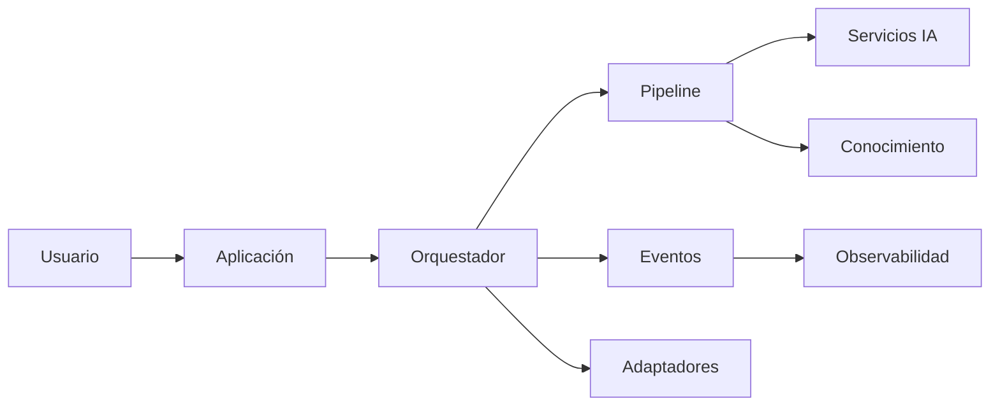

# Capítulo 11 — Arquitecturas de Referencia para Soluciones de Inteligencia Artificial
## Sección 03 — Patrones Arquitectónicos para Soluciones Empresariales de IA

**Versión:** 1.0  
**Estado:** Aprobado para publicación

> *"Los patrones arquitectónicos permiten reutilizar experiencia acumulada para resolver problemas recurrentes con mayor consistencia."*

---

# Objetivos de aprendizaje

Al finalizar esta sección el lector será capaz de:

- identificar los principales patrones arquitectónicos utilizados en soluciones de IA;
- comprender cuándo aplicar cada patrón;
- evaluar ventajas, limitaciones y compromisos de diseño;
- seleccionar patrones alineados con los objetivos del negocio.

---

# Introducción

Las arquitecturas de referencia establecen la organización general de una solución.

Los patrones arquitectónicos, en cambio, resuelven problemas recurrentes que aparecen durante el diseño.

Un mismo sistema puede combinar múltiples patrones según sus requisitos funcionales y no funcionales.

La decisión correcta depende del contexto y no de preferencias tecnológicas.

---

# Patrones más frecuentes

Cada patrón responde a una necesidad específica y puede coexistir con los demás.

---

# Comparación de patrones

| Patrón | Cuándo utilizarlo | Beneficio principal |
|--------|-------------------|---------------------|
| Orquestación | Procesos con múltiples pasos | Coordinación centralizada |
| Pipeline | Procesamiento secuencial | Separación de etapas |
| Eventos | Integración desacoplada | Escalabilidad y evolución |
| Microservicios | Dominios independientes | Despliegue y mantenimiento independientes |
| Adaptadores | Sistemas legados | Bajo acoplamiento |
| Caché | Consultas repetitivas | Reducción de latencia y costos |

La combinación adecuada depende de la complejidad del dominio y de la estrategia de evolución de la plataforma.

---

# Composición de patrones

La arquitectura se construye mediante la composición de patrones complementarios, evitando concentrar toda la lógica en un único componente.

---

# Caso de estudio

Una organización desarrolla un asistente para procesos de compras.

El flujo principal utiliza un patrón de orquestación para coordinar autenticación, recuperación documental y generación de respuestas.

Las notificaciones hacia otros sistemas se implementan mediante eventos, mientras que la conexión con el ERP corporativo utiliza adaptadores para aislar dependencias.

La combinación de patrones facilita la incorporación de nuevas capacidades sin afectar el funcionamiento existente.

---

# Buenas prácticas

- Seleccionar patrones en función del problema a resolver.
- Combinar patrones cuando aporten valor.
- Mantener responsabilidades claramente delimitadas.
- Documentar las decisiones arquitectónicas.
- Revisar periódicamente si los patrones continúan siendo adecuados.

---

# Errores frecuentes

- Aplicar un patrón por moda y no por necesidad.
- Utilizar microservicios para dominios simples.
- Centralizar toda la lógica en el orquestador.
- Ignorar el impacto operacional de cada patrón.

---

# Ideas clave

- Los patrones representan soluciones reutilizables a problemas recurrentes.
- Ningún patrón resulta universalmente superior.
- Una arquitectura empresarial suele combinar varios patrones de forma coherente.

---

# Transición hacia la siguiente sección

La próxima sección presentará arquitecturas de referencia para distintos tipos de soluciones de IA, analizando cómo adaptar estos patrones a escenarios empresariales concretos.

---

> **"Un arquitecto no memoriza respuestas. Comprende problemas para poder diseñar soluciones."**
