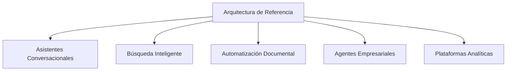

# Capítulo 11 — Arquitecturas de Referencia para Soluciones de Inteligencia Artificial
## Sección 04 — Arquitecturas de Referencia según el Tipo de Solución

**Versión:** 1.0  
**Estado:** Aprobado para publicación

> *"No existe una única arquitectura ideal; existe una arquitectura adecuada para cada problema de negocio."*

---

# Objetivos de aprendizaje

Al finalizar esta sección el lector será capaz de:

- reconocer diferentes familias de soluciones empresariales basadas en IA;
- adaptar una arquitectura de referencia según el caso de uso;
- identificar qué componentes permanecen estables y cuáles cambian;
- seleccionar una arquitectura alineada con los objetivos del negocio.

---

# Introducción

Las organizaciones implementan asistentes conversacionales, motores de búsqueda semántica, automatización documental, sistemas de recomendación y agentes capaces de ejecutar procesos completos.

Aunque estas soluciones comparten numerosos componentes, difieren en la forma en que los organizan y priorizan.

Una arquitectura de referencia debe ser suficientemente estable para facilitar la reutilización y suficientemente flexible para adaptarse a escenarios diversos.

---

# Variantes de arquitectura

Cada variante reutiliza principios comunes, modificando únicamente los componentes necesarios para cumplir objetivos específicos.

---

# Comparación de enfoques

| Tipo de solución | Capacidades predominantes | Componentes críticos |
|------------------|---------------------------|----------------------|
| Asistente conversacional | Comprensión y generación | Orquestación, IA, UX |
| Búsqueda semántica | Recuperación de conocimiento | Índices, RAG, autorización |
| Automatización documental | Clasificación y extracción | Pipeline, reglas de negocio |
| Agentes empresariales | Planificación y ejecución | Herramientas, supervisión, auditoría |
| Plataforma analítica | Inferencia y apoyo a decisiones | Datos, observabilidad, gobierno |

La diferencia principal no reside en la tecnología utilizada, sino en la distribución de responsabilidades dentro de la arquitectura.

---

# Componentes reutilizables

Independientemente del escenario, suelen mantenerse constantes:

- gestión de identidad;
- observabilidad;
- gobierno;
- seguridad;
- integración con sistemas corporativos;
- mecanismos de auditoría.

Esto permite construir un ecosistema coherente donde múltiples soluciones comparten capacidades transversales.

---

# Caso de estudio

Una organización comienza implementando un asistente interno para consultas sobre políticas corporativas.

Meses después incorpora un sistema de automatización documental y posteriormente agentes que ejecutan procesos administrativos.

En lugar de desarrollar tres plataformas independientes, reutiliza la misma arquitectura de referencia.

Solo cambian los componentes especializados de cada dominio, mientras que la autenticación, la observabilidad, la gobernanza y la integración permanecen inalteradas.

La estrategia reduce el tiempo de desarrollo y simplifica la operación.

---

# Buenas prácticas

- Reutilizar capacidades comunes entre soluciones.
- Adaptar la arquitectura al problema y no al revés.
- Mantener interfaces estables entre bloques funcionales.
- Diseñar componentes especializados con bajo acoplamiento.
- Documentar las variantes de la arquitectura de referencia.

---

# Errores frecuentes

- Crear una arquitectura completamente nueva para cada proyecto.
- Intentar utilizar exactamente la misma estructura en todos los escenarios.
- Duplicar capacidades transversales.
- Ignorar diferencias entre procesos de negocio.

---

# Ideas clave

- Las arquitecturas de referencia evolucionan mediante variantes controladas.
- Los componentes transversales favorecen la reutilización.
- La adaptación arquitectónica debe responder al contexto empresarial.

---

# Transición hacia la siguiente sección

La próxima sección analizará cómo evolucionan las arquitecturas de referencia a medida que crece el ecosistema de IA, incorporando nuevos dominios, plataformas y capacidades sin perder consistencia.

---

> **"Un arquitecto no memoriza respuestas. Comprende problemas para poder diseñar soluciones."**
