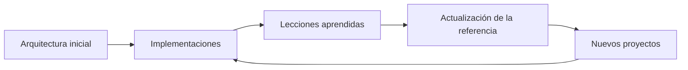

# Capítulo 11 — Arquitecturas de Referencia para Soluciones de Inteligencia Artificial
## Sección 05 — Evolución de las Arquitecturas de Referencia

**Versión:** 1.0  
**Estado:** Aprobado para publicación

> *"Las arquitecturas que sobreviven al paso del tiempo no son las más complejas, sino las que fueron diseñadas para evolucionar."*

---

# Objetivos de aprendizaje

Al finalizar esta sección el lector será capaz de:

- comprender cómo evolucionan las arquitecturas de referencia a lo largo del tiempo;
- identificar mecanismos que favorecen la adaptabilidad de una plataforma de IA;
- distinguir entre evolución arquitectónica y crecimiento tecnológico;
- incorporar estrategias de evolución continua al diseño empresarial.

---

# Introducción

Ninguna arquitectura permanece inalterable.

Cambian los procesos del negocio, aparecen nuevos modelos, evolucionan las regulaciones y se incorporan capacidades que no existían cuando la solución fue diseñada.

Por ello, una arquitectura de referencia debe concebirse como un activo vivo que evoluciona de manera controlada, preservando la coherencia del ecosistema tecnológico.

---

# Ciclo de evolución

Cada nuevo proyecto aporta conocimiento que puede incorporarse a la arquitectura de referencia, fortaleciendo futuras implementaciones.

---

# Factores que impulsan la evolución

Entre los cambios más frecuentes se encuentran:

- nuevos casos de uso;
- incorporación de modelos más eficientes;
- crecimiento del volumen de datos;
- nuevas exigencias regulatorias;
- aparición de plataformas y servicios especializados;
- cambios en la estrategia del negocio.

La arquitectura debe absorber estos cambios sin perder estabilidad.

---

# Principios para evolucionar

Una arquitectura de referencia madura debería:

- separar responsabilidades claramente;
- mantener contratos estables entre componentes;
- permitir reemplazar tecnologías sin afectar el diseño conceptual;
- favorecer la reutilización de capacidades comunes;
- documentar las decisiones arquitectónicas relevantes.

Estos principios reducen el costo asociado a la evolución continua.

---

# Caso de estudio

Una organización comienza utilizando modelos de lenguaje exclusivamente para asistencia documental.

Dos años después incorpora agentes autónomos, automatización de procesos y análisis predictivo.

Gracias a que la arquitectura de referencia había separado los bloques funcionales de las implementaciones tecnológicas, las nuevas capacidades se integran como extensiones naturales de la plataforma y no como soluciones paralelas.

La evolución ocurre mediante cambios incrementales, preservando la consistencia del ecosistema.

---

# Buenas prácticas

- Revisar periódicamente la arquitectura de referencia.
- Incorporar aprendizajes provenientes de proyectos reales.
- Evitar dependencias innecesarias con tecnologías específicas.
- Mantener documentación arquitectónica actualizada.
- Definir procesos formales para aprobar cambios estructurales.

---

# Errores frecuentes

- Considerar la arquitectura como un documento estático.
- Introducir excepciones permanentes para casos particulares.
- Modificar la referencia sin evaluar el impacto sobre otros proyectos.
- Acumular deuda técnica en nombre de la velocidad.

---

# Ideas clave

- La evolución debe ser planificada y gobernada.
- Una arquitectura de referencia mejora con la experiencia acumulada.
- Adaptarse al cambio es una característica de diseño, no una consecuencia fortuita.

---

# Transición hacia la siguiente sección

La próxima sección abordará la estandarización de plataformas de IA a nivel organizacional, mostrando cómo las arquitecturas de referencia facilitan la construcción de ecosistemas tecnológicos coherentes y sostenibles.

---

> **"Un arquitecto no memoriza respuestas. Comprende problemas para poder diseñar soluciones."**
