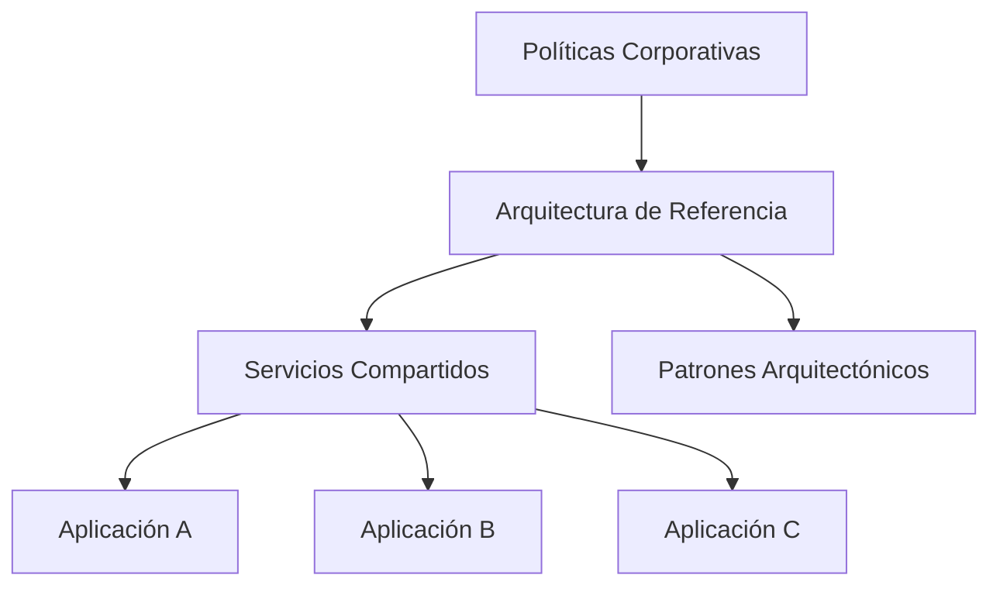

# Capítulo 11 — Arquitecturas de Referencia para Soluciones de Inteligencia Artificial
## Sección 06 — Estandarización de Plataformas Empresariales de IA

**Versión:** 1.0  
**Estado:** Aprobado para publicación

> *"La estandarización no reduce la innovación; crea una base estable para que la innovación pueda escalar."*

---

# Objetivos de aprendizaje

Al finalizar esta sección el lector será capaz de:

- comprender el valor de la estandarización en ecosistemas de IA;
- identificar qué elementos conviene estandarizar y cuáles mantener flexibles;
- diseñar plataformas reutilizables para múltiples equipos;
- reducir la deuda arquitectónica mediante capacidades compartidas.

---

# Introducción

Cuando una organización desarrolla una única solución de IA, las decisiones arquitectónicas suelen afectar exclusivamente a ese proyecto.

Sin embargo, cuando comienzan a coexistir asistentes, agentes, motores de búsqueda semántica, automatizaciones documentales y aplicaciones inteligentes, la ausencia de estándares provoca duplicación de esfuerzos, inconsistencias y mayores costos operativos.

La estandarización permite transformar soluciones aisladas en una plataforma empresarial.

---

# Capas de estandarización

Cada nueva solución reutiliza capacidades existentes en lugar de reconstruirlas.

---

# Capacidades que conviene estandarizar

Entre los componentes más adecuados para compartir se encuentran:

- autenticación y autorización;
- observabilidad;
- auditoría;
- gobierno;
- acceso a modelos;
- recuperación de conocimiento;
- integración con sistemas corporativos;
- gestión de configuración;
- monitoreo operacional.

Estos bloques constituyen la infraestructura común sobre la cual evolucionan las aplicaciones.

---

# Flexibilidad controlada

No todos los componentes deben ser idénticos.

Las organizaciones deberían permitir variaciones en:

| Elemento | Motivo |
|----------|--------|
| Casos de uso | Responden a necesidades distintas del negocio |
| Flujos de trabajo | Cambian según el dominio funcional |
| Modelos utilizados | Dependen del problema a resolver |
| Fuentes de conocimiento | Son específicas de cada área |

La estandarización debe concentrarse en las capacidades transversales y no en limitar las necesidades particulares de cada solución.

---

# Caso de estudio

Una empresa desarrolla inicialmente un asistente para recursos humanos.

Posteriormente incorpora soluciones para soporte técnico, finanzas y compras.

Todas reutilizan los mismos mecanismos de autenticación, observabilidad, auditoría y acceso a servicios de IA.

Cada equipo desarrolla únicamente la lógica específica de su dominio.

Como resultado, disminuyen los tiempos de implementación, se simplifica la operación y la incorporación de nuevos proyectos resulta considerablemente más rápida.

---

# Buenas prácticas

- Definir una plataforma común para toda la organización.
- Reutilizar componentes antes de desarrollar nuevos.
- Establecer estándares arquitectónicos documentados.
- Mantener procesos de revisión para nuevas capacidades.
- Evolucionar la plataforma mediante mejoras incrementales.

---

# Errores frecuentes

- Permitir que cada proyecto implemente servicios compartidos.
- Estandarizar aspectos que requieren flexibilidad.
- Acoplar la plataforma a un único proveedor tecnológico.
- Ignorar la gobernanza durante la evolución del ecosistema.

---

# Ideas clave

- La estandarización favorece la reutilización y reduce costos.
- Las capacidades compartidas fortalecen la gobernanza.
- Una plataforma empresarial evoluciona más rápido cuando existe una arquitectura común.

---

# Transición hacia la siguiente sección

La próxima sección analizará cómo evaluar la calidad de una arquitectura de referencia mediante criterios objetivos, revisiones arquitectónicas y mecanismos de mejora continua.

---

> **"Un arquitecto no memoriza respuestas. Comprende problemas para poder diseñar soluciones."**
