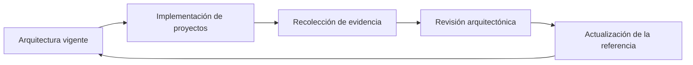

# Capítulo 11 — Arquitecturas de Referencia para Soluciones de Inteligencia Artificial
## Sección 07 — Evaluación y Mejora Continua de Arquitecturas de Referencia

**Versión:** 1.0  
**Estado:** Aprobado para publicación

> *"Una arquitectura de referencia conserva su valor únicamente cuando evoluciona apoyada en evidencia y no en suposiciones."*

---

# Objetivos de aprendizaje

Al finalizar esta sección el lector será capaz de:

- evaluar la calidad de una arquitectura de referencia mediante criterios objetivos;
- identificar oportunidades de mejora arquitectónica;
- incorporar revisiones periódicas al ciclo de vida de la plataforma;
- establecer mecanismos de retroalimentación entre proyectos y arquitectura.

---

# Introducción

Una arquitectura de referencia no constituye un documento definitivo.

Cada implementación aporta información sobre fortalezas, limitaciones y nuevas necesidades del negocio.

El desafío consiste en transformar esa experiencia en mejoras sistemáticas que beneficien a toda la organización.

La mejora continua evita que la arquitectura se convierta en un obstáculo para la innovación.

---

# Ciclo de mejora

Este ciclo convierte la experiencia operacional en conocimiento reutilizable.

---

# Criterios de evaluación

Una arquitectura de referencia debería revisarse considerando, entre otros aspectos:

| Criterio | Pregunta orientadora |
|----------|----------------------|
| Reutilización | ¿Los componentes comunes siguen siendo realmente reutilizables? |
| Escalabilidad | ¿La arquitectura acompaña el crecimiento esperado? |
| Mantenibilidad | ¿Los cambios continúan siendo de alcance limitado? |
| Seguridad | ¿Los controles siguen siendo adecuados? |
| Gobierno | ¿La evolución permanece alineada con las políticas organizacionales? |
| Costos | ¿La complejidad aporta valor al negocio? |

Estos criterios permiten evaluar la arquitectura desde una perspectiva integral.

---

# Retroalimentación desde los proyectos

Los proyectos reales representan la principal fuente de aprendizaje.

Entre los insumos más valiosos se encuentran:

- incidentes repetitivos;
- patrones exitosos;
- componentes reutilizados con frecuencia;
- dificultades de integración;
- observaciones de equipos de desarrollo y operación;
- cambios regulatorios y tecnológicos.

La incorporación sistemática de esta información fortalece la arquitectura con cada nueva implementación.

---

# Caso de estudio

Una organización detecta que distintos equipos desarrollan mecanismos similares para gestionar sesiones conversacionales.

Tras revisar varios proyectos, el comité de arquitectura decide incorporar esta capacidad como un servicio compartido dentro de la arquitectura de referencia.

Los proyectos posteriores reutilizan el nuevo componente, reduciendo tiempos de desarrollo y mejorando la consistencia entre soluciones.

---

# Buenas prácticas

- Programar revisiones arquitectónicas periódicas.
- Basar las decisiones en evidencia proveniente de proyectos reales.
- Documentar las modificaciones y su justificación.
- Validar el impacto antes de introducir cambios estructurales.
- Comunicar la evolución de la arquitectura a todos los equipos involucrados.

---

# Errores frecuentes

- Actualizar la arquitectura únicamente ante incidentes graves.
- Incorporar excepciones sin revisar el modelo general.
- Confundir preferencias individuales con mejoras arquitectónicas.
- No medir el impacto de los cambios introducidos.

---

# Ideas clave

- La mejora continua mantiene vigente la arquitectura de referencia.
- La experiencia acumulada constituye un activo estratégico.
- Las decisiones arquitectónicas deben apoyarse en evidencia objetiva.

---

# Transición hacia la siguiente sección

La próxima sección integrará los conceptos desarrollados mediante un caso de estudio sobre la construcción de un ecosistema empresarial de IA basado en arquitecturas de referencia, mostrando cómo múltiples soluciones pueden evolucionar sobre una plataforma común.

---

> **"Un arquitecto no memoriza respuestas. Comprende problemas para poder diseñar soluciones."**
