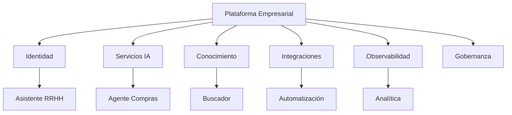

# Capítulo 11 — Arquitecturas de Referencia para Soluciones de Inteligencia Artificial
## Sección 08 — Caso de Estudio: Construcción de un Ecosistema Empresarial de IA

**Versión:** 1.0  
**Estado:** Aprobado para publicación

> *"Una solución aislada resuelve un problema. Un ecosistema arquitectónico multiplica la capacidad de toda la organización."*

---

# Objetivos de aprendizaje

Al finalizar esta sección el lector será capaz de:

- integrar los conceptos desarrollados durante el capítulo en un escenario empresarial;
- comprender cómo múltiples soluciones pueden compartir una misma arquitectura de referencia;
- identificar decisiones que favorecen la reutilización y la evolución del ecosistema;
- analizar la relación entre plataforma, proyectos y gobierno.

---

# Escenario

Una organización inicia su estrategia de IA con un asistente interno para consultas sobre políticas corporativas.

Durante los siguientes tres años incorpora:

- un buscador semántico para documentación técnica;
- agentes para automatizar procesos administrativos;
- asistentes especializados para recursos humanos, finanzas y compras;
- motores de clasificación documental;
- servicios de apoyo a la toma de decisiones.

Cada iniciativa responde a una necesidad diferente, pero todas forman parte de un mismo ecosistema.

---

# Arquitectura del ecosistema

La plataforma proporciona capacidades comunes, mientras cada aplicación implementa únicamente la lógica específica de su dominio.

---

# Evolución del ecosistema

La arquitectura de referencia permite incorporar nuevos proyectos mediante un proceso repetible:

1. identificar el nuevo caso de uso;
2. reutilizar los servicios compartidos;
3. desarrollar únicamente los componentes específicos;
4. validar la integración con la plataforma;
5. incorporar los aprendizajes a la arquitectura de referencia.

Cada implementación fortalece la siguiente.

---

# Decisiones arquitectónicas

| Objetivo | Decisión |
|----------|----------|
| Reutilización | Servicios compartidos para capacidades transversales |
| Evolución | Componentes desacoplados y contratos estables |
| Gobierno | Políticas comunes para todas las soluciones |
| Escalabilidad | Crecimiento independiente por dominio |
| Operación | Observabilidad centralizada |

Estas decisiones permiten administrar múltiples soluciones con criterios uniformes.

---

# Resultados

Tras varios años de evolución, la organización obtiene:

- mayor velocidad para desarrollar nuevos proyectos;
- reducción de componentes duplicados;
- menor costo de mantenimiento;
- operación homogénea;
- incorporación sencilla de nuevas capacidades;
- mejor alineación entre tecnología y negocio.

El éxito proviene de la plataforma compartida y no de una aplicación individual.

---

# Buenas prácticas

- Construir primero capacidades reutilizables.
- Diseñar cada proyecto como parte de un ecosistema mayor.
- Mantener procesos comunes de gobierno y operación.
- Incorporar las lecciones aprendidas a la arquitectura de referencia.
- Favorecer la evolución incremental de la plataforma.

---

# Errores frecuentes

- Desarrollar soluciones independientes para cada área.
- Duplicar servicios compartidos.
- Permitir excepciones permanentes a la arquitectura.
- Evolucionar proyectos sin actualizar la referencia.

---

# Ideas clave

- Un ecosistema de IA comparte capacidades, no únicamente infraestructura.
- La arquitectura de referencia acelera el crecimiento organizacional.
- La reutilización arquitectónica reduce costos y complejidad.

---

# Transición hacia la siguiente sección

La próxima y última sección del capítulo sintetizará los principios de las arquitecturas de referencia mediante un checklist para arquitectos de IA y preparará el paso hacia el siguiente eje temático del libro.

---

> **"Un arquitecto no memoriza respuestas. Comprende problemas para poder diseñar soluciones."**
