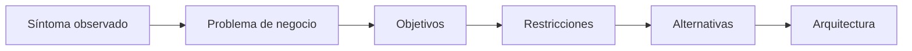

# Capítulo 6 — Ingeniería de Soluciones de IA
## Sección 02 — Descubrimiento de Requerimientos y Comprensión del Negocio

**Versión:** 1.0  
**Estado:** Aprobado para publicación

> *"Las mejores arquitecturas no nacen de mejores respuestas, sino de mejores preguntas."*

---

# Objetivos de aprendizaje

Al finalizar esta sección el lector será capaz de:

- comprender por qué el descubrimiento de requerimientos determina el éxito de un proyecto de IA;
- diferenciar síntomas, necesidades y objetivos de negocio;
- identificar los actores involucrados en una iniciativa de IA;
- transformar necesidades empresariales en requerimientos arquitectónicos;
- reconocer señales tempranas de que un problema no requiere Inteligencia Artificial.

---

# Introducción

Una arquitectura sólida no comienza cuando se selecciona un modelo, una plataforma o un proveedor.

Comienza mucho antes.

Empieza cuando el arquitecto intenta comprender qué problema intenta resolver la organización y cuáles son las restricciones bajo las cuales deberá operar la solución.

La mayor parte de los proyectos que fracasan técnicamente ya habían fracasado durante esta etapa, aunque todavía nadie lo supiera.

---

# El problema declarado rara vez es el problema real

En una reunión inicial es habitual escuchar frases como:

- "Necesitamos un chatbot."
- "Queremos incorporar IA."
- "Necesitamos un agente inteligente."

Ninguna de ellas constituye un requerimiento.

Son hipótesis de solución.

El trabajo del Arquitecto de IA consiste en descubrir qué necesidad originó esa propuesta.

Por ejemplo, detrás de un supuesto "chatbot" puede existir un problema de tiempos de respuesta, una documentación desorganizada o una deficiente capacitación del personal.

---

# Del síntoma a la causa

Una solución diseñada directamente sobre el síntoma suele incrementar la complejidad sin resolver el problema.

---

# Caso de estudio

Una empresa afirma necesitar un asistente basado en LLM para responder consultas internas.

Durante el relevamiento se descubre que el 85 % de las preguntas corresponden a procesos perfectamente estructurados y con reglas estables.

En ese escenario, una automatización tradicional puede ofrecer menor costo, mayor velocidad y resultados completamente determinísticos.

La decisión arquitectónica correcta no consiste en incorporar IA, sino en justificar por qué no hacerlo.

---

# Buenas prácticas

- Entrevistar tanto usuarios como responsables del negocio.
- Documentar restricciones regulatorias y presupuestarias.
- Definir métricas de éxito antes de hablar de tecnologías.
- Identificar procesos existentes antes de rediseñarlos.
- Cuestionar toda solución propuesta inicialmente.

---

# Errores frecuentes

- Confundir requerimientos con preferencias tecnológicas.
- Diseñar para escenarios ideales e ignorar las excepciones.
- No identificar quién será responsable de operar la solución.
- Asumir que toda tarea cognitiva requiere un LLM.

---

# Ideas clave

- El descubrimiento de requerimientos es una actividad de arquitectura, no de implementación.
- El negocio define el problema; la arquitectura define la estrategia.
- Muchas iniciativas de IA terminan resolviéndose con soluciones más simples.

---

# Transición hacia la siguiente sección

Una vez comprendido el negocio, el siguiente desafío consiste en evaluar qué tipo de solución resulta más adecuada: automatización clásica, Machine Learning, LLM, RAG, agentes o arquitecturas híbridas.

---

> **"Un arquitecto no memoriza respuestas. Comprende problemas para poder diseñar soluciones."**
