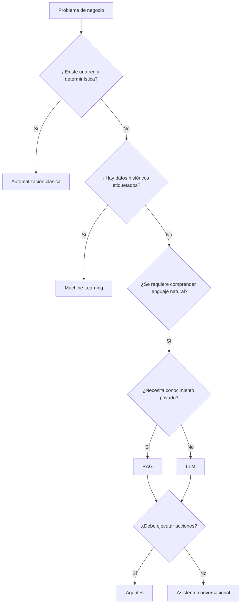

# Capítulo 6 — Ingeniería de Soluciones de IA
## Sección 03 — Selección del Enfoque Arquitectónico

**Versión:** 1.0  
**Estado:** Aprobado para publicación

> *"La mejor tecnología es aquella cuya ausencia nadie cuestiona porque el problema quedó resuelto."*

---

# Objetivos de aprendizaje

Al finalizar esta sección el lector será capaz de:

- seleccionar el enfoque arquitectónico adecuado para un problema empresarial;
- distinguir entre automatización clásica, Machine Learning, LLM, RAG, agentes y sistemas híbridos;
- comprender los criterios que justifican cada decisión;
- evitar el uso innecesario de tecnologías de IA.

---

# Introducción

Una vez comprendido el problema de negocio, el arquitecto debe responder una pregunta decisiva:

**¿Cuál es la solución más simple capaz de resolver el problema de forma sostenible?**

La respuesta rara vez surge de una única tecnología. Requiere evaluar la naturaleza del proceso, la calidad de los datos, la incertidumbre, los costos y la evolución esperada del sistema.

---

# El árbol de decisión del arquitecto

Este flujo no pretende ser una receta universal. Representa un proceso de razonamiento para reducir alternativas antes de incrementar la complejidad.

---

# Comparación conceptual

| Necesidad | Alternativa preferente |
|-----------|------------------------|
| Reglas estables y repetitivas | Automatización clásica |
| Predicción basada en datos históricos | Machine Learning |
| Generación o comprensión de lenguaje | LLM |
| Respuestas sustentadas en documentación propia | RAG |
| Ejecución coordinada de múltiples tareas | Agentes |
| Requerimientos heterogéneos | Sistema híbrido |

---

# Caso de estudio

Una aseguradora desea acelerar el procesamiento de siniestros.

Durante el análisis aparecen distintas necesidades:

- validar que la documentación esté completa;
- clasificar fotografías;
- responder consultas del cliente;
- generar el borrador del informe técnico;
- registrar el resultado en el sistema corporativo.

Ninguna tecnología resuelve todo el proceso.

Una arquitectura adecuada podría combinar automatización para las validaciones, Machine Learning para clasificación de imágenes, un LLM para redactar el informe y un agente para coordinar el flujo completo.

La solución no es un modelo; es la integración coherente de capacidades.

---

# Buenas prácticas

- Elegir la alternativa más simple que cumpla los objetivos.
- Justificar cada componente incorporado.
- Evitar superponer tecnologías con responsabilidades equivalentes.
- Diseñar pensando en la evolución futura del negocio.

---

# Errores frecuentes

- Implementar un LLM cuando bastan reglas de negocio.
- Utilizar agentes para procesos lineales.
- Aplicar Fine-Tuning antes de evaluar RAG.
- Elegir una arquitectura por tendencia tecnológica y no por necesidad.

---

# Ideas clave

- La arquitectura consiste en tomar decisiones justificadas.
- No existe una tecnología superior en términos absolutos.
- Toda incorporación tecnológica incrementa costos, riesgos y complejidad.
- El valor surge de la combinación correcta de capacidades.

---

# Transición hacia la siguiente sección

Seleccionar una alternativa tecnológica es solo el comienzo. La siguiente sección analizará los trade-offs arquitectónicos y cómo evaluar costo, complejidad, escalabilidad, mantenimiento y riesgo antes de aprobar una solución.

---

> **"Un arquitecto no memoriza respuestas. Comprende problemas para poder diseñar soluciones."**
