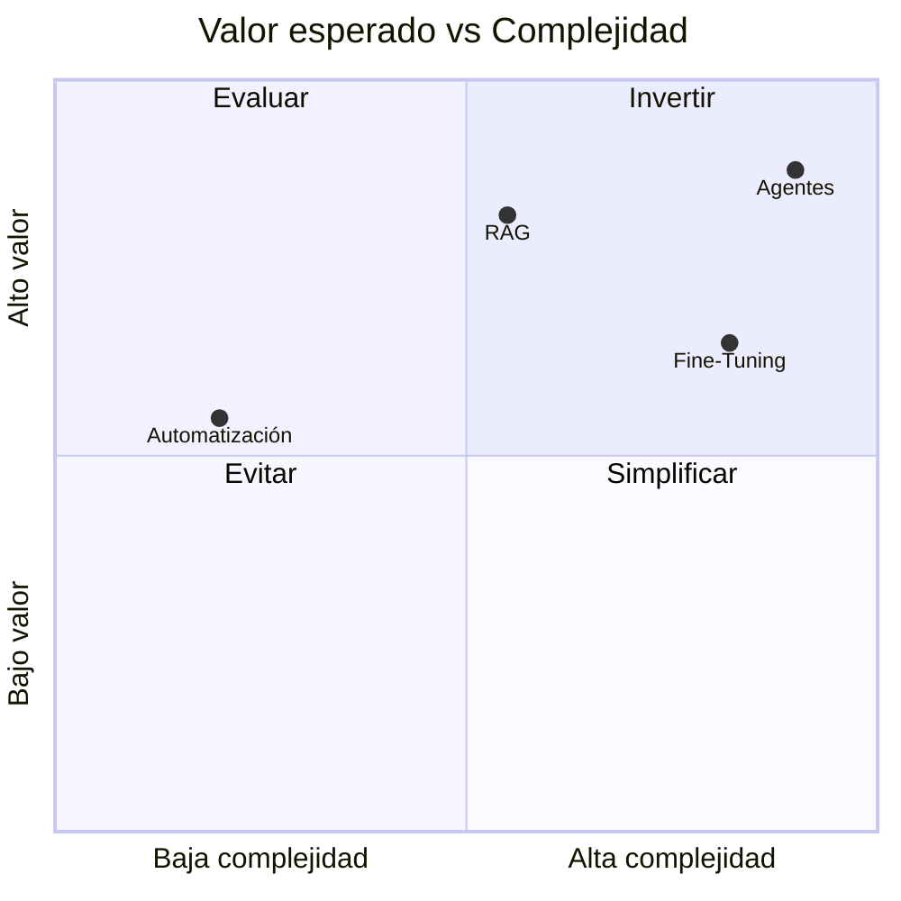

# Capítulo 6 — Ingeniería de Soluciones de IA
## Sección 04 — Trade-offs Arquitectónicos y Toma de Decisiones

**Versión:** 1.0  
**Estado:** Aprobado para publicación

> *"Toda decisión arquitectónica resuelve un problema al mismo tiempo que introduce nuevas restricciones."*

---

# Objetivos de aprendizaje

Al finalizar esta sección el lector será capaz de:

- comprender el concepto de *trade-off* en arquitectura de IA;
- evaluar alternativas considerando beneficios y costos;
- analizar impacto sobre escalabilidad, mantenimiento, riesgo y gobernanza;
- justificar decisiones técnicas frente al negocio.

---

# Introducción

No existen arquitecturas perfectas.

Toda decisión implica aceptar ventajas y renunciar a otras capacidades. El trabajo del Arquitecto de IA consiste en hacer explícitos esos compromisos para que la organización tome decisiones informadas.

Elegir un LLM más potente puede incrementar los costos operativos. Diseñar un sistema completamente determinístico puede reducir la flexibilidad. Incorporar un agente autónomo puede mejorar la automatización, pero también aumentar la complejidad operacional.

La arquitectura es el arte de administrar estas tensiones.

---

# Dimensiones de evaluación

Antes de aprobar una solución conviene analizar, como mínimo, las siguientes dimensiones:

| Dimensión | Pregunta clave |
|-----------|----------------|
| Valor de negocio | ¿Qué beneficio concreto aporta? |
| Complejidad | ¿Cuánto aumenta la dificultad de construir y mantener el sistema? |
| Costos | ¿Cuál será el costo inicial y operativo? |
| Escalabilidad | ¿Podrá crecer sin rediseños profundos? |
| Riesgo | ¿Qué ocurre si el componente falla? |
| Gobernanza | ¿Es posible auditar y controlar su comportamiento? |

---

# Matriz de decisión

La ubicación depende del contexto. El objetivo del gráfico no es clasificar tecnologías de forma absoluta, sino ilustrar el razonamiento que realiza un arquitecto.

---

# Caso de estudio

Una empresa desea resumir automáticamente miles de contratos.

Se consideran tres alternativas:

1. Utilizar un servicio externo basado en un LLM.
2. Implementar un modelo local.
3. Incorporar un sistema RAG para consultar los contratos originales.

El análisis revela que:

- el servicio externo ofrece menor tiempo de implementación;
- el modelo local reduce dependencia del proveedor;
- RAG permite justificar cada respuesta utilizando el documento fuente.

La decisión final no depende únicamente de la precisión. También intervienen aspectos regulatorios, confidencialidad, presupuesto, tiempo disponible y capacidad operativa del equipo.

---

# Buenas prácticas

- Documentar los criterios utilizados para cada decisión.
- Comparar siempre varias alternativas.
- Explicar qué riesgos se aceptan y cuáles se mitigan.
- Revisar periódicamente las decisiones arquitectónicas.

---

# Errores frecuentes

- Optimizar únicamente el costo inicial.
- Elegir la solución técnicamente más sofisticada sin justificar el beneficio.
- Ignorar el costo operativo de largo plazo.
- No considerar la evolución futura del negocio.

---

# Ideas clave

- Toda decisión arquitectónica implica compromisos.
- La mejor alternativa depende del contexto.
- Una arquitectura justificable es más valiosa que una arquitectura novedosa.

---

# Transición hacia la siguiente sección

Con los criterios de evaluación definidos, el siguiente paso consiste en estudiar los principales patrones arquitectónicos utilizados para construir soluciones empresariales de IA y comprender cuándo aplicar cada uno de ellos.

---

> **"Un arquitecto no memoriza respuestas. Comprende problemas para poder diseñar soluciones."**
