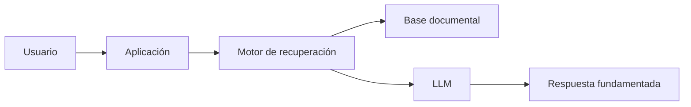

# Capítulo 6 — Ingeniería de Soluciones de IA
## Sección 05 — Patrones Arquitectónicos para Soluciones de IA

**Versión:** 1.0  
**Estado:** Aprobado para publicación

> *"Las arquitecturas cambian. Los principios que las organizan permanecen."*

---

# Objetivos de aprendizaje

Al finalizar esta sección el lector será capaz de:

- identificar los principales patrones arquitectónicos utilizados en soluciones empresariales de IA;
- comprender cuándo aplicar cada patrón y cuándo evitarlo;
- combinar patrones para resolver problemas complejos sin incrementar innecesariamente la complejidad;
- evaluar el impacto de cada decisión sobre mantenibilidad, escalabilidad y evolución.

---

# Introducción

Las tecnologías evolucionan a gran velocidad. Los patrones arquitectónicos, en cambio, permanecen vigentes durante años porque representan formas recurrentes de resolver problemas recurrentes.

El Arquitecto de IA no diseña cada solución desde cero. Reutiliza patrones probados y los adapta al contexto del negocio.

---

# Patrón 1 — IA como capacidad aislada

La IA se implementa como un componente especializado consumido por aplicaciones existentes mediante APIs o mensajería.

**Cuándo utilizarlo**

- Incorporaciones graduales.
- Organizaciones con sistemas legados.
- Equipos independientes.

**Ventajas**

- Bajo acoplamiento.
- Evolución independiente.
- Fácil reemplazo del proveedor o modelo.

---

# Patrón 2 — IA enriqueciendo procesos existentes

En lugar de reemplazar un proceso, la IA asiste a los usuarios durante su ejecución.

Ejemplos:

- sugerencias de respuesta;
- clasificación automática;
- extracción de información;
- generación de borradores.

Este patrón mantiene al ser humano dentro del circuito de decisión.

---

# Patrón 3 — Recuperación de conocimiento empresarial

Cuando el principal activo es la documentación, el patrón dominante consiste en desacoplar el conocimiento del modelo.

Este enfoque facilita la actualización del conocimiento sin necesidad de modificar el modelo.

---

# Patrón 4 — Orquestación mediante agentes

Cuando una solución requiere coordinar múltiples capacidades, un agente puede asumir la responsabilidad de planificar y ejecutar el flujo de trabajo.

No reemplaza los sistemas existentes.

Los coordina.

Este patrón resulta especialmente útil cuando intervienen herramientas heterogéneas, reglas dinámicas y múltiples decisiones durante una misma operación.

---

# Caso de estudio

Una organización pública desea automatizar el tratamiento de expedientes.

La solución final combina varios patrones:

- un sistema tradicional administra el expediente;
- un motor documental recupera normativa;
- un LLM redacta propuestas;
- un agente coordina validaciones y aprobaciones;
- un operador humano toma la decisión final.

La arquitectura no depende de un único componente inteligente, sino de la colaboración entre varios servicios especializados.

---

# Buenas prácticas

- Diseñar componentes con responsabilidades bien definidas.
- Favorecer interfaces desacopladas.
- Permitir sustituir tecnologías sin rediseñar toda la solución.
- Incorporar observabilidad desde el inicio.

---

# Errores frecuentes

- Concentrar toda la lógica en el modelo de IA.
- Crear dependencias fuertes entre componentes.
- Diseñar patrones pensando en una herramienta específica.
- Ignorar la evolución futura de la organización.

---

# Ideas clave

- Los patrones representan experiencias acumuladas de arquitectura.
- Una buena solución suele combinar varios patrones.
- La arquitectura debe sobrevivir a los cambios tecnológicos.

---

# Transición hacia la siguiente sección

Con los patrones arquitectónicos definidos, el siguiente paso será estudiar cómo diseñar soluciones empresariales escalables incorporando gobierno, seguridad, observabilidad y evolución continua desde las primeras decisiones de arquitectura.

---

> **"Un arquitecto no memoriza respuestas. Comprende problemas para poder diseñar soluciones."**
