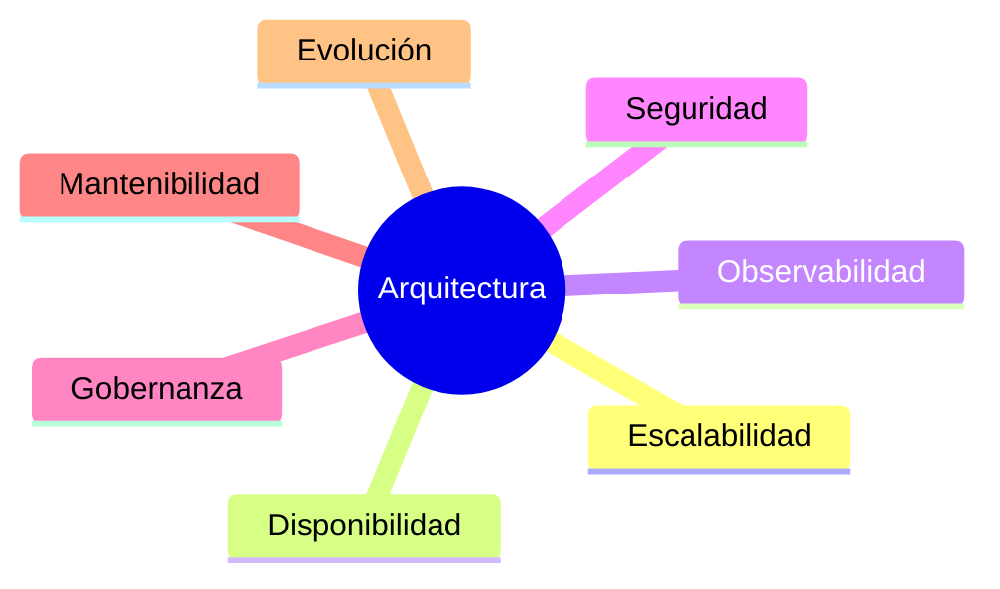

# Capítulo 6 — Ingeniería de Soluciones de IA
## Sección 06 — Diseño para Escalabilidad, Gobierno y Evolución

**Versión:** 1.0  
**Estado:** Aprobado para publicación

> *"Una solución de IA no termina cuando entra en producción; allí comienza su verdadero ciclo de vida."*

---

# Objetivos de aprendizaje

Al finalizar esta sección el lector será capaz de:

- incorporar escalabilidad como un criterio de diseño desde las primeras etapas;
- comprender el papel del gobierno en soluciones de IA empresariales;
- identificar atributos de calidad que condicionan la arquitectura;
- diseñar soluciones preparadas para evolucionar sin rediseños disruptivos.

---

# Introducción

Una prueba de concepto puede ser desarrollada por una sola persona en pocos días.

Una solución empresarial debe operar durante años, soportar cambios de negocio, incorporar nuevos modelos, cumplir regulaciones y mantenerse observable.

La diferencia entre ambos escenarios no reside únicamente en el volumen de usuarios, sino en la calidad de la arquitectura.

---

# Pensar más allá del primer despliegue

Un arquitecto no diseña únicamente para el presente.

También diseña para responder preguntas como:

- ¿Qué ocurrirá si el volumen de consultas se multiplica por diez?
- ¿Cómo se incorporará una nueva fuente de conocimiento?
- ¿Qué sucede si cambia el proveedor del modelo?
- ¿Cómo se auditarán las respuestas dentro de dos años?

Responder estas preguntas antes de escribir la primera línea de código reduce significativamente el costo de evolución.

---

# Atributos de calidad

Estos atributos compiten entre sí. Incrementar uno puede afectar otro, por lo que deben equilibrarse según los objetivos del negocio.

---

# Gobierno de IA

El gobierno establece cómo se controla el uso de la Inteligencia Artificial dentro de la organización.

Algunos aspectos fundamentales son:

- definición de responsables;
- políticas para uso de modelos;
- gestión de datos y conocimiento;
- auditoría de decisiones;
- versionado de prompts y configuraciones;
- trazabilidad de respuestas;
- cumplimiento normativo.

El gobierno no limita la innovación. La hace sostenible.

---

# Caso de estudio

Una empresa implementa un asistente interno para consultar políticas corporativas.

Durante el primer año aparecen nuevos departamentos, documentación adicional y cambios regulatorios.

La arquitectura original había desacoplado el conocimiento, las reglas de negocio y el modelo de lenguaje.

Como consecuencia, fue posible actualizar la base documental y modificar políticas sin reemplazar el resto de la solución.

El diseño inicial evitó una reingeniería completa.

---

# Buenas prácticas

- Diseñar componentes reemplazables.
- Mantener interfaces estables entre servicios.
- Registrar eventos relevantes para auditoría.
- Incorporar métricas operativas desde el inicio.
- Considerar la evolución como un requerimiento funcional.

---

# Errores frecuentes

- Diseñar únicamente para el escenario actual.
- Acoplar la solución a un proveedor específico.
- No registrar decisiones relevantes del sistema.
- Tratar el gobierno como una tarea posterior.

---

# Ideas clave

- La escalabilidad comienza durante el diseño.
- El gobierno debe formar parte de la arquitectura.
- La evolución continua es un objetivo arquitectónico, no una consecuencia.

---

# Transición hacia la siguiente sección

Con los principios de diseño establecidos, la siguiente sección integrará todos los conceptos del capítulo mediante un caso completo de arquitectura empresarial, recorriendo el proceso de decisión desde el requerimiento inicial hasta la solución final.

---

> **"Un arquitecto no memoriza respuestas. Comprende problemas para poder diseñar soluciones."**
