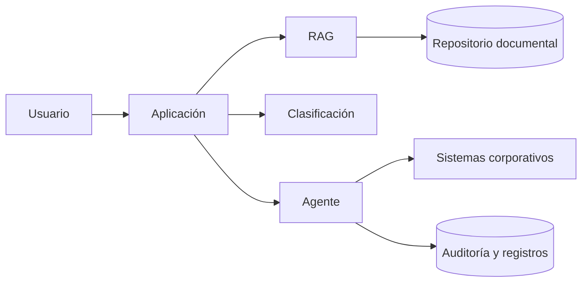

# Capítulo 6 — Ingeniería de Soluciones de IA
## Sección 07 — Caso de Estudio: Diseñando una Solución Empresarial de IA de Extremo a Extremo

**Versión:** 1.0  
**Estado:** Aprobado para publicación

> *"La calidad de una arquitectura no se mide por la sofisticación de sus componentes, sino por la claridad de las decisiones que la sostienen."*

---

# Objetivos de aprendizaje

Al finalizar esta sección el lector será capaz de:

- integrar los conceptos desarrollados a lo largo del capítulo;
- recorrer el proceso completo de diseño de una solución empresarial;
- justificar decisiones arquitectónicas considerando negocio, riesgos y evolución;
- comprender cómo convergen múltiples patrones en una única arquitectura.

---

# Escenario

Una empresa de servicios recibe más de 20.000 consultas mensuales relacionadas con contratos, facturación, soporte técnico y normativa interna.

Los problemas identificados son:

- tiempos de respuesta elevados;
- alta dependencia de especialistas;
- documentación dispersa;
- procesos manuales para derivar casos;
- crecimiento constante del volumen de consultas.

La dirección solicita "incorporar IA".

El arquitecto evita comenzar por la tecnología y formula preguntas adicionales.

---

# Descubrimiento

El relevamiento identifica cuatro necesidades distintas:

1. Responder consultas sobre documentación interna.
2. Clasificar automáticamente las solicitudes.
3. Derivar cada caso al área correspondiente.
4. Registrar todas las acciones para auditoría.

El supuesto problema único resulta ser un conjunto de problemas diferentes.

---

# Decisiones arquitectónicas

| Necesidad | Decisión |
|-----------|----------|
| Consulta documental | RAG |
| Clasificación de solicitudes | Machine Learning o reglas, según criticidad |
| Coordinación del flujo | Agente orquestador |
| Registro y trazabilidad | Plataforma transaccional existente |

El resultado no es una única tecnología, sino una arquitectura compuesta.

---

# Arquitectura conceptual

Cada componente posee una responsabilidad claramente definida.

Esta separación facilita la evolución independiente de cada capacidad.

---

# ¿Por qué no utilizar únicamente un LLM?

Una solución basada exclusivamente en un modelo de lenguaje presentaría limitaciones importantes:

- ausencia de conocimiento actualizado;
- escasa trazabilidad;
- dificultad para justificar respuestas;
- poca integración con procesos corporativos.

La arquitectura propuesta evita estas limitaciones distribuyendo responsabilidades entre componentes especializados.

---

# Buenas prácticas observadas

- Separar conocimiento, lógica y ejecución.
- Mantener al usuario como responsable de decisiones críticas.
- Diseñar componentes sustituibles.
- Incorporar observabilidad desde el primer día.
- Definir métricas de éxito antes del despliegue.

---

# Errores que el arquitecto evitó

- Elegir una tecnología antes del análisis.
- Diseñar alrededor de un proveedor específico.
- Centralizar toda la inteligencia en un único componente.
- Ignorar restricciones regulatorias y operativas.

---

# Ideas clave

- Los problemas empresariales rara vez se resuelven con una sola tecnología.
- La arquitectura emerge del análisis del negocio.
- Cada componente debe aportar una capacidad específica y justificable.

---

# Transición hacia el cierre del capítulo

La siguiente y última sección consolidará los conceptos presentados mediante una síntesis ejecutiva, preguntas de reflexión, checklist arquitectónico y recomendaciones para afrontar el siguiente capítulo del libro.

---

> **"Un arquitecto no memoriza respuestas. Comprende problemas para poder diseñar soluciones."**
