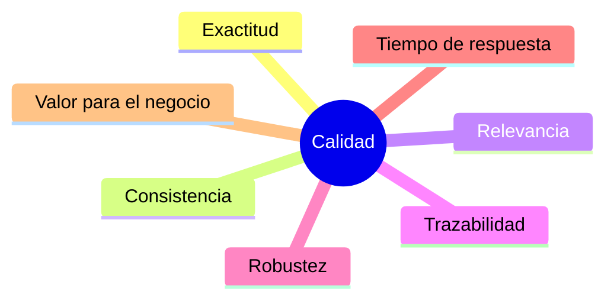

# Capítulo 7 — Evaluación y Validación de Soluciones de IA
## Sección 01 — ¿Cómo saber si una solución de IA realmente funciona?

**Versión:** 1.0  
**Estado:** Aprobado para publicación

> *"Una solución de IA no genera valor porque produce respuestas; genera valor cuando esas respuestas son confiables para el negocio."*

---

# Objetivos de aprendizaje

Al finalizar esta sección el lector será capaz de:

- comprender por qué evaluar una solución de IA es diferente de probar software tradicional;
- distinguir entre funcionamiento técnico y valor de negocio;
- identificar los principales criterios de evaluación de sistemas basados en IA;
- comprender el rol de las métricas dentro del ciclo de vida de una solución empresarial.

---

# Introducción

Una aplicación tradicional suele responder correctamente o incorrectamente.

En cambio, una solución basada en Inteligencia Artificial opera sobre probabilidades, incertidumbre y distintos niveles de calidad.

Por ese motivo, validar un sistema de IA requiere un enfoque diferente al utilizado en el desarrollo de software convencional.

La pregunta deja de ser:

> "¿El sistema funciona?"

y pasa a convertirse en:

> "¿El sistema funciona con suficiente calidad para este contexto de negocio?"

---

# La diferencia entre precisión y utilidad

Un modelo puede producir respuestas técnicamente correctas y, sin embargo, no aportar valor.

De la misma manera, un modelo con una precisión inferior puede resultar más útil si reduce tiempos de respuesta, mejora la productividad o disminuye errores operativos.

El arquitecto debe evaluar ambos aspectos de forma conjunta.

---

# Dimensiones de evaluación

Cada proyecto priorizará estas dimensiones de manera diferente.

No existe una métrica universal.

---

# Caso de estudio

Una organización implementa un asistente documental basado en RAG.

Durante las pruebas técnicas obtiene respuestas correctas en el 92 % de los casos.

Sin embargo, los usuarios siguen consultando a especialistas.

El análisis revela que el problema no era la exactitud, sino la falta de referencias a los documentos utilizados.

Al incorporar citas y enlaces a las fuentes originales, la confianza de los usuarios aumenta significativamente sin modificar el modelo.

---

# Buenas prácticas

- Definir métricas antes del desarrollo.
- Medir resultados técnicos y resultados de negocio.
- Involucrar usuarios reales en la validación.
- Registrar evidencias durante todo el proceso de evaluación.

---

# Errores frecuentes

- Medir únicamente la precisión del modelo.
- Validar solo con datos de laboratorio.
- Considerar la puesta en producción como el final del proyecto.
- Ignorar la percepción del usuario final.

---

# Ideas clave

- Evaluar IA significa medir calidad, riesgo y valor.
- Las métricas deben responder a objetivos del negocio.
- La confianza del usuario constituye un indicador tan importante como la precisión técnica.

---

# Transición hacia la siguiente sección

La siguiente sección analizará las principales métricas utilizadas para evaluar modelos, sistemas RAG, agentes y soluciones empresariales de IA, explicando cuándo utilizar cada una y cuáles son sus limitaciones.

---

> **"Un arquitecto no memoriza respuestas. Comprende problemas para poder diseñar soluciones."**
