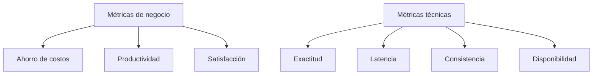

# Capítulo 7 — Evaluación y Validación de Soluciones de IA
## Sección 02 — Métricas para Evaluar Sistemas de IA

**Versión:** 1.0  
**Estado:** Aprobado para publicación

> *"Lo que no puede medirse difícilmente pueda mejorarse de manera sistemática."*

---

# Objetivos de aprendizaje

Al finalizar esta sección el lector será capaz de:

- distinguir métricas de negocio de métricas técnicas;
- seleccionar indicadores adecuados según el tipo de solución de IA;
- comprender las limitaciones de las métricas más utilizadas;
- construir un marco de evaluación alineado con los objetivos de la organización.

---

# Introducción

En el desarrollo tradicional suele bastar con verificar que una funcionalidad produzca el resultado esperado.

En IA esa aproximación resulta insuficiente.

Los modelos trabajan con probabilidades, las respuestas pueden admitir distintos grados de calidad y el contexto modifica la percepción del usuario.

Por ello, la evaluación debe contemplar múltiples dimensiones de manera simultánea.

---

# Las métricas deben responder al negocio

Antes de elegir un indicador conviene responder una pregunta sencilla:

**¿Qué decisión permitirá tomar esta métrica?**

Si un indicador no modifica ninguna decisión técnica o de negocio, probablemente no merezca formar parte del tablero de control.

---

# Niveles de medición

Una solución madura combina ambos niveles.

---

# Métricas según el tipo de solución

| Tipo de solución | Indicadores relevantes |
|------------------|------------------------|
| Automatización | Tiempo de ejecución, errores evitados |
| Machine Learning | Accuracy, Precision, Recall, F1 Score |
| LLM | Relevancia, consistencia, latencia, costo por interacción |
| RAG | Calidad del retrieval, grounding, cobertura documental |
| Agentes | Tasa de éxito de tareas, autonomía, intervenciones humanas |

Las métricas no sustituyen el juicio del arquitecto. Lo complementan.

---

# Caso de estudio

Una empresa implementa un asistente para el área legal.

Durante las primeras semanas se observa una precisión elevada en las respuestas, pero también un incremento del tiempo medio de atención.

La investigación muestra que el sistema recupera demasiados documentos antes de responder.

Al optimizar el proceso de recuperación, la latencia disminuye sin afectar la calidad de las respuestas.

La mejora fue posible porque la organización medía tanto exactitud como tiempo de respuesta.

---

# Buenas prácticas

- Definir indicadores antes del desarrollo.
- Evitar métricas que no influyan en decisiones.
- Revisar periódicamente los objetivos de medición.
- Combinar indicadores técnicos y de negocio.
- Compartir los resultados con todas las partes interesadas.

---

# Errores frecuentes

- Utilizar una única métrica para evaluar todo el sistema.
- Comparar proyectos distintos utilizando los mismos indicadores.
- Ignorar el costo asociado a mejorar una métrica.
- Optimizar un indicador perjudicando otros atributos de calidad.

---

# Ideas clave

- Cada solución requiere un conjunto diferente de métricas.
- Los indicadores deben estar alineados con los objetivos del negocio.
- Medir correctamente permite evolucionar con menor incertidumbre.

---

# Transición hacia la siguiente sección

La próxima sección abordará las metodologías de validación para soluciones empresariales de IA, incluyendo pruebas offline, validaciones con usuarios, experimentación controlada y monitoreo continuo en producción.

---

> **"Un arquitecto no memoriza respuestas. Comprende problemas para poder diseñar soluciones."**
