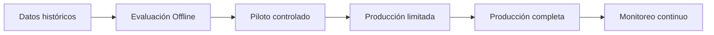

# Capítulo 7 — Evaluación y Validación de Soluciones de IA
## Sección 03 — Estrategias de Validación: Del Laboratorio a Producción

**Versión:** 1.0  
**Estado:** Aprobado para publicación

> *"La verdadera validación comienza cuando un sistema enfrenta el comportamiento impredecible del mundo real."*

---

# Objetivos de aprendizaje

Al finalizar esta sección el lector será capaz de:

- comprender las distintas etapas de validación de una solución de IA;
- diferenciar pruebas offline, pilotos controlados y validaciones en producción;
- identificar qué riesgos pueden detectarse en cada etapa;
- diseñar un proceso de validación continuo.

---

# Introducción

Una evaluación aislada sobre un conjunto de datos históricos no garantiza que una solución mantenga su calidad una vez desplegada.

Los datos cambian.

Los usuarios cambian.

El negocio cambia.

Por esa razón, validar una solución de IA debe entenderse como un proceso continuo y no como una actividad previa al despliegue.

---

# Etapas de validación

Cada etapa reduce incertidumbre antes de incrementar el alcance del sistema.

---

# Evaluación offline

La primera validación se realiza utilizando conjuntos de datos previamente conocidos.

Su objetivo es responder preguntas como:

- ¿El sistema resuelve correctamente los casos representativos?
- ¿Existen errores sistemáticos?
- ¿Qué escenarios presentan mayor incertidumbre?

Aunque indispensable, esta etapa no representa el comportamiento real del sistema.

---

# Pilotos controlados

Una vez superadas las pruebas iniciales, la solución se expone a un grupo reducido de usuarios.

El objetivo deja de ser únicamente medir precisión.

Ahora también interesa observar:

- experiencia de uso;
- tiempos reales de operación;
- aceptación por parte del negocio;
- aparición de casos no contemplados.

El piloto permite ajustar la solución antes de una adopción masiva.

---

# Validación en producción

La entrada en producción no representa el final del proyecto.

Representa el comienzo de un ciclo permanente de observación.

Aspectos que deben monitorearse:

- degradación de la calidad;
- cambios en los datos;
- incremento de latencia;
- comportamiento inesperado de los usuarios;
- evolución de los costos.

Una solución madura incorpora mecanismos para detectar estos cambios de forma temprana.

---

# Caso de estudio

Una organización despliega un asistente interno para responder consultas sobre procedimientos administrativos.

Durante el piloto el sistema obtiene excelentes resultados.

Sin embargo, al habilitar el acceso a toda la empresa aparecen consultas completamente diferentes a las utilizadas durante el entrenamiento.

El problema no era el modelo.

Era la diferencia entre el conjunto de prueba y el comportamiento real de los usuarios.

Gracias al monitoreo continuo fue posible ampliar la base documental y mejorar la recuperación de información sin reemplazar la arquitectura.

---

# Buenas prácticas

- Validar utilizando datos representativos.
- Incorporar usuarios reales desde etapas tempranas.
- Implementar despliegues progresivos.
- Registrar métricas antes y después de cada cambio.
- Mantener ciclos permanentes de evaluación.

---

# Errores frecuentes

- Asumir que un buen resultado offline garantiza éxito en producción.
- Desplegar cambios masivos sin pruebas controladas.
- No registrar el comportamiento de los usuarios.
- Finalizar el proyecto una vez completado el despliegue.

---

# Ideas clave

- La validación es un proceso continuo.
- Cada etapa responde preguntas diferentes.
- El monitoreo permanente reduce riesgos y facilita la evolución.

---

# Transición hacia la siguiente sección

La siguiente sección analizará los principales riesgos asociados a la evaluación de soluciones de IA, incluyendo sesgos, deriva de datos, sobreajuste y degradación del desempeño a lo largo del tiempo.

---

> **"Un arquitecto no memoriza respuestas. Comprende problemas para poder diseñar soluciones."**
