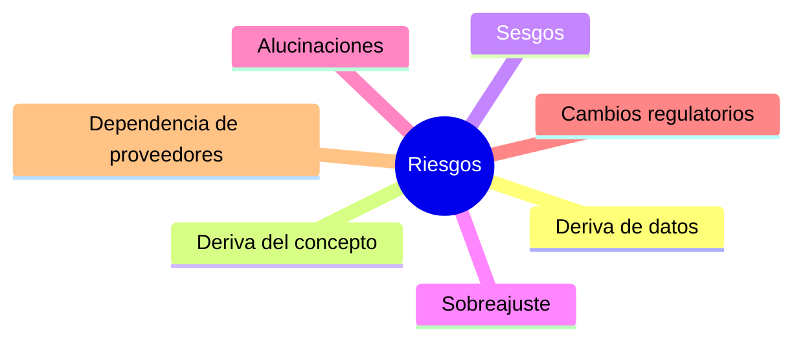

# Capítulo 7 — Evaluación y Validación de Soluciones de IA
## Sección 04 — Riesgos Durante la Evaluación y la Operación de Sistemas de IA

**Versión:** 1.0  
**Estado:** Aprobado para publicación

> *"Evaluar un sistema de IA también implica comprender cómo puede fallar."*

---

# Objetivos de aprendizaje

Al finalizar esta sección el lector será capaz de:

- identificar los principales riesgos que afectan la calidad de una solución de IA;
- comprender cómo esos riesgos impactan en la arquitectura y en el negocio;
- reconocer estrategias para detectarlos y mitigarlos;
- incorporar la gestión del riesgo como parte del proceso de evaluación continua.

---

# Introducción

Ninguna solución de IA permanece inalterable una vez desplegada.

Los datos evolucionan, los usuarios modifican su comportamiento, las reglas del negocio cambian y aparecen nuevos escenarios que no fueron considerados durante el diseño.

Por este motivo, la evaluación debe contemplar no solo el desempeño actual del sistema, sino también su capacidad para mantener ese desempeño a lo largo del tiempo.

---

# Riesgos más frecuentes

Cada riesgo requiere mecanismos específicos de monitoreo y respuesta.

---

# Deriva de datos (*Data Drift*)

La distribución de los datos de entrada cambia con respecto a la utilizada durante el desarrollo.

Como consecuencia, un modelo que anteriormente ofrecía buenos resultados puede comenzar a degradarse sin que exista un error de implementación.

Ejemplos habituales incluyen cambios en formularios, nuevos productos, modificaciones normativas o variaciones en el comportamiento de los usuarios.

---

# Deriva del concepto (*Concept Drift*)

En este caso no cambian únicamente los datos, sino también la relación entre los datos y el resultado esperado.

Un clasificador entrenado con reglas históricas puede dejar de ser válido cuando el negocio modifica sus políticas o aparecen nuevos criterios de decisión.

La solución suele requerir una nueva etapa de entrenamiento o un rediseño parcial del sistema.

---

# Sobreajuste

El sobreajuste ocurre cuando un modelo aprende excesivamente las particularidades del conjunto de entrenamiento y pierde capacidad para generalizar.

Una precisión elevada durante las pruebas internas puede ocultar un rendimiento deficiente frente a datos reales.

Por ello resulta indispensable utilizar conjuntos de validación independientes y escenarios representativos.

---

# Sesgos

Los sesgos pueden originarse en:

- los datos disponibles;
- el proceso de etiquetado;
- la selección de ejemplos;
- las decisiones de diseño.

El objetivo no consiste únicamente en detectarlos, sino también en comprender su impacto sobre las personas, el negocio y el cumplimiento normativo.

---

# Caso de estudio

Una entidad financiera implementa un sistema para clasificar solicitudes de crédito.

Durante los primeros meses el rendimiento resulta satisfactorio.

Posteriormente cambian las condiciones económicas del mercado y comienzan a rechazarse solicitudes que anteriormente eran aprobadas.

El monitoreo identifica una deriva del concepto.

La arquitectura incorpora un proceso periódico de revalidación del modelo y evita que la degradación afecte la operación durante largos períodos.

---

# Buenas prácticas

- Monitorear continuamente la calidad del sistema.
- Comparar resultados actuales con líneas base históricas.
- Revisar periódicamente los conjuntos de evaluación.
- Mantener procesos de reentrenamiento cuando corresponda.
- Registrar incidentes y decisiones de mitigación.

---

# Errores frecuentes

- Asumir que el rendimiento inicial permanecerá estable.
- Evaluar únicamente antes del despliegue.
- Ignorar cambios en el negocio.
- Confundir una degradación del modelo con fallas de infraestructura.

---

# Ideas clave

- Todo sistema de IA cambia con el tiempo.
- El monitoreo continuo es un requisito arquitectónico.
- Detectar tempranamente una degradación reduce costos y riesgos.
- La gestión del riesgo forma parte de la calidad del sistema.

---

# Transición hacia la siguiente sección

La siguiente sección abordará la evaluación específica de soluciones basadas en Large Language Models, Retrieval-Augmented Generation y agentes, analizando criterios prácticos para validar sistemas generativos en entornos empresariales.

---

> **"Un arquitecto no memoriza respuestas. Comprende problemas para poder diseñar soluciones."**
