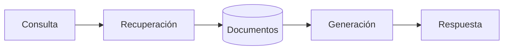

# Capítulo 7 — Evaluación y Validación de Soluciones de IA
## Sección 05 — Evaluación de LLM, RAG y Agentes en Entornos Empresariales

**Versión:** 1.0  
**Estado:** Aprobado para publicación

> *"Cuanto mayor es la autonomía de un sistema, mayor debe ser el rigor con el que se evalúa."*

---

# Objetivos de aprendizaje

Al finalizar esta sección el lector será capaz de:

- diferenciar la evaluación de LLM, sistemas RAG y agentes;
- identificar criterios específicos para cada arquitectura;
- comprender por qué la evaluación debe abarcar el sistema completo y no únicamente el modelo;
- diseñar una estrategia de validación alineada con el uso empresarial.

---

# Introducción

No todas las soluciones basadas en Inteligencia Artificial se evalúan de la misma manera.

Aunque un LLM, un sistema RAG y un agente puedan compartir el mismo modelo de lenguaje, cada uno incorpora responsabilidades adicionales que modifican los criterios de calidad.

Evaluar únicamente el modelo conduce a conclusiones incompletas.

La unidad de análisis debe ser la solución integral.

---

# Evaluación de un Large Language Model

En un sistema basado exclusivamente en un LLM interesa responder preguntas como:

- ¿La respuesta es coherente?
- ¿Mantiene el contexto de la conversación?
- ¿Respeta las instrucciones del sistema?
- ¿Cuál es la latencia promedio?
- ¿Cuál es el costo por interacción?

En este escenario la generación constituye el componente principal de la evaluación.

---

# Evaluación de un sistema RAG

Cuando la arquitectura incorpora recuperación de conocimiento, aparecen nuevas preguntas:

- ¿Los documentos recuperados son pertinentes?
- ¿La respuesta utiliza efectivamente la información recuperada?
- ¿Las referencias son correctas?
- ¿Existe trazabilidad hacia la fuente original?

Un excelente modelo no compensará una recuperación deficiente.

---

# Evaluación de agentes

Los agentes agregan una dimensión adicional: la ejecución.

Además de la calidad del razonamiento, resulta necesario validar:

- planificación de tareas;
- selección de herramientas;
- manejo de errores;
- recuperación ante fallos;
- cumplimiento del objetivo.

El éxito ya no depende únicamente del contenido generado, sino también del comportamiento observado durante todo el flujo.

---

# Caso de estudio

Una organización implementa un agente encargado de procesar solicitudes de compras.

Durante las pruebas iniciales el agente genera respuestas claras y correctamente fundamentadas.

Sin embargo, en determinadas situaciones ejecuta dos veces la misma acción sobre el sistema transaccional.

El problema no reside en el modelo de lenguaje.

Se encuentra en la lógica de orquestación.

Este caso demuestra que evaluar únicamente la calidad del texto hubiera ocultado un riesgo operativo significativo.

---

# Buenas prácticas

- Evaluar cada componente por separado y como parte del sistema completo.
- Definir escenarios representativos del negocio.
- Incorporar casos límite y situaciones excepcionales.
- Automatizar pruebas repetitivas siempre que resulte posible.
- Revisar periódicamente los criterios de aceptación.

---

# Errores frecuentes

- Medir únicamente la calidad del texto generado.
- Ignorar la recuperación documental en soluciones RAG.
- No validar la ejecución de acciones realizadas por agentes.
- Utilizar escenarios de prueba demasiado simples.

---

# Ideas clave

- Cada arquitectura introduce nuevos criterios de evaluación.
- El comportamiento global del sistema es más importante que el rendimiento aislado del modelo.
- Una evaluación completa combina calidad técnica, comportamiento operativo y valor para el negocio.

---

# Transición hacia la siguiente sección

La siguiente sección analizará cómo construir procesos continuos de evaluación mediante observabilidad, monitoreo y mejora iterativa, integrando la validación dentro del ciclo de vida completo de una solución de IA.

---

> **"Un arquitecto no memoriza respuestas. Comprende problemas para poder diseñar soluciones."**
