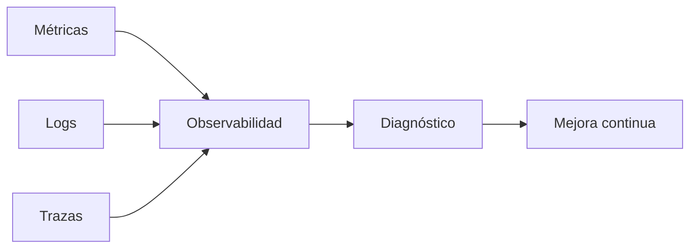
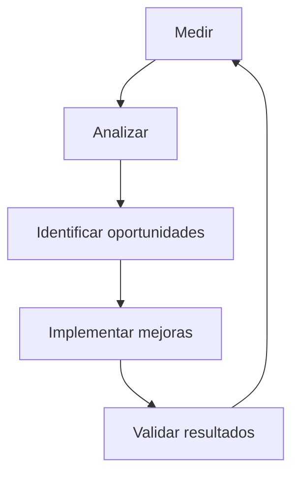

# Capítulo 7 — Evaluación y Validación de Soluciones de IA
## Sección 06 — Observabilidad y Mejora Continua en Sistemas de IA

**Versión:** 1.0  
**Estado:** Aprobado para publicación

> *"No puede mejorarse aquello que no puede observarse."*

---

# Objetivos de aprendizaje

Al finalizar esta sección el lector será capaz de:

- comprender el rol de la observabilidad en soluciones de IA;
- diferenciar monitoreo, observabilidad y mejora continua;
- identificar los indicadores que deben recolectarse en producción;
- diseñar un ciclo de retroalimentación para evolucionar una solución empresarial.

---

# Introducción

En una aplicación tradicional, el monitoreo suele centrarse en disponibilidad, uso de CPU, memoria o tiempos de respuesta.

En una solución de IA esos indicadores siguen siendo importantes, pero resultan insuficientes.

También es necesario observar cómo razona el sistema, cómo evolucionan los datos, cómo interactúan los usuarios y si la calidad obtenida continúa siendo aceptable para el negocio.

---

# Del monitoreo a la observabilidad

El monitoreo responde preguntas conocidas.

La observabilidad permite descubrir problemas que todavía no fueron formulados.

Una arquitectura observable facilita comprender por qué ocurrió un comportamiento inesperado y no únicamente detectar que ocurrió.

---

# ¿Qué conviene observar?

Una solución empresarial basada en IA debería registrar, como mínimo:

- latencia por solicitud;
- costo por interacción;
- tasa de éxito de tareas;
- consultas fallidas;
- calidad percibida por los usuarios;
- utilización de fuentes documentales;
- frecuencia de intervención humana;
- versiones de modelos, prompts y bases de conocimiento.

Estos datos permiten identificar tendencias antes de que se transformen en incidentes.

---

# Ciclo de mejora continua

La observabilidad solo genera valor cuando conduce a acciones concretas.

Este ciclo debe repetirse durante toda la vida útil del sistema.

---

# Caso de estudio

Una empresa despliega un asistente para consultas técnicas.

Los indicadores muestran que la latencia permanece estable, pero la satisfacción de los usuarios disminuye.

El análisis revela que gran parte de la documentación utilizada por el sistema había quedado desactualizada.

La arquitectura permitía actualizar el repositorio documental sin modificar el modelo de lenguaje.

Tras incorporar la nueva documentación, los indicadores de satisfacción recuperan sus valores originales.

La mejora provino de la observabilidad y no de un cambio tecnológico.

---

# Buenas prácticas

- Diseñar la observabilidad desde el inicio del proyecto.
- Centralizar métricas técnicas y métricas de negocio.
- Versionar modelos, prompts y fuentes de conocimiento.
- Revisar periódicamente tendencias y anomalías.
- Automatizar alertas para degradaciones relevantes.

---

# Errores frecuentes

- Registrar grandes volúmenes de información sin objetivos claros.
- Medir únicamente infraestructura.
- No correlacionar métricas técnicas con indicadores de negocio.
- Tratar la mejora continua como una actividad ocasional.

---

# Ideas clave

- La observabilidad es un componente arquitectónico, no una herramienta.
- Los datos operativos permiten tomar mejores decisiones de evolución.
- La mejora continua debe formar parte del ciclo de vida de toda solución de IA.

---

# Transición hacia la siguiente sección

La próxima sección abordará el diseño de experimentos, pruebas A/B y estrategias de comparación entre versiones para validar mejoras de manera objetiva antes de su adopción definitiva.

---

> **"Un arquitecto no memoriza respuestas. Comprende problemas para poder diseñar soluciones."**
