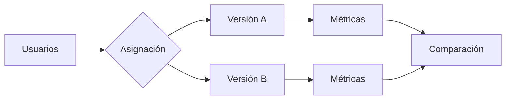

# Capítulo 7 — Evaluación y Validación de Soluciones de IA
## Sección 07 — Experimentación Controlada y Pruebas A/B

**Versión:** 1.0  
**Estado:** Aprobado para publicación

> *"Las decisiones arquitectónicas deben sustentarse en evidencia, no en intuiciones."*

---

# Objetivos de aprendizaje

Al finalizar esta sección el lector será capaz de:

- comprender el papel de la experimentación controlada en proyectos de IA;
- diseñar pruebas A/B para comparar soluciones;
- interpretar resultados sin introducir sesgos metodológicos;
- incorporar la experimentación como parte del ciclo de mejora continua.

---

# Introducción

Cuando existen dos alternativas técnicamente viables, la arquitectura no debería decidir únicamente por percepción o experiencia previa.

La mejor práctica consiste en obtener evidencia mediante experimentación.

Las pruebas controladas permiten comparar versiones de un sistema bajo condiciones equivalentes y medir su impacto real sobre los objetivos del negocio.

---

# ¿Qué es una prueba A/B?

Una prueba A/B consiste en exponer grupos comparables de usuarios o solicitudes a dos variantes de una solución.

El objetivo no es demostrar que una versión es "mejor" en términos absolutos, sino determinar cuál genera mejores resultados para un contexto específico.

---

# Variables que pueden compararse

En soluciones de IA es habitual evaluar:

- diferentes prompts;
- modelos de lenguaje alternativos;
- estrategias de recuperación en RAG;
- configuraciones de temperatura;
- interfaces de usuario;
- flujos de agentes;
- mecanismos de validación humana.

Cada experimento debe modificar una cantidad limitada de variables para que los resultados puedan interpretarse correctamente.

---

# Caso de estudio

Una empresa implementa dos estrategias de recuperación documental para un asistente interno.

La versión A prioriza similitud semántica.

La versión B incorpora además filtros por vigencia normativa.

Después de cuatro semanas de pruebas, ambas versiones muestran una precisión similar.

Sin embargo, la versión B reduce en un 35 % las consultas que requieren intervención humana.

La decisión arquitectónica se fundamenta en indicadores objetivos y no en preferencias técnicas.

---

# Buenas prácticas

- Definir hipótesis antes de iniciar el experimento.
- Mantener grupos comparables.
- Ejecutar las pruebas durante un período representativo.
- Analizar resultados técnicos y de negocio.
- Documentar todas las decisiones obtenidas.

---

# Errores frecuentes

- Cambiar múltiples variables simultáneamente.
- Finalizar el experimento antes de obtener evidencia suficiente.
- Interpretar diferencias pequeñas como mejoras significativas.
- Ignorar el contexto operativo durante el análisis.

---

# Ideas clave

- Experimentar reduce incertidumbre.
- Las decisiones arquitectónicas deben apoyarse en datos.
- Una mejora técnica solo tiene valor cuando también mejora el negocio.

---

# Transición hacia la siguiente sección

La próxima sección integrará los conceptos de evaluación, observabilidad y experimentación en un marco unificado de aseguramiento de calidad para soluciones empresariales de IA.

---

> **"Un arquitecto no memoriza respuestas. Comprende problemas para poder diseñar soluciones."**
