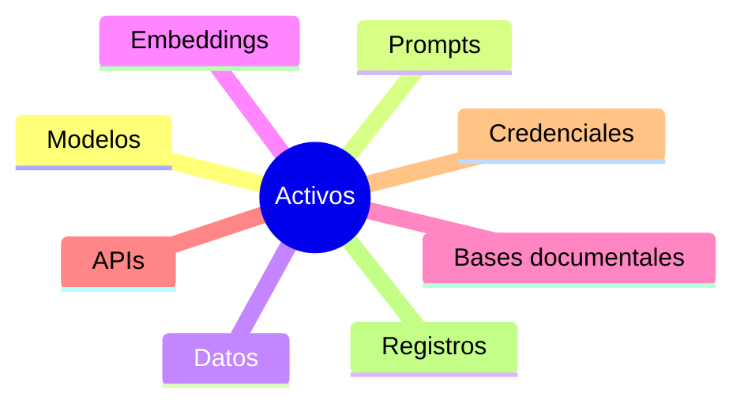

# Capítulo 8 — Seguridad, Gobernanza y Gestión Responsable de la IA
## Sección 01 — La Seguridad como Pilar Arquitectónico

**Versión:** 1.0  
**Estado:** Aprobado para publicación

> *"Una solución inteligente que no puede protegerse deja de ser una solución confiable."*

---

# Objetivos de aprendizaje

Al finalizar esta sección el lector será capaz de:

- comprender por qué la seguridad debe incorporarse desde el diseño de una solución de IA;
- diferenciar la seguridad tradicional de los desafíos específicos de la Inteligencia Artificial;
- identificar los principales activos que requieren protección;
- incorporar el concepto de seguridad por diseño (*Security by Design*) en arquitecturas empresariales.

---

# Introducción

En el desarrollo de software moderno, la seguridad dejó hace tiempo de ser una actividad reservada a las etapas finales del proyecto.

En las soluciones basadas en Inteligencia Artificial esta afirmación adquiere todavía mayor relevancia.

Además de proteger aplicaciones, infraestructura y datos, ahora es necesario resguardar modelos, bases de conocimiento, prompts, configuraciones, registros de interacción y procesos automatizados de decisión.

La superficie de ataque aumenta junto con las capacidades del sistema.

---

# ¿Qué debe proteger un Arquitecto de IA?

La seguridad ya no se limita a impedir accesos no autorizados.

También debe preservar la integridad del conocimiento, garantizar la disponibilidad del servicio y evitar modificaciones que alteren el comportamiento esperado de la solución.

Cada uno de estos activos posee riesgos particulares y requiere controles específicos.

---

# Seguridad por diseño

Una arquitectura madura incorpora controles desde las primeras decisiones de diseño.

Entre ellos:

- autenticación y autorización;
- segmentación de responsabilidades;
- protección de secretos;
- cifrado de datos en tránsito y en reposo;
- registro de eventos relevantes;
- auditoría de cambios;
- gestión de identidades de usuarios y servicios.

Agregar estos mecanismos una vez desplegada la solución suele resultar considerablemente más costoso.

---

# Caso de estudio

Una empresa implementa un asistente corporativo basado en RAG.

Durante una revisión de seguridad se descubre que cualquier usuario autenticado puede consultar documentación correspondiente a otras áreas.

El problema no reside en el modelo ni en el motor de recuperación.

Se encuentra en la ausencia de controles de autorización sobre la base documental.

La solución consiste en integrar los permisos existentes del repositorio con el proceso de recuperación, garantizando que cada usuario solo pueda acceder al conocimiento autorizado.

---

# Buenas prácticas

- Diseñar bajo el principio de mínimo privilegio.
- Centralizar la gestión de identidades.
- Separar ambientes de desarrollo, pruebas y producción.
- Versionar configuraciones críticas.
- Auditar accesos y modificaciones relevantes.

---

# Errores frecuentes

- Suponer que proteger el modelo es suficiente.
- Compartir credenciales entre componentes.
- Exponer servicios internos sin autenticación.
- Ignorar la seguridad de las fuentes documentales utilizadas por RAG.

---

# Ideas clave

- La seguridad constituye un atributo arquitectónico.
- Los sistemas de IA amplían la superficie de ataque tradicional.
- Proteger el conocimiento resulta tan importante como proteger la infraestructura.

---

# Transición hacia la siguiente sección

La próxima sección analizará los riesgos específicos introducidos por los sistemas de IA, incluyendo ataques sobre modelos, manipulación de prompts, exposición de información sensible y amenazas derivadas de la interacción con modelos de lenguaje.

---

> **"Un arquitecto no memoriza respuestas. Comprende problemas para poder diseñar soluciones."**
