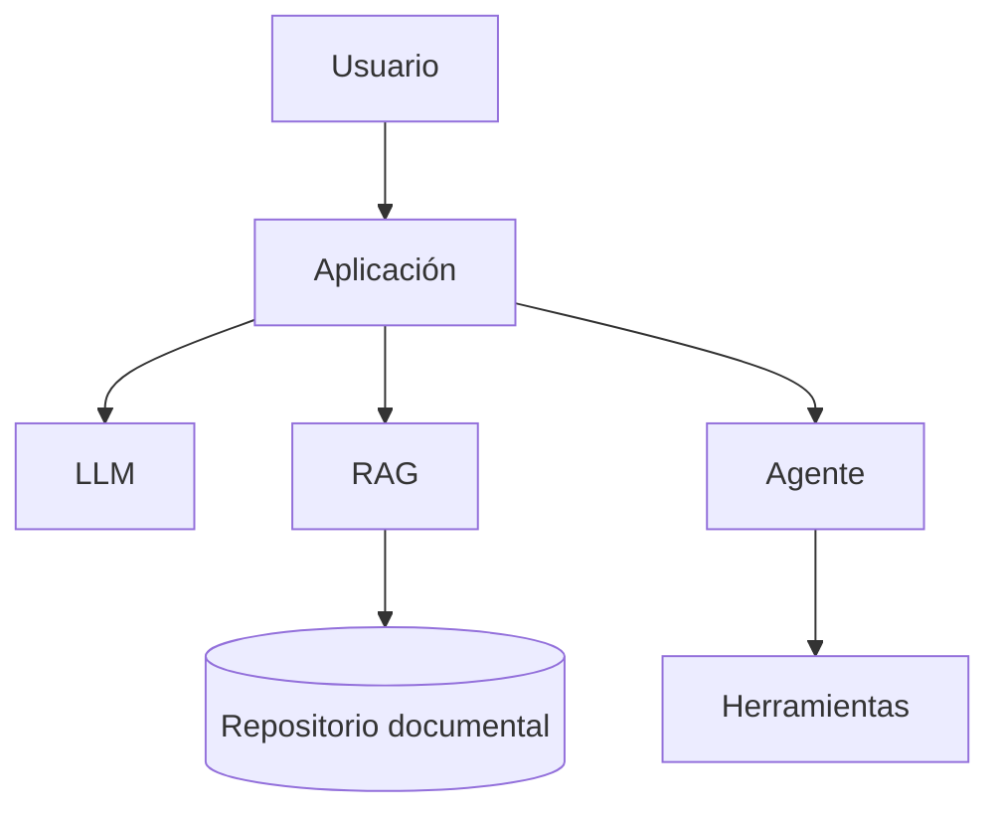

# Capítulo 8 — Seguridad, Gobernanza y Gestión Responsable de la IA
## Sección 02 — Riesgos Específicos de Seguridad en Sistemas de IA

**Versión:** 1.0  
**Estado:** Aprobado para publicación

> *"Toda nueva capacidad tecnológica introduce nuevas superficies de ataque."*

---

# Objetivos de aprendizaje

Al finalizar esta sección el lector será capaz de:

- identificar las amenazas específicas de las soluciones basadas en IA;
- comprender por qué los modelos de lenguaje requieren controles adicionales;
- analizar riesgos asociados a datos, prompts, modelos y herramientas;
- incorporar estos riesgos al proceso de diseño arquitectónico.

---

# Introducción

Durante décadas la seguridad informática estuvo enfocada en proteger aplicaciones, redes y bases de datos.

La incorporación de Inteligencia Artificial amplía significativamente el conjunto de activos críticos.

Ahora deben protegerse también los modelos, los mecanismos de recuperación de conocimiento, las instrucciones que gobiernan el comportamiento del sistema y las herramientas capaces de ejecutar acciones en nombre de los usuarios.

Cada nuevo componente representa una posible superficie de ataque.

---

# Superficie de ataque en una solución de IA

Cada elemento incorpora riesgos diferentes y requiere estrategias de protección específicas.

---

# Manipulación de instrucciones

Los modelos de lenguaje responden siguiendo instrucciones.

Si un atacante logra modificar o interferir con dichas instrucciones, el comportamiento esperado del sistema puede alterarse.

Por ello, las instrucciones del sistema deben considerarse un activo crítico y gestionarse con el mismo nivel de protección que otros componentes sensibles de la arquitectura.

---

# Exposición de información sensible

Un asistente puede acceder a información corporativa, datos personales o documentación confidencial.

La arquitectura debe impedir que esa información sea utilizada fuera del contexto autorizado.

Esto implica controlar:

- permisos de acceso;
- alcance de las consultas;
- registros de auditoría;
- anonimización cuando corresponda;
- retención de información.

---

# Riesgos asociados a herramientas externas

Los agentes suelen interactuar con APIs, sistemas transaccionales y servicios corporativos.

Cada integración amplía la superficie de ataque.

Antes de permitir que un agente ejecute acciones reales conviene responder preguntas como:

- ¿Qué operaciones puede realizar?
- ¿Quién autorizó esas acciones?
- ¿Cómo se registrarán?
- ¿Qué ocurre ante un fallo parcial?

La seguridad debe contemplar no solo la generación de respuestas, sino también la ejecución de operaciones.

---

# Caso de estudio

Una organización implementa un agente capaz de crear solicitudes de soporte.

Durante una auditoría se detecta que el agente puede invocar cualquier función expuesta por la API interna.

Aunque el modelo funciona correctamente, la ausencia de controles de autorización permitiría ejecutar operaciones no previstas.

La solución consiste en limitar explícitamente las capacidades disponibles para el agente y registrar cada ejecución para su posterior auditoría.

---

# Buenas prácticas

- Aplicar el principio de mínimo privilegio a modelos y agentes.
- Validar todas las entradas antes de procesarlas.
- Restringir las herramientas disponibles para cada flujo.
- Auditar accesos y acciones ejecutadas automáticamente.
- Revisar periódicamente las configuraciones de seguridad.

---

# Errores frecuentes

- Confiar plenamente en el comportamiento del modelo.
- Exponer herramientas críticas sin controles adicionales.
- Almacenar información sensible sin clasificación.
- Ignorar los riesgos derivados de las integraciones externas.

---

# Ideas clave

- Los sistemas de IA introducen nuevos riesgos además de los tradicionales.
- Modelos, prompts y herramientas deben tratarse como activos críticos.
- La seguridad debe diseñarse para todo el ecosistema y no únicamente para el modelo.

---

# Transición hacia la siguiente sección

La siguiente sección abordará el gobierno de la Inteligencia Artificial, analizando cómo definir responsabilidades, políticas y mecanismos de control que permitan operar soluciones empresariales de forma segura, transparente y sostenible.

---

> **"Un arquitecto no memoriza respuestas. Comprende problemas para poder diseñar soluciones."**
