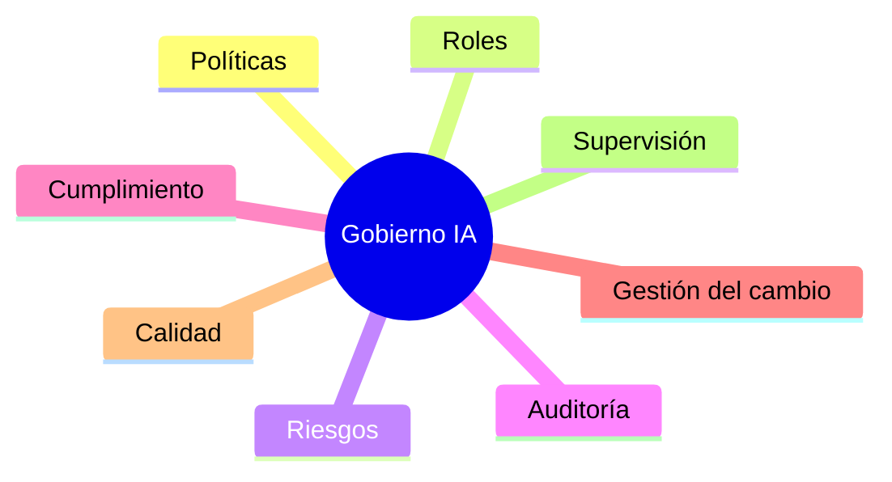

# Capítulo 8 — Seguridad, Gobernanza y Gestión Responsable de la IA
## Sección 03 — Gobierno de la Inteligencia Artificial en Organizaciones

**Versión:** 1.0  
**Estado:** Aprobado para publicación

> *"La confianza en un sistema de IA no depende únicamente de su precisión, sino de la forma en que la organización decide gobernarlo."*

---

# Objetivos de aprendizaje

Al finalizar esta sección el lector será capaz de:

- comprender qué significa gobernar una solución de IA;
- diferenciar gobierno, gestión y operación;
- identificar los principales componentes de un marco de gobierno;
- incorporar mecanismos de control desde el diseño arquitectónico.

---

# Introducción

A medida que las soluciones de IA adquieren mayor autonomía e impacto sobre los procesos del negocio, aumenta la necesidad de establecer reglas claras sobre su utilización.

El gobierno de la IA proporciona ese marco.

No se limita a definir políticas. También establece responsabilidades, mecanismos de supervisión, criterios de aprobación y procesos de revisión que permiten operar la tecnología de forma consistente y sostenible.

---

# ¿Qué es el gobierno de IA?

El gobierno de IA es el conjunto de políticas, procesos, responsabilidades y controles que regulan el diseño, desarrollo, despliegue, operación y retiro de soluciones basadas en Inteligencia Artificial.

Su propósito consiste en asegurar que la tecnología permanezca alineada con los objetivos estratégicos, las obligaciones regulatorias y los principios definidos por la organización.

---

# Componentes principales

Cada componente responde a una pregunta diferente.

Las políticas indican qué está permitido.

Los roles determinan quién decide.

La auditoría registra lo ocurrido.

La supervisión verifica que el sistema continúe operando dentro de los límites aceptables.

---

# Definición de responsabilidades

Una solución empresarial requiere responsabilidades explícitas.

Entre las más habituales se encuentran:

- patrocinador del negocio;
- propietario funcional del sistema;
- Arquitecto de IA;
- responsables de seguridad;
- responsables de datos;
- equipo de operación;
- auditoría interna.

La ausencia de una asignación clara de responsabilidades suele producir decisiones inconsistentes y dificultades para responder ante incidentes.

---

# Caso de estudio

Una organización despliega un asistente interno para responder consultas regulatorias.

Con el paso del tiempo aparecen nuevas normas, cambia la estructura organizacional y distintos equipos actualizan la documentación sin coordinación.

Las respuestas comienzan a mostrar inconsistencias.

El problema no se origina en el modelo de lenguaje, sino en la falta de un proceso formal para aprobar cambios en la base de conocimiento.

La organización implementa un comité de revisión documental, define responsables por dominio y establece un procedimiento de publicación.

La calidad del sistema mejora sin modificar la arquitectura tecnológica.

---

# Buenas prácticas

- Definir propietarios para cada componente crítico.
- Formalizar procesos de aprobación de cambios.
- Mantener trazabilidad sobre decisiones relevantes.
- Revisar periódicamente riesgos y políticas.
- Integrar negocio, tecnología y seguridad en el proceso de gobierno.

---

# Errores frecuentes

- Considerar el gobierno como una actividad exclusivamente legal.
- No asignar responsables para el conocimiento utilizado por el sistema.
- Permitir cambios sin procesos de revisión.
- Confiar únicamente en controles técnicos.

---

# Ideas clave

- El gobierno complementa a la arquitectura y a la seguridad.
- Las responsabilidades deben estar claramente definidas.
- Una buena gobernanza permite que la solución evolucione sin perder control ni trazabilidad.

---

# Transición hacia la siguiente sección

La próxima sección analizará el papel de la privacidad, la protección de datos y el cumplimiento normativo dentro de las soluciones de IA, incorporando estos aspectos como restricciones arquitectónicas desde las primeras etapas del diseño.

---

> **"Un arquitecto no memoriza respuestas. Comprende problemas para poder diseñar soluciones."**
