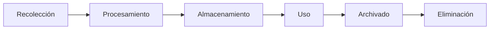

# Capítulo 8 — Seguridad, Gobernanza y Gestión Responsable de la IA
## Sección 04 — Privacidad, Protección de Datos y Cumplimiento Normativo

**Versión:** 1.0  
**Estado:** Aprobado para publicación

> *"La confianza se construye cuando los datos son tratados con el mismo cuidado con el que fueron confiados."*

---

# Objetivos de aprendizaje

Al finalizar esta sección el lector será capaz de:

- comprender la relación entre privacidad, cumplimiento normativo y arquitectura de IA;
- identificar los principales riesgos asociados al tratamiento de datos;
- incorporar requisitos regulatorios desde las primeras decisiones de diseño;
- aplicar el principio de privacidad por diseño (*Privacy by Design*).

---

# Introducción

Toda solución de Inteligencia Artificial procesa información.

En muchos casos esa información incluye datos personales, documentos internos, información financiera, historias clínicas o propiedad intelectual.

Por ese motivo, la protección de datos no puede tratarse como una tarea administrativa posterior al desarrollo.

Debe convertirse en una restricción arquitectónica desde el inicio del proyecto.

---

# Privacidad por diseño

El principio de *Privacy by Design* propone incorporar mecanismos de protección durante el diseño de la solución y no después de su implementación.

Esto implica considerar desde el comienzo:

- qué datos serán utilizados;
- con qué finalidad;
- quién podrá acceder a ellos;
- cuánto tiempo permanecerán almacenados;
- cómo serán eliminados cuando ya no resulten necesarios.

---

# Ciclo de vida de los datos

Cada etapa introduce riesgos diferentes y requiere controles específicos.

---

# Minimización de datos

Una buena arquitectura evita recopilar información innecesaria.

Cuanto mayor sea el volumen de datos almacenados, mayor será también la superficie de riesgo.

El principio de minimización recomienda conservar únicamente la información imprescindible para cumplir el objetivo del sistema.

Este criterio reduce costos, simplifica la operación y facilita el cumplimiento normativo.

---

# Caso de estudio

Una empresa desarrolla un asistente para consultas sobre recursos humanos.

Durante el análisis inicial se plantea indexar todos los documentos disponibles.

El Arquitecto de IA identifica que numerosos archivos contienen información médica y datos salariales que no participan del caso de uso.

La arquitectura se modifica para indexar únicamente la documentación necesaria y aplicar controles de acceso diferenciados.

Como resultado disminuyen tanto el riesgo regulatorio como la exposición de información sensible.

---

# Buenas prácticas

- Clasificar la información antes de incorporarla al sistema.
- Aplicar controles de acceso coherentes con la sensibilidad de los datos.
- Anonimizar información cuando resulte posible.
- Definir políticas de retención y eliminación.
- Mantener evidencia sobre el tratamiento de los datos.

---

# Errores frecuentes

- Indexar toda la información disponible sin análisis previo.
- Compartir datos entre ambientes de desarrollo y producción.
- Conservar información indefinidamente.
- Desconocer las obligaciones regulatorias aplicables al negocio.

---

# Ideas clave

- La privacidad constituye un requisito arquitectónico.
- Menos datos implican menor superficie de riesgo.
- El cumplimiento normativo debe integrarse al diseño y no agregarse posteriormente.

---

# Transición hacia la siguiente sección

La siguiente sección abordará la explicabilidad, la transparencia y la trazabilidad en sistemas de IA, analizando cómo diseñar soluciones cuyas decisiones puedan comprenderse, auditarse y justificarse en contextos empresariales.

---

> **"Un arquitecto no memoriza respuestas. Comprende problemas para poder diseñar soluciones."**
