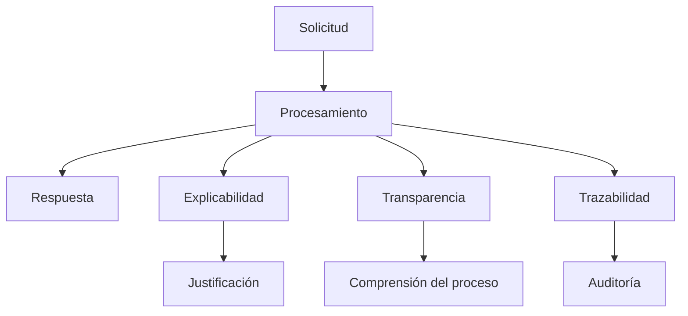

# Capítulo 8 — Seguridad, Gobernanza y Gestión Responsable de la IA
## Sección 05 — Explicabilidad, Transparencia y Trazabilidad

**Versión:** 1.0  
**Estado:** Aprobado para publicación

> *"Una decisión automatizada genera confianza cuando puede comprenderse, justificarse y auditarse."*

---

# Objetivos de aprendizaje

Al finalizar esta sección el lector será capaz de:

- diferenciar explicabilidad, transparencia y trazabilidad;
- comprender cuándo cada concepto resulta crítico;
- diseñar arquitecturas que permitan auditar decisiones;
- incorporar mecanismos de evidencia en soluciones empresariales de IA.

---

# Introducción

No todas las organizaciones necesitan conocer el funcionamiento interno de un modelo matemático.

Sin embargo, toda organización necesita comprender por qué una solución produjo un determinado resultado, qué información utilizó y qué componentes participaron durante su ejecución.

La explicabilidad busca responder **por qué** ocurrió una decisión.

La transparencia responde **cómo opera el sistema**.

La trazabilidad responde **qué evidencia permite reconstruir lo sucedido**.

Estas capacidades fortalecen la confianza, simplifican auditorías y facilitan el mantenimiento.

---

# Relación entre los conceptos

Aunque relacionados, representan objetivos diferentes y complementarios.

---

# Diseñar para la trazabilidad

Una arquitectura empresarial debería conservar evidencia suficiente para reconstruir una interacción significativa.

Dependiendo del caso de uso, esto puede incluir:

- versión del modelo utilizado;
- versión del prompt del sistema;
- documentos recuperados;
- herramientas invocadas;
- usuario solicitante;
- fecha y hora;
- identificadores de la transacción;
- resultado obtenido.

La finalidad no es almacenar toda la información posible, sino registrar aquella necesaria para explicar y auditar el comportamiento del sistema.

---

# Caso de estudio

Un organismo público utiliza un asistente para orientar a ciudadanos sobre requisitos administrativos.

Un ciudadano cuestiona una respuesta recibida semanas atrás.

Gracias a los mecanismos de trazabilidad, el equipo reconstruye la consulta original, identifica la versión de la base documental utilizada y verifica que la normativa cambió dos días después de la interacción.

La organización puede justificar el comportamiento del sistema con evidencia objetiva, evitando interpretaciones basadas en suposiciones.

---

# Buenas prácticas

- Registrar información relevante para auditoría.
- Versionar modelos, prompts y conocimiento.
- Asociar cada respuesta con la evidencia utilizada.
- Definir políticas de conservación de registros.
- Facilitar el acceso controlado a la información de auditoría.

---

# Errores frecuentes

- Conservar únicamente la respuesta final.
- No registrar cambios de configuración.
- Mezclar registros técnicos y de negocio sin estructura.
- Eliminar evidencia antes de finalizar el período de auditoría.

---

# Ideas clave

- La confianza depende de la capacidad de explicar y reconstruir decisiones.
- La trazabilidad constituye un atributo arquitectónico.
- Explicabilidad, transparencia y auditoría deben diseñarse desde el inicio.

---

# Transición hacia la siguiente sección

La siguiente sección analizará el papel del ser humano en el ciclo de decisión, abordando estrategias de supervisión, aprobación y control para soluciones de IA con distintos niveles de autonomía.

---

> **"Un arquitecto no memoriza respuestas. Comprende problemas para poder diseñar soluciones."**
