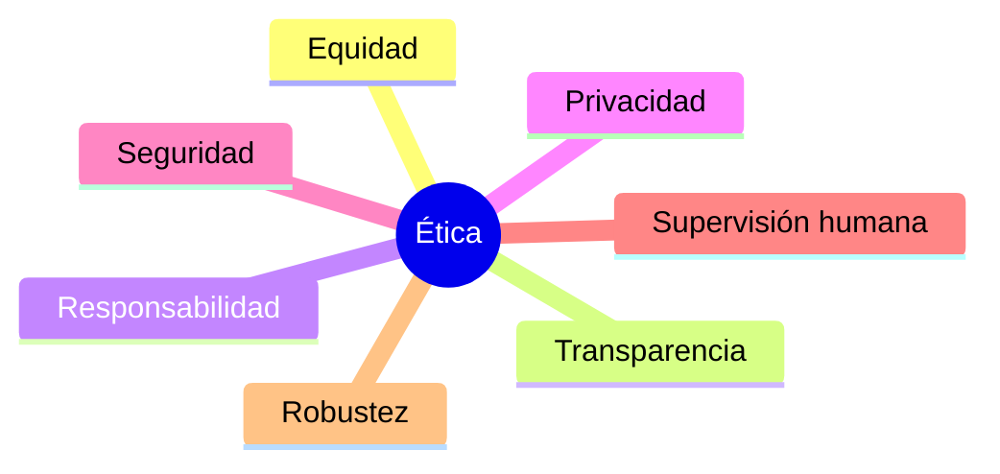

# Capítulo 8 — Seguridad, Gobernanza y Gestión Responsable de la IA
## Sección 07 — Principios Éticos Aplicados a la Arquitectura de IA

**Versión:** 1.0  
**Estado:** Aprobado para publicación

> *"La ética en Inteligencia Artificial no consiste en limitar la innovación, sino en orientar su impacto."*

---

# Objetivos de aprendizaje

Al finalizar esta sección el lector será capaz de:

- comprender la diferencia entre ética, cumplimiento normativo y gobierno;
- incorporar principios éticos al diseño de soluciones empresariales;
- identificar decisiones arquitectónicas con impacto sobre personas y organizaciones;
- traducir principios abstractos en mecanismos concretos de diseño.

---

# Introducción

Las organizaciones no implementan soluciones de IA en el vacío.

Cada decisión automatizada puede afectar clientes, empleados, ciudadanos, proveedores o socios comerciales.

Por ese motivo, el Arquitecto de IA no solo debe evaluar viabilidad técnica y costos. También debe considerar las consecuencias que una arquitectura puede producir sobre quienes interactúan con ella.

La ética no reemplaza a la ingeniería.

La complementa.

---

# Principios fundamentales

Estos principios deben reflejarse en decisiones técnicas verificables y no permanecer únicamente como declaraciones institucionales.

---

# De los principios a la arquitectura

Cada principio ético puede transformarse en requisitos concretos.

| Principio | Decisión arquitectónica |
|-----------|--------------------------|
| Transparencia | Registrar evidencia y justificar respuestas |
| Equidad | Evaluar sesgos y revisar datos |
| Privacidad | Minimizar y proteger la información |
| Responsabilidad | Definir propietarios y procesos de aprobación |
| Supervisión | Incorporar intervención humana cuando el riesgo lo requiera |

El valor de estos principios reside en su implementación práctica.

---

# Caso de estudio

Una empresa desarrolla un sistema para priorizar postulantes durante un proceso de selección.

El equipo identifica que determinadas variables históricas podrían introducir tratamientos injustificados sobre ciertos grupos de candidatos.

La arquitectura elimina atributos no pertinentes para el objetivo del proceso, documenta los criterios utilizados y establece revisiones periódicas de los resultados obtenidos.

La solución no pretende eliminar toda posibilidad de error, sino reducir riesgos mediante decisiones de diseño explícitas.

---

# Buenas prácticas

- Analizar el impacto potencial sobre las personas antes del desarrollo.
- Documentar criterios relevantes de diseño.
- Incorporar revisiones multidisciplinarias en procesos críticos.
- Evaluar periódicamente el comportamiento del sistema.
- Mantener mecanismos de apelación o revisión cuando corresponda.

---

# Errores frecuentes

- Considerar la ética como un problema exclusivamente jurídico.
- Confiar únicamente en controles automáticos.
- No revisar periódicamente el comportamiento de la solución.
- Suponer que un modelo técnicamente preciso siempre produce resultados aceptables.

---

# Ideas clave

- La ética debe incorporarse desde la arquitectura.
- Los principios adquieren valor cuando generan decisiones concretas.
- La confianza se construye mediante diseño, supervisión y evidencia.

---

# Transición hacia la siguiente sección

La siguiente sección integrará seguridad, gobierno, privacidad, explicabilidad y ética en un marco unificado de gestión responsable para soluciones empresariales de Inteligencia Artificial.

---

> **"Un arquitecto no memoriza respuestas. Comprende problemas para poder diseñar soluciones."**
