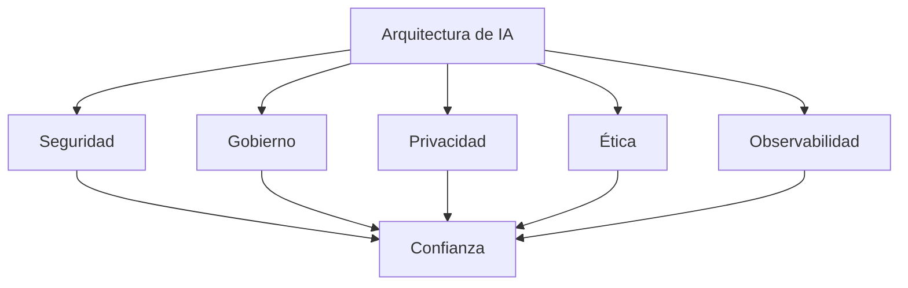

# Capítulo 8 — Seguridad, Gobernanza y Gestión Responsable de la IA
## Sección 08 — Integrando Seguridad, Gobierno y Ética en una Arquitectura Empresarial

**Versión:** 1.0  
**Estado:** Aprobado para publicación

> *"La confianza no surge de un único mecanismo; es el resultado de una arquitectura diseñada para proteger, controlar y explicar."*

---

# Objetivos de aprendizaje

Al finalizar esta sección el lector será capaz de:

- integrar seguridad, gobierno y ética en una visión arquitectónica unificada;
- comprender cómo interactúan estos dominios durante el ciclo de vida de una solución;
- identificar controles transversales aplicables a cualquier arquitectura de IA;
- diseñar soluciones preparadas para evolucionar sin perder confiabilidad.

---

# Introducción

En organizaciones maduras, la seguridad, la gobernanza, la privacidad y la ética no funcionan como iniciativas independientes.

Cada una aporta restricciones, responsabilidades y controles que condicionan el diseño de la solución.

El Arquitecto de IA debe integrar estos elementos en una única arquitectura coherente.

---

# Un modelo unificado

La confianza organizacional emerge de la interacción de todos estos componentes.

---

# Controles transversales

Los controles más efectivos suelen aplicarse de forma transversal:

| Dominio | Controles representativos |
|---------|---------------------------|
| Seguridad | Autenticación, autorización, cifrado |
| Gobierno | Roles, políticas, auditoría |
| Privacidad | Clasificación y minimización de datos |
| Ética | Revisión de impacto, supervisión humana |
| Operación | Observabilidad y mejora continua |

Su implementación coordinada reduce riesgos y facilita la evolución de la plataforma.

---

# Caso de estudio

Una compañía multinacional despliega un asistente corporativo para áreas legales, financieras y de recursos humanos.

La arquitectura incorpora permisos heredados del directorio corporativo, registros de auditoría, separación de ambientes, revisión documental, aprobación de cambios y supervisión humana para consultas críticas.

Meses después se incorpora un nuevo modelo de lenguaje.

La sustitución no requiere rediseñar los mecanismos de seguridad ni el gobierno de la solución, ya que estos fueron concebidos como capacidades independientes del proveedor tecnológico.

---

# Buenas prácticas

- Diseñar controles reutilizables entre proyectos.
- Evitar dependencias fuertes con un único proveedor.
- Mantener políticas comunes para todas las soluciones de IA.
- Revisar periódicamente la efectividad de los controles.
- Documentar decisiones arquitectónicas relevantes.

---

# Errores frecuentes

- Implementar controles aislados sin coordinación.
- Delegar la gobernanza exclusivamente al área de seguridad.
- Diseñar políticas imposibles de aplicar operativamente.
- Considerar la ética como una actividad separada del diseño.

---

# Ideas clave

- La confianza es un atributo emergente de toda la arquitectura.
- Los controles deben integrarse desde el diseño inicial.
- Seguridad, gobierno y ética evolucionan junto con la solución.

---

# Transición hacia la siguiente sección

La próxima y última sección del capítulo sintetizará los principios desarrollados, presentará un checklist para arquitectos de IA y cerrará el capítulo preparando el paso hacia el siguiente eje temático del libro.

---

> **"Un arquitecto no memoriza respuestas. Comprende problemas para poder diseñar soluciones."**
