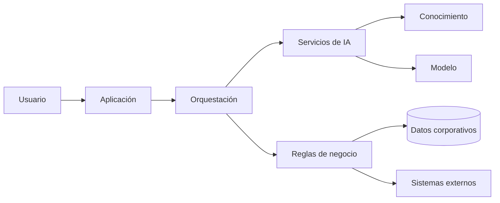

# Capítulo 9 — Ingeniería de Aplicaciones Inteligentes
## Sección 01 — De la Arquitectura a la Aplicación Inteligente

**Versión:** 1.0  
**Estado:** Aprobado para publicación

> *"Una arquitectura adquiere valor cuando se materializa en una aplicación capaz de resolver problemas reales."*

---

# Objetivos de aprendizaje

Al finalizar esta sección el lector será capaz de:

- comprender qué caracteriza a una aplicación inteligente empresarial;
- diferenciar una aplicación tradicional de una aplicación enriquecida con IA;
- identificar los componentes funcionales que conforman una aplicación inteligente;
- reconocer el papel del Arquitecto de IA durante la construcción de la solución.

---

# Introducción

Los capítulos anteriores desarrollaron los fundamentos necesarios para comprender modelos, recuperación de conocimiento, agentes, arquitectura, evaluación, seguridad y gobierno.

El siguiente paso consiste en integrar todos esos conceptos en aplicaciones completas.

Una aplicación inteligente no es un modelo de lenguaje expuesto mediante una interfaz conversacional.

Es un sistema empresarial donde la Inteligencia Artificial representa una capacidad más dentro de una arquitectura mayor.

El objetivo continúa siendo resolver necesidades del negocio.

La IA constituye un medio para lograrlo.

---

# ¿Qué convierte a una aplicación en inteligente?

Una aplicación puede incorporar capacidades de IA sin perder los principios clásicos de ingeniería de software.

Entre las capacidades más habituales se encuentran:

- comprender lenguaje natural;
- recuperar conocimiento corporativo;
- generar contenido;
- asistir decisiones;
- coordinar procesos;
- automatizar tareas cognitivas.

Estas capacidades deben integrarse con autenticación, reglas de negocio, auditoría, observabilidad, seguridad y sistemas existentes.

---

# Arquitectura conceptual

La Inteligencia Artificial ocupa un lugar dentro de la arquitectura, pero no reemplaza al resto de los componentes empresariales.

---

# Caso de estudio

Una organización desarrolla un portal para asistencia técnica interna.

El usuario interactúa mediante lenguaje natural.

La aplicación autentica al usuario, identifica su perfil, recupera documentación autorizada, consulta un modelo de lenguaje, registra toda la interacción y, cuando corresponde, genera automáticamente un ticket en la plataforma corporativa.

Desde la perspectiva del usuario existe una única aplicación.

Desde la perspectiva del arquitecto, múltiples capacidades colaboran para ofrecer una experiencia consistente.

---

# Buenas prácticas

- Diseñar aplicaciones alrededor del negocio y no del modelo.
- Mantener responsabilidades claramente separadas.
- Evitar que el modelo concentre lógica empresarial.
- Integrar observabilidad, seguridad y gobierno desde el inicio.
- Diseñar componentes reemplazables y desacoplados.

---

# Errores frecuentes

- Construir la aplicación directamente sobre un proveedor de IA.
- Mezclar lógica de negocio con prompts.
- Ignorar sistemas corporativos existentes.
- Considerar la interfaz conversacional como la aplicación completa.

---

# Ideas clave

- Una aplicación inteligente integra múltiples capacidades coordinadas.
- La IA complementa la arquitectura empresarial existente.
- El diseño sigue guiándose por principios de ingeniería de software.

---

# Transición hacia la siguiente sección

La próxima sección analizará los componentes fundamentales de una aplicación inteligente y cómo distribuir sus responsabilidades para construir soluciones mantenibles, escalables y preparadas para evolucionar.

---

> **"Un arquitecto no memoriza respuestas. Comprende problemas para poder diseñar soluciones."**
