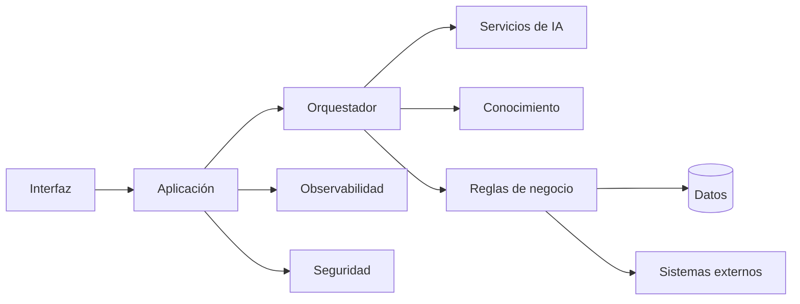

# Capítulo 9 — Ingeniería de Aplicaciones Inteligentes
## Sección 02 — Componentes Fundamentales de una Aplicación Inteligente

**Versión:** 1.0  
**Estado:** Aprobado para publicación

> *"Las aplicaciones inteligentes duraderas no se construyen alrededor de modelos; se construyen alrededor de responsabilidades bien definidas."*

---

# Objetivos de aprendizaje

Al finalizar esta sección el lector será capaz de:

- identificar los componentes principales de una aplicación inteligente empresarial;
- comprender las responsabilidades de cada componente;
- diseñar aplicaciones desacopladas y mantenibles;
- evitar dependencias innecesarias entre la lógica de negocio y los servicios de IA.

---

# Introducción

Una aplicación inteligente combina capacidades tradicionales de ingeniería de software con componentes especializados de Inteligencia Artificial.

La calidad de la solución depende menos del modelo utilizado que de la manera en que se distribuyen las responsabilidades entre los distintos módulos.

Una arquitectura modular facilita la evolución tecnológica sin afectar el funcionamiento general de la aplicación.

---

# Componentes principales

Cada componente cumple una función específica y puede evolucionar de forma independiente.

---

# Responsabilidades

| Componente | Responsabilidad |
|------------|-----------------|
| Interfaz | Interacción con usuarios y sistemas |
| Orquestador | Coordinar el flujo de ejecución |
| Servicios de IA | Comprensión, generación o clasificación |
| Reglas de negocio | Aplicar políticas corporativas |
| Conocimiento | Proveer contexto y documentación |
| Seguridad | Controlar identidades y permisos |
| Observabilidad | Registrar métricas, eventos y trazas |

Esta separación evita que el modelo de IA asuma responsabilidades que pertenecen a la aplicación.

---

# Caso de estudio

Un asistente para mesa de ayuda recibe una consulta en lenguaje natural.

La interfaz autentica al usuario.

El orquestador identifica la intención y consulta la base de conocimiento.

Las reglas de negocio verifican permisos y prioridades.

El servicio de IA genera una respuesta fundamentada.

Finalmente, el sistema registra la interacción y crea un ticket cuando la incidencia no puede resolverse automáticamente.

Cada componente participa únicamente en aquello para lo que fue diseñado.

---

# Buenas prácticas

- Mantener bajo acoplamiento entre módulos.
- Encapsular el acceso a modelos mediante servicios especializados.
- Centralizar la lógica de negocio fuera de los prompts.
- Diseñar interfaces estables entre componentes.
- Permitir reemplazar modelos sin modificar el resto de la aplicación.

---

# Errores frecuentes

- Incorporar reglas de negocio dentro del modelo.
- Acceder directamente al proveedor de IA desde la interfaz.
- Duplicar lógica entre componentes.
- Mezclar responsabilidades técnicas y funcionales.

---

# Ideas clave

- La modularidad facilita la evolución.
- La IA constituye un componente de la aplicación, no la aplicación completa.
- Las responsabilidades claras reducen complejidad y riesgo.

---

# Transición hacia la siguiente sección

La próxima sección analizará los patrones de comunicación entre componentes inteligentes, incluyendo flujos síncronos, asíncronos y orientados a eventos para aplicaciones empresariales de gran escala.

---

> **"Un arquitecto no memoriza respuestas. Comprende problemas para poder diseñar soluciones."**
