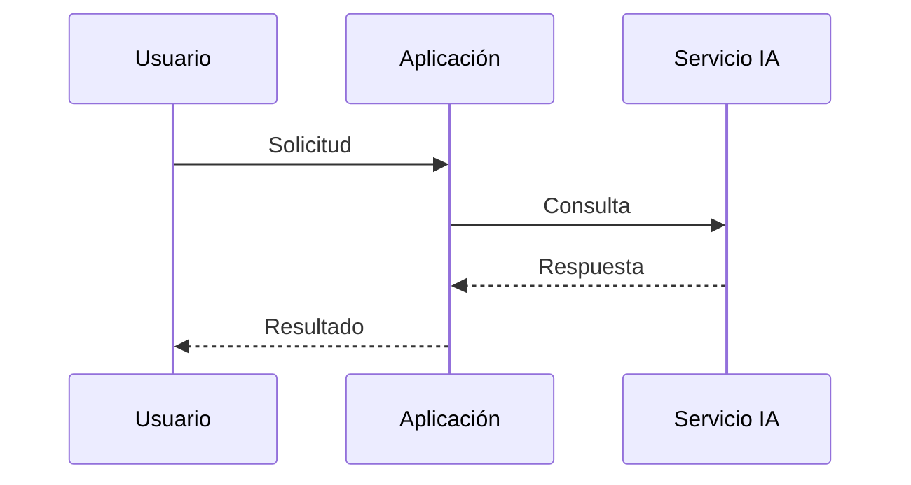
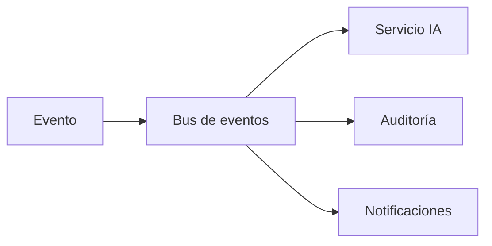

# Capítulo 9 — Ingeniería de Aplicaciones Inteligentes
## Sección 03 — Patrones de Comunicación en Aplicaciones Inteligentes

**Versión:** 1.0  
**Estado:** Aprobado para publicación

> *"La inteligencia de una aplicación depende tanto de sus decisiones como de la forma en que sus componentes colaboran."*

---

# Objetivos de aprendizaje

Al finalizar esta sección el lector será capaz de:

- comprender los principales patrones de comunicación utilizados en aplicaciones inteligentes;
- seleccionar mecanismos de interacción adecuados según el contexto;
- diferenciar comunicaciones síncronas, asíncronas y orientadas a eventos;
- diseñar aplicaciones desacopladas y resilientes.

---

# Introducción

Una aplicación inteligente rara vez está compuesta por un único proceso.

En la mayoría de los escenarios empresariales participan múltiples servicios: autenticación, reglas de negocio, recuperación de conocimiento, modelos de IA, bases documentales, sistemas transaccionales y plataformas externas.

La forma en que estos componentes intercambian información condiciona la escalabilidad, la disponibilidad y la capacidad de evolución de la solución.

---

# Comunicación síncrona

En un flujo síncrono un componente espera la respuesta del siguiente antes de continuar.

Este patrón simplifica el diseño y resulta apropiado cuando el usuario necesita una respuesta inmediata.

Sin embargo, incrementa el acoplamiento entre los componentes y hace que la disponibilidad de un servicio dependa de los demás.

---

# Comunicación asíncrona

Cuando una tarea requiere varios segundos o minutos, la comunicación asíncrona suele ofrecer mejores resultados.

En este enfoque, la aplicación registra la solicitud y continúa procesando el trabajo en segundo plano.

Entre sus ventajas se encuentran:

- mejor utilización de recursos;
- mayor resiliencia frente a fallos temporales;
- posibilidad de reintentos automáticos;
- menor impacto sobre la experiencia del usuario.

---

# Arquitecturas orientadas a eventos

Las aplicaciones empresariales modernas suelen reaccionar a eventos producidos por otros sistemas.

Este enfoque permite incorporar nuevas capacidades sin modificar los componentes existentes, favoreciendo la evolución de la plataforma.

---

# Selección del patrón adecuado

| Escenario | Patrón recomendado |
|-----------|--------------------|
| Consulta interactiva | Comunicación síncrona |
| Procesamiento masivo | Comunicación asíncrona |
| Integración entre múltiples dominios | Eventos |
| Procesos híbridos | Combinación de patrones |

No existe un mecanismo universalmente superior. La decisión depende de los requisitos funcionales y no funcionales del sistema.

---

# Caso de estudio

Una empresa implementa un asistente para analizar contratos.

La respuesta preliminar se genera de forma síncrona para mantener una experiencia fluida.

En paralelo, un proceso asíncrono ejecuta verificaciones adicionales, consulta repositorios externos y genera un informe ampliado.

Cada etapa utiliza el patrón de comunicación más adecuado para su objetivo.

---

# Buenas prácticas

- Mantener contratos de comunicación estables.
- Diseñar mecanismos de reintento para operaciones críticas.
- Evitar dependencias innecesarias entre servicios.
- Incorporar trazabilidad en todos los flujos.
- Elegir el patrón según el comportamiento esperado del negocio.

---

# Errores frecuentes

- Utilizar llamadas síncronas para procesos prolongados.
- Compartir estado entre componentes sin necesidad.
- Ignorar escenarios de fallo parcial.
- Diseñar integraciones difíciles de evolucionar.

---

# Ideas clave

- La comunicación condiciona la arquitectura tanto como los componentes.
- El desacoplamiento favorece la escalabilidad y el mantenimiento.
- Es habitual combinar varios patrones dentro de una misma aplicación.

---

# Transición hacia la siguiente sección

La próxima sección analizará cómo diseñar flujos de trabajo inteligentes que integren reglas de negocio, servicios de IA, agentes y sistemas corporativos para resolver procesos empresariales completos.

---

> **"Un arquitecto no memoriza respuestas. Comprende problemas para poder diseñar soluciones."**
