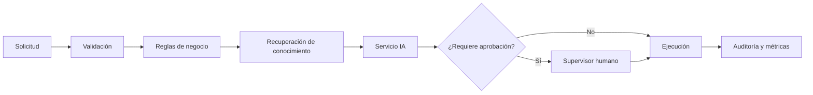

# Capítulo 9 — Ingeniería de Aplicaciones Inteligentes
## Sección 04 — Diseño de Flujos de Trabajo Inteligentes

**Versión:** 1.0  
**Estado:** Aprobado para publicación

> *"Una aplicación inteligente crea valor cuando coordina capacidades diversas para resolver un proceso de negocio de principio a fin."*

---

# Objetivos de aprendizaje

Al finalizar esta sección el lector será capaz de:

- diseñar flujos de trabajo que integren IA y sistemas empresariales;
- distinguir entre decisiones de negocio y decisiones del modelo;
- identificar puntos de control dentro de un proceso inteligente;
- construir aplicaciones preparadas para evolucionar sin afectar el flujo operativo.

---

# Introducción

En la mayoría de las organizaciones, el valor no reside en una única respuesta generada por un modelo de lenguaje.

El verdadero impacto aparece cuando esa capacidad se integra dentro de un proceso empresarial completo.

Una aplicación inteligente debe coordinar personas, reglas de negocio, conocimiento corporativo, servicios de IA y sistemas existentes para alcanzar un objetivo concreto.

---

# El flujo como unidad de diseño

La arquitectura debe diseñarse alrededor del proceso y no alrededor del modelo.

Cada etapa incorpora una responsabilidad específica y puede evolucionar de manera independiente.

---

# Separación de responsabilidades

Dentro del flujo conviene diferenciar claramente:

| Componente | Responsabilidad |
|------------|-----------------|
| Reglas de negocio | Definir políticas y validaciones |
| IA | Analizar, clasificar o generar contenido |
| Orquestación | Coordinar el flujo |
| Sistemas corporativos | Ejecutar operaciones transaccionales |
| Supervisión | Aprobar excepciones y casos críticos |

Esta separación evita que el modelo tome decisiones que corresponden al negocio.

---

# Diseño para excepciones

Los procesos reales contienen situaciones no previstas.

Una arquitectura madura contempla:

- datos incompletos;
- respuestas ambiguas;
- fallos de servicios externos;
- intervención humana;
- reintentos controlados.

El tratamiento de excepciones forma parte del diseño del flujo y no debe agregarse posteriormente.

---

# Caso de estudio

Una entidad financiera automatiza el análisis inicial de solicitudes de crédito.

El sistema verifica la identidad del solicitante, consulta fuentes documentales, resume la información relevante y propone una evaluación preliminar.

Si detecta inconsistencias o un nivel de riesgo superior al definido por la organización, deriva automáticamente el caso a un analista.

La IA acelera el proceso, mientras que las decisiones críticas permanecen bajo control humano.

---

# Buenas prácticas

- Diseñar procesos completos antes de seleccionar tecnologías.
- Incorporar puntos de control explícitos.
- Mantener la lógica de negocio fuera de los modelos.
- Registrar cada transición relevante del flujo.
- Diseñar para recuperación ante fallos.

---

# Errores frecuentes

- Construir flujos dependientes de un único proveedor.
- Automatizar decisiones críticas sin mecanismos de revisión.
- Omitir escenarios excepcionales.
- Acoplar la orquestación al modelo de IA.

---

# Ideas clave

- El proceso constituye la unidad principal de diseño.
- La IA participa dentro del flujo, pero no reemplaza su lógica.
- Las aplicaciones inteligentes combinan automatización y supervisión según el riesgo.

---

# Transición hacia la siguiente sección

La próxima sección analizará cómo integrar aplicaciones inteligentes con plataformas empresariales, servicios existentes y ecosistemas de software, preservando el desacoplamiento y la capacidad de evolución.

---

> **"Un arquitecto no memoriza respuestas. Comprende problemas para poder diseñar soluciones."**
