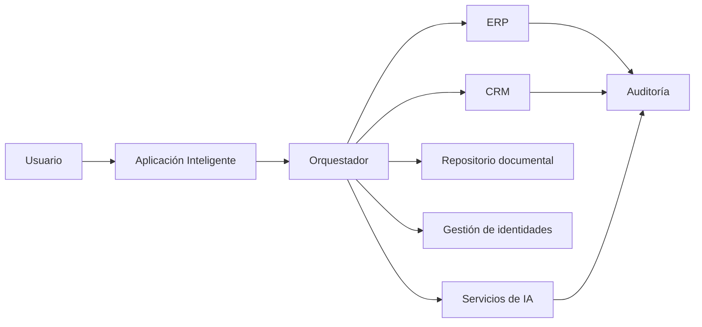

# Capítulo 9 — Ingeniería de Aplicaciones Inteligentes
## Sección 05 — Integración con Sistemas Empresariales y Ecosistemas Tecnológicos

**Versión:** 1.0  
**Estado:** Aprobado para publicación

> *"Una aplicación inteligente genera valor cuando se integra con el negocio, no cuando funciona de manera aislada."*

---

# Objetivos de aprendizaje

Al finalizar esta sección el lector será capaz de:

- comprender la importancia de integrar aplicaciones inteligentes con plataformas corporativas;
- identificar estrategias de desacoplamiento entre la IA y los sistemas empresariales;
- diseñar integraciones preparadas para evolucionar;
- reducir el impacto de cambios tecnológicos mediante principios arquitectónicos.

---

# Introducción

Pocas organizaciones desarrollan aplicaciones completamente nuevas.

La mayoría incorpora capacidades de IA sobre un ecosistema ya existente compuesto por ERP, CRM, gestores documentales, sistemas de tickets, plataformas de identidad, bases de datos y servicios externos.

El desafío del Arquitecto de IA consiste en integrar estas capacidades sin comprometer la estabilidad del resto de la organización.

---

# La IA como un consumidor más del ecosistema

La Inteligencia Artificial no debería acceder directamente a todos los sistemas corporativos.

La arquitectura debe definir puntos de integración claramente controlados.

El orquestador centraliza la coordinación, mientras cada sistema mantiene su responsabilidad funcional.

---

# Principios de integración

Una integración empresarial sostenible debería cumplir los siguientes principios:

- bajo acoplamiento entre componentes;
- contratos de integración estables;
- separación entre lógica de negocio y servicios de IA;
- manejo explícito de errores;
- trazabilidad de todas las operaciones relevantes.

Estos principios permiten reemplazar modelos, modificar procesos o incorporar nuevos sistemas sin rediseñar toda la solución.

---

# Estrategias habituales

| Estrategia | Cuándo utilizarla |
|------------|-------------------|
| APIs | Integraciones síncronas con respuesta inmediata |
| Mensajería | Procesos desacoplados y resilientes |
| Eventos | Ecosistemas distribuidos y evolución continua |
| Adaptadores | Integración con sistemas legados |
| Orquestación | Procesos que involucran múltiples dominios |

La selección depende del contexto tecnológico y de los atributos de calidad esperados.

---

# Caso de estudio

Una empresa incorpora un asistente comercial que consulta información de clientes.

En lugar de permitir que el modelo acceda directamente al CRM, la arquitectura expone un servicio especializado que valida permisos, aplica reglas de negocio y devuelve únicamente la información necesaria para responder la consulta.

Semanas después el CRM es reemplazado por otra plataforma.

Gracias al uso de un adaptador, la aplicación inteligente continúa funcionando sin modificaciones en los componentes de IA.

---

# Buenas prácticas

- Integrar mediante interfaces bien definidas.
- Limitar el acceso de la IA a la información estrictamente necesaria.
- Centralizar autenticación y autorización.
- Registrar todas las integraciones críticas.
- Diseñar adaptadores para sistemas con alta probabilidad de cambio.

---

# Errores frecuentes

- Conectar el modelo directamente con bases de datos corporativas.
- Acoplar la aplicación a un proveedor específico.
- Duplicar reglas de negocio durante las integraciones.
- Ignorar el tratamiento de fallos parciales.

---

# Ideas clave

- Las aplicaciones inteligentes forman parte del ecosistema empresarial.
- El desacoplamiento facilita la evolución tecnológica.
- Las integraciones deben diseñarse con los mismos criterios de calidad que el resto de la arquitectura.

---

# Transición hacia la siguiente sección

La próxima sección abordará el diseño de experiencias de usuario para aplicaciones inteligentes, analizando cómo construir interfaces que aprovechen las capacidades de la IA sin sacrificar claridad, control y confianza.

---

> **"Un arquitecto no memoriza respuestas. Comprende problemas para poder diseñar soluciones."**
