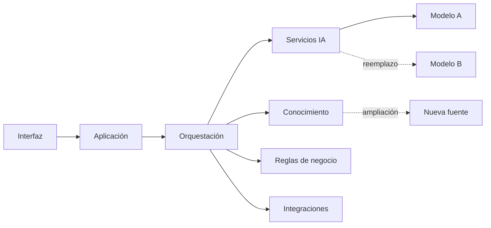

# Capítulo 9 — Ingeniería de Aplicaciones Inteligentes
## Sección 07 — Resiliencia y Evolución de Aplicaciones Inteligentes

**Versión:** 1.0  
**Estado:** Aprobado para publicación

> *"Una aplicación inteligente bien diseñada no solo resuelve los problemas de hoy; también está preparada para adaptarse a los de mañana."*

---

# Objetivos de aprendizaje

Al finalizar esta sección el lector será capaz de:

- diseñar aplicaciones inteligentes resilientes frente a fallos y cambios tecnológicos;
- identificar estrategias para facilitar la evolución continua de la solución;
- comprender cómo reducir el impacto de incorporar nuevos modelos, fuentes de conocimiento o procesos;
- aplicar principios arquitectónicos orientados a la adaptabilidad.

---

# Introducción

Los modelos evolucionan, aparecen nuevas plataformas, cambian las regulaciones y el negocio incorpora procesos inéditos.

Si la arquitectura depende excesivamente de una tecnología específica, cada cambio implicará una reingeniería costosa.

El objetivo del Arquitecto de IA consiste en construir aplicaciones capaces de evolucionar mediante modificaciones controladas y de alcance limitado.

---

# Arquitectura preparada para el cambio

El desacoplamiento permite sustituir componentes sin alterar el comportamiento general de la aplicación.

---

# Estrategias de resiliencia

Una aplicación inteligente debería contemplar mecanismos como:

- degradación controlada del servicio;
- reintentos automáticos para operaciones transitorias;
- tiempos máximos de espera;
- circuitos de protección ante dependencias externas;
- alternativas cuando un modelo no se encuentre disponible.

Estos mecanismos aumentan la disponibilidad sin comprometer la calidad arquitectónica.

---

# Evolución incremental

La incorporación de nuevas capacidades debería realizarse mediante cambios pequeños y verificables.

Por ejemplo:

- agregar un nuevo modelo de lenguaje;
- incorporar una nueva base documental;
- sumar herramientas para un agente;
- extender un flujo de negocio existente.

La arquitectura debe facilitar estas incorporaciones sin afectar componentes que no participan del cambio.

---

# Caso de estudio

Una empresa despliega un asistente técnico basado inicialmente en un único modelo de lenguaje.

Meses después decide incorporar un segundo proveedor para comparar desempeño y reducir el riesgo de dependencia tecnológica.

Gracias a que el acceso al modelo se encontraba encapsulado detrás de un servicio especializado, la incorporación requiere modificar únicamente ese componente y actualizar las políticas de selección.

La interfaz, la lógica de negocio y las integraciones permanecen sin cambios.

---

# Buenas prácticas

- Diseñar componentes sustituibles.
- Mantener contratos estables entre módulos.
- Aislar dependencias externas.
- Automatizar pruebas de regresión antes de cada cambio.
- Documentar decisiones arquitectónicas relevantes.

---

# Errores frecuentes

- Acoplar la aplicación a un proveedor específico.
- Incorporar lógica de negocio dentro de los componentes de IA.
- Ignorar escenarios de indisponibilidad.
- Introducir múltiples cambios simultáneamente.

---

# Ideas clave

- La resiliencia es una propiedad arquitectónica.
- La evolución continua debe planificarse desde el inicio.
- El desacoplamiento reduce el costo de incorporar nuevas capacidades.

---

# Transición hacia la siguiente sección

La próxima sección integrará los principios estudiados mediante un caso completo de aplicación inteligente empresarial, mostrando cómo convergen arquitectura, integración, experiencia de usuario y resiliencia en una solución de extremo a extremo.

---

> **"Un arquitecto no memoriza respuestas. Comprende problemas para poder diseñar soluciones."**
