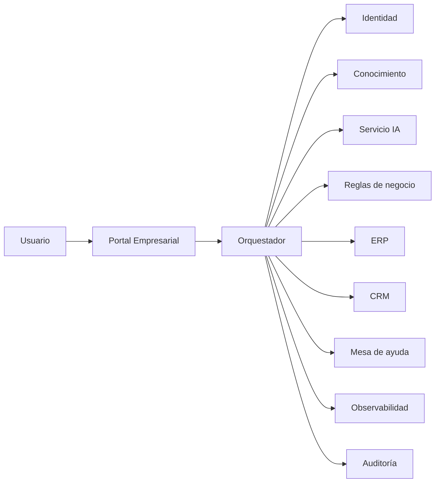

# Capítulo 9 — Ingeniería de Aplicaciones Inteligentes
## Sección 08 — Caso de Estudio: Diseño Integral de una Aplicación Inteligente Empresarial

**Versión:** 1.0  
**Estado:** Aprobado para publicación

> *"Una arquitectura demuestra su calidad cuando convierte principios en una solución capaz de generar valor de manera sostenida."*

---

# Objetivos de aprendizaje

Al finalizar esta sección el lector será capaz de:

- integrar los conceptos desarrollados a lo largo del capítulo;
- recorrer el diseño completo de una aplicación inteligente empresarial;
- justificar decisiones arquitectónicas desde la perspectiva del negocio;
- comprender cómo interactúan IA, procesos, seguridad y operación.

---

# Escenario

Una empresa con presencia internacional recibe miles de consultas internas relacionadas con compras, recursos humanos, soporte técnico y normativa corporativa.

Los objetivos son:

- reducir tiempos de respuesta;
- reutilizar el conocimiento organizacional;
- automatizar tareas repetitivas;
- mantener el control sobre procesos críticos.

El desafío consiste en incorporar IA sin alterar los sistemas corporativos existentes.

---

# Arquitectura propuesta

La aplicación actúa como una capa de coordinación que reutiliza capacidades ya existentes dentro de la organización.

---

# Flujo operativo

1. El usuario inicia una consulta autenticada.
2. La aplicación identifica el contexto y los permisos.
3. El orquestador recupera información relevante.
4. El servicio de IA genera una propuesta de respuesta.
5. Las reglas de negocio determinan si puede ejecutarse una acción automática.
6. Cuando corresponde, interviene un supervisor humano.
7. La interacción queda registrada para auditoría y mejora continua.

La IA participa únicamente en aquellas etapas donde aporta valor.

---

# Decisiones arquitectónicas

| Necesidad | Decisión |
|-----------|-----------|
| Conocimiento actualizado | Arquitectura RAG |
| Integración empresarial | Orquestador desacoplado |
| Seguridad | Identidad centralizada y autorización |
| Escalabilidad | Componentes independientes |
| Evolución | Servicios sustituibles y contratos estables |
| Gobierno | Auditoría y observabilidad integradas |

Cada decisión responde a un requisito del negocio y no a una preferencia tecnológica.

---

# Resultado

La solución consigue:

- disminuir el tiempo medio de atención;
- reducir consultas repetitivas;
- preservar el control humano sobre operaciones críticas;
- incorporar nuevos modelos sin modificar la aplicación principal;
- mantener evidencia completa para auditoría.

El éxito proviene del diseño integral de la arquitectura y no exclusivamente del modelo utilizado.

---

# Buenas prácticas

- Comenzar siempre por el proceso de negocio.
- Diseñar componentes con responsabilidades únicas.
- Mantener interfaces estables entre servicios.
- Incorporar observabilidad desde el primer despliegue.
- Planificar la evolución tecnológica desde el diseño inicial.

---

# Errores frecuentes

- Construir la solución alrededor del proveedor de IA.
- Duplicar reglas de negocio dentro del modelo.
- Ignorar la operación y el mantenimiento.
- Considerar la IA como un componente aislado del ecosistema.

---

# Ideas clave

- Una aplicación inteligente integra múltiples disciplinas de ingeniería.
- La arquitectura coordina capacidades; la IA aporta inteligencia.
- El valor surge de la combinación entre procesos, datos, personas y tecnología.

---

# Transición hacia la siguiente sección

La próxima y última sección sintetizará los principios del capítulo mediante un checklist para arquitectos de IA y establecerá el puente conceptual hacia los siguientes temas del libro.

---

> **"Un arquitecto no memoriza respuestas. Comprende problemas para poder diseñar soluciones."**
