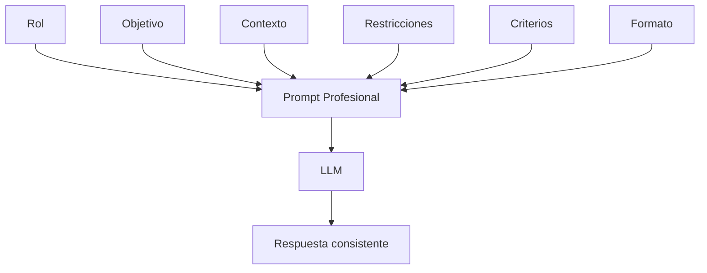

# Capitulo-16-Seccion-02-v0.1

# Módulo 2 — Prompt Engineering Profesional

# Capítulo 16 — Ingeniería del Prompt

**Versión:** 0.1  
**Estado:** Manuscrito del autor

> *"Todo prompt profesional posee una estructura. La diferencia entre un resultado consistente y uno impredecible suele comenzar allí."*

---

# Objetivos de aprendizaje

- Comprender la anatomía de un prompt profesional.
- Diferenciar los distintos bloques que conforman un prompt de producción.
- Relacionar cada componente con un requisito de negocio.
- Introducir el concepto de diseño modular de prompts.

---

# Introducción

En una conversación cotidiana es habitual escribir una única instrucción y esperar una respuesta. En una aplicación empresarial ese enfoque rara vez resulta suficiente.

A medida que las soluciones basadas en Large Language Models (LLM) crecieron en complejidad, los prompts evolucionaron desde simples instrucciones hasta convertirse en especificaciones estructuradas con responsabilidades claramente definidas.

Diseñar un prompt implica organizar información de manera que el modelo pueda interpretar correctamente el objetivo, las restricciones y el formato esperado de la respuesta.

---

# Anatomía de un prompt

Un prompt de ingeniería suele estar compuesto por bloques independientes.

| Componente | Propósito |
|------------|-----------|
| Rol | Define el comportamiento esperado del modelo. |
| Objetivo | Explica la tarea que debe resolver. |
| Contexto | Proporciona información relevante. |
| Restricciones | Limita comportamientos no deseados. |
| Criterios de calidad | Establece cómo evaluar la respuesta. |
| Formato de salida | Define la estructura esperada. |

---

# Modularidad

Cada bloque cumple una responsabilidad específica.

Esta separación facilita el mantenimiento, el versionado y la reutilización. Una modificación en el formato de salida no debería requerir reescribir el contexto ni alterar el rol asignado al modelo.

Desde la perspectiva del AI Engineering, esta modularidad permite tratar los prompts como artefactos versionables dentro del ciclo de vida de una aplicación.

---

# Caso de estudio

Un equipo desarrolla un asistente jurídico para analizar contratos. Inicialmente cada prompt contiene instrucciones mezcladas, ejemplos y reglas de formato en un único bloque de texto.

Tras separar el prompt en componentes reutilizables, el equipo consigue:

- disminuir el esfuerzo de mantenimiento;
- reutilizar bloques entre distintos asistentes;
- simplificar las revisiones;
- controlar mejor los cambios entre versiones.

---

# Buenas prácticas

- Separar responsabilidades dentro del prompt.
- Documentar el propósito de cada bloque.
- Evitar instrucciones contradictorias.
- Mantener un formato consistente entre versiones.

---

# Errores frecuentes

- Mezclar contexto con restricciones.
- Duplicar instrucciones.
- Cambiar múltiples bloques simultáneamente sin evaluación.
- Diseñar prompts difíciles de mantener.

---

# Ideas clave

- Un prompt profesional posee una estructura deliberada.
- La modularidad mejora la mantenibilidad.
- Cada componente responde a un objetivo concreto de ingeniería.

---

# Transición hacia la siguiente sección

En la próxima sección estudiaremos el concepto de rol (*role prompting*) y cómo influye en el comportamiento de un modelo dentro de soluciones empresariales.

---

> **"Un arquitecto no memoriza respuestas. Comprende problemas para poder diseñar soluciones."**
