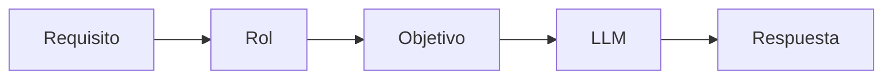

# Capitulo-16-Seccion-03-v0.1

# Módulo 2 — Prompt Engineering Profesional

# Capítulo 16 — Ingeniería del Prompt

**Versión:** 0.1  
**Estado:** Manuscrito del autor

> *"El rol asignado al modelo no cambia quién es el modelo. Cambia el marco desde el cual debe interpretar el problema."*

---

# Objetivos de aprendizaje

- Comprender el concepto de **Role Prompting**.
- Analizar cómo influye el rol en la generación de respuestas.
- Distinguir entre un rol conversacional y un rol de ingeniería.
- Incorporar buenas prácticas para definir roles en aplicaciones empresariales.

---

# Introducción

Uno de los patrones más utilizados en Prompt Engineering consiste en asignar un rol explícito al Large Language Model (LLM).

En apariencia, esta técnica parece sencilla: indicar al modelo que actúe como un abogado, un arquitecto de software o un analista financiero.

Sin embargo, desde la perspectiva del AI Engineering, un rol no representa un personaje, sino un mecanismo para acotar el espacio de respuesta del modelo.

Definir correctamente el rol reduce ambigüedad, mejora la consistencia y facilita la reutilización del prompt.

---

# ¿Qué representa un rol?

Un rol comunica al modelo el tipo de comportamiento esperado antes de resolver la tarea.

No aporta conocimiento nuevo ni modifica los parámetros del modelo.

Su función consiste en orientar el proceso de inferencia hacia un contexto determinado.

| Rol | Propósito |
|------|-----------|
| Arquitecto de IA | Priorizar decisiones de diseño y arquitectura. |
| Auditor | Identificar riesgos y controles. |
| Redactor técnico | Generar documentación clara y estructurada. |
| Revisor | Detectar inconsistencias y oportunidades de mejora. |

---

# Roles en producción

En aplicaciones empresariales, el rol suele permanecer estable y formar parte del propio sistema.

Por ejemplo, un asistente de soporte técnico mantiene el mismo rol durante todas las conversaciones, mientras que el contexto cambia en cada consulta.

Esta separación favorece el versionado y evita modificar instrucciones críticas cada vez que evoluciona el negocio.

---

# Caso de estudio

Una empresa implementa un asistente para revisar documentación técnica.

En la primera versión el prompt comienza simplemente con:

> "Analiza este documento."

Los resultados varían considerablemente entre consultas.

En una segunda iteración se define el rol:

> "Actúa como un arquitecto de software especializado en revisión de documentación técnica. Prioriza consistencia, riesgos y oportunidades de mejora."

Sin modificar el modelo ni la información de entrada, las respuestas se vuelven más homogéneas y alineadas con las expectativas del equipo.

---

# Buenas prácticas

- Definir roles estables y específicos.
- Evitar roles contradictorios.
- Relacionar el rol con el objetivo del negocio.
- Versionar cualquier cambio sobre el rol.

---

# Errores frecuentes

- Utilizar roles excesivamente genéricos.
- Mezclar el rol con instrucciones operativas.
- Cambiar el rol sin evaluar el impacto sobre la calidad.
- Pensar que un rol reemplaza el contexto o las restricciones.

---

# Ideas clave

- Un rol orienta el comportamiento esperado del modelo.
- El rol forma parte del diseño del prompt.
- Los roles deben responder a necesidades de ingeniería y no solo a fines conversacionales.

---

# Transición hacia la siguiente sección

En la próxima sección analizaremos el papel del contexto dentro de un prompt profesional y cómo influye en la calidad de las respuestas generadas.

---

> **"Un arquitecto no memoriza respuestas. Comprende problemas para poder diseñar soluciones."**
