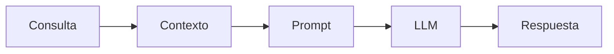

# Capitulo-16-Seccion-04-v0.1

# Módulo 2 — Prompt Engineering Profesional

# Capítulo 16 — Ingeniería del Prompt

**Versión:** 0.1  
**Estado:** Manuscrito del autor

> *"Un modelo responde con lo que sabe, pero decide qué conocimiento utilizar en función del contexto que recibe."*

---

# Objetivos de aprendizaje

- Comprender el papel del contexto en Prompt Engineering.
- Diferenciar contexto, conocimiento y memoria.
- Analizar cómo el contexto condiciona la calidad de la inferencia.
- Incorporar criterios para diseñar contexto en aplicaciones empresariales.

---

# Introducción

En la sección anterior analizamos cómo el rol establece el marco general de actuación del modelo. Sin embargo, un rol por sí solo rara vez resulta suficiente para resolver problemas reales.

El modelo necesita comprender la situación concreta sobre la cual debe trabajar. Esa información adicional constituye el contexto.

Desde la perspectiva del AI Engineering, el contexto representa uno de los recursos más valiosos de un sistema basado en Large Language Models (LLM). Su calidad influye directamente sobre la precisión, consistencia y relevancia de las respuestas.

---

# ¿Qué es el contexto?

El contexto es el conjunto de información que el sistema incorpora al prompt para ayudar al modelo a resolver una tarea específica.

Puede incluir:

- información del usuario;
- documentación corporativa;
- resultados de búsquedas;
- conversaciones previas;
- reglas del negocio;
- datos provenientes de otras aplicaciones.

El contexto no modifica el conocimiento interno del modelo. Lo orienta hacia la información relevante para la consulta actual.

---

# Contexto y memoria

Con frecuencia ambos conceptos se utilizan como sinónimos, aunque cumplen funciones diferentes.

| Concepto | Propósito |
|----------|-----------|
| Contexto | Información disponible para la inferencia actual. |
| Memoria | Información persistente reutilizada entre interacciones. |

Comprender esta diferencia será fundamental cuando estudiemos arquitecturas conversacionales y agentes inteligentes.

---

# Caso de estudio

Una organización desarrolla un asistente para responder consultas sobre procedimientos internos.

Sin contexto, el modelo responde utilizando únicamente su conocimiento general.

Cuando el sistema incorpora las políticas internas mediante una arquitectura Retrieval-Augmented Generation (RAG), las respuestas pasan a reflejar las normas reales de la organización.

El cambio no proviene del modelo, sino del contexto suministrado.

---

# Buenas prácticas

- Incorporar únicamente contexto relevante.
- Mantener la información actualizada.
- Evitar contexto redundante.
- Identificar claramente el origen de los datos incorporados.

---

# Errores frecuentes

- Asumir que más contexto siempre produce mejores respuestas.
- Mezclar información contradictoria.
- Incluir datos irrelevantes.
- No controlar el tamaño del contexto disponible.

---

# Ideas clave

- El contexto orienta la inferencia del modelo.
- Su calidad impacta directamente en la calidad de la respuesta.
- Diseñar el contexto constituye una tarea de ingeniería.

---

# Transición hacia la siguiente sección

En la próxima sección analizaremos las restricciones dentro de un prompt profesional y cómo permiten controlar el comportamiento del modelo en aplicaciones empresariales.

---

> **"Un arquitecto no memoriza respuestas. Comprende problemas para poder diseñar soluciones."**
