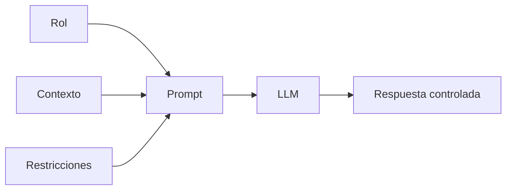

# Capitulo-16-Seccion-05-v0.1

# Módulo 2 — Prompt Engineering Profesional

# Capítulo 16 — Ingeniería del Prompt

**Versión:** 0.1  
**Estado:** Manuscrito del autor

> *"Un buen prompt no solo indica qué hacer. También define claramente qué no debe hacerse."*

---

# Objetivos de aprendizaje

- Comprender el papel de las restricciones dentro de un prompt profesional.
- Analizar cómo las restricciones reducen la ambigüedad durante la inferencia.
- Diferenciar restricciones funcionales y no funcionales.
- Incorporar criterios de diseño para soluciones empresariales.

---

# Introducción

Hasta el momento hemos estudiado dos componentes fundamentales del Prompt Engineering: el rol y el contexto.

Sin embargo, incluso un modelo correctamente contextualizado puede generar respuestas que no resulten adecuadas para una aplicación empresarial.

El motivo es sencillo.

Los Large Language Models (LLM) poseen una enorme flexibilidad durante la generación de texto. Esa capacidad constituye una ventaja para tareas creativas, pero representa un desafío cuando se requieren respuestas consistentes, auditables y alineadas con reglas de negocio.

Las restricciones aparecen precisamente para reducir ese espacio de incertidumbre.

---

# ¿Qué son las restricciones?

Las restricciones representan un conjunto de reglas que limitan el comportamiento permitido del modelo.

No describen el problema.

No aportan conocimiento.

Su función consiste en establecer los límites dentro de los cuales debe desarrollarse la respuesta.

Algunos ejemplos son:

- utilizar únicamente la información proporcionada;
- responder en un idioma determinado;
- no realizar suposiciones;
- citar las fuentes utilizadas;
- limitar la extensión de la respuesta;
- generar una estructura específica.

---

# Tipos de restricciones

Desde una perspectiva de ingeniería pueden distinguirse dos grandes categorías.

| Tipo | Finalidad |
|------|-----------|
| Funcionales | Definen qué debe o no debe hacer el modelo. |
| No funcionales | Establecen requisitos de formato, longitud, idioma, estilo o rendimiento. |

Esta clasificación resulta útil cuando los prompts forman parte de sistemas complejos y deben mantenerse durante largos períodos.

---

# Caso de estudio

Una organización desarrolla un asistente para responder consultas legales.

Durante las primeras pruebas el modelo complementa artículos de la legislación con información inferida a partir de su entrenamiento general.

Aunque muchas respuestas parecen razonables, algunas incluyen interpretaciones que no forman parte del marco normativo vigente.

El problema se corrige incorporando una restricción explícita:

> "Responde únicamente utilizando la normativa incluida en el contexto. Si la información no está disponible, indícalo expresamente."

Esta modificación reduce significativamente las respuestas no verificables.

---

# Buenas prácticas

- Escribir restricciones de forma explícita.
- Evitar reglas ambiguas.
- Diferenciar claramente restricciones y objetivos.
- Revisar periódicamente su vigencia.

---

# Errores frecuentes

- Confiar en restricciones implícitas.
- Incorporar reglas contradictorias.
- Definir restricciones excesivamente generales.
- Olvidar actualizar las restricciones cuando evoluciona el negocio.

---

# Ideas clave

- Las restricciones delimitan el comportamiento del modelo.
- Constituyen un mecanismo esencial para aumentar la confiabilidad.
- Forman parte del diseño arquitectónico del prompt.

---

# Transición hacia la siguiente sección

En la próxima sección estudiaremos cómo definir criterios de calidad y formatos de salida, transformando las respuestas del modelo en artefactos consistentes y fácilmente consumibles por otras aplicaciones.

---

> **"Un arquitecto no memoriza respuestas. Comprende problemas para poder diseñar soluciones."**
